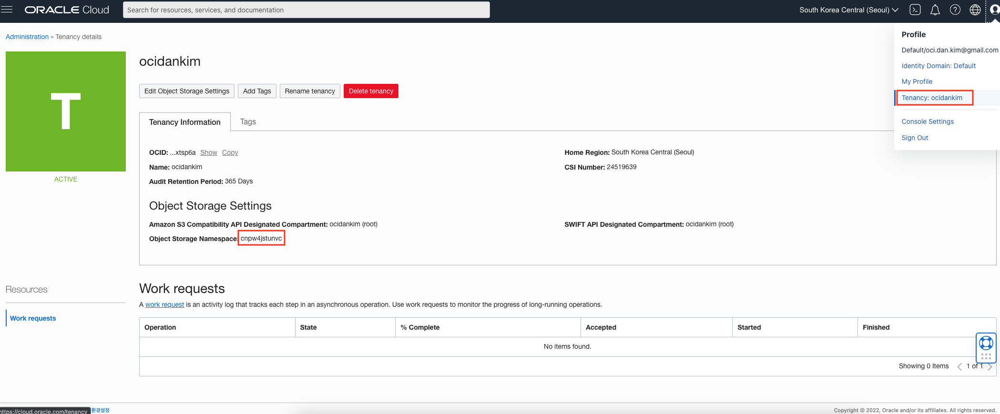
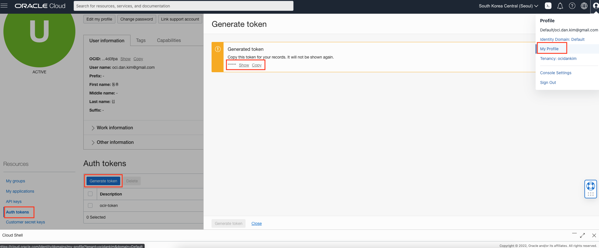
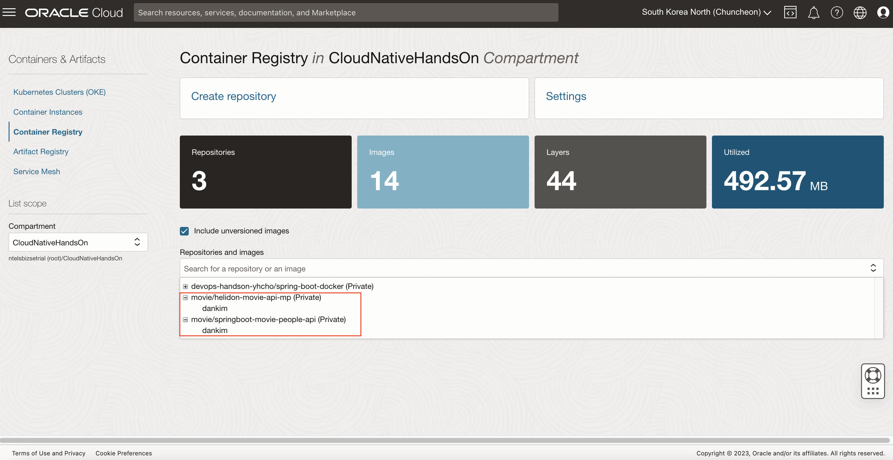
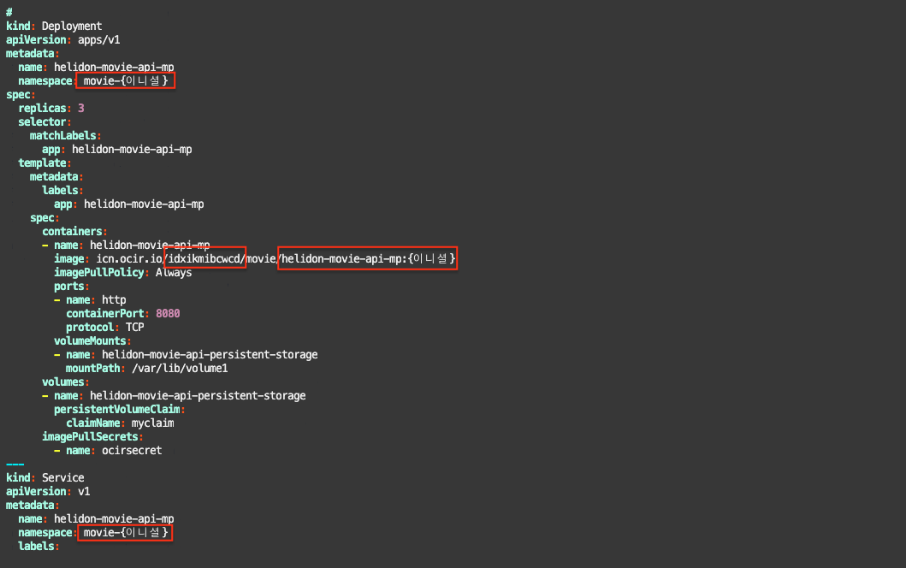

# Microprofile 마이크로 서비스 배포

## 소개

Spring Boot 및 Microprofile 기반 (Oracle Helidon Framework)의 REST 서비스를 OKE 환경에 배포하는 과정입니다.

소요시간: 30 minutes

### 목표

* 이미지 빌드, 생성 
* Oracle Cloud Infrastructure Container Registry (OCIR) 활용
* OKE 배포 및 서비스 동작 확인

### 사전 준비사항

1. 실습을 위한 노트북 (Windows, MacOS)
1. Oracle Free Tier 계정

## Task 1: Microprofile 및 SpringBoot 기반 REST 서비스 소스코드 내려받기

> **Note**: Cloud Shell이 오픈되어 있지 않다면, 우측 상단의 **Cloud Shell** 아이콘을 클릭하여 Cloud Shell을 오픈합니다.

1. Cloud Shell에서 다음 명령어로 실습을 위한 소스코드를 다운로드 받습니다.

    ````shell
    <copy>
    git clone https://github.com/the-team-oasis/movie.git movie
    </copy>
    ````

## Task 2: 이미지 빌드 및 OCIR에 푸시

1. 이미지 빌드

    OCIR에 이미지를 푸시하기 위해서는 다음과 같은 이미지 태그 네이밍 규칙을 따라야 합니다.
    > {Region Key}.ocir.io/{Object Storage Namespace}/{레파지토리명}/{이미지명}:{태그}

    Region Key는 [Regions and Availability Domains](https://docs.oracle.com/en-us/iaas/Content/General/Concepts/regions.htm) 에서 확인 가능합니다. 서울의 Region Key는 **icn**, 춘천의 Region Key는 **yny**입니다. 본 실습에서는 **서울 리전(icn)**을 사용하도록 합니다.

    Object Storage Namespace는 Tenancy Detail 화면에서 확인할 수 있습니다. 본 실습에서 사용하는 Namespace는 다음과 같습니다.
    > cnsrxemtrab8

    
    
    Sample Tag Namespace:  
    **[중요]** 여러 사람이 같이 실습을 하므로, 레파지토리 이름이 겹치지 않게 하기 위해 애플리케이션 태그에 실습자의 이니셜을 붙여서 진행합니다.  
    > icn.ocir.io/cnsrxemtrab8/movie/helidon-movie-api-mp:{이니셜}

    이미지 빌드 예시(Microprofile):
    ````shell
    cd movie/helidon-movie-api-mp
    ````

    ````shell
    docker build -t icn.ocir.io/cnsrxemtrab8/movie/helidon-movie-api-mp:dankim .
    ````

    이미지 빌드 예시(SpringBoot):
    ````shell
    cd movie/springboot-movie-people-api
    ````

    ````shell
    docker build -t icn.ocir.io/cnsrxemtrab8/movie/springboot-movie-people-api:dankim .
    ````

1. OCIR 로그인

    OCIR 로그인을 위해서는 Username과 Password가 필요합니다. Identity Domain(New IAM)인 경우 {Object Storage Namespace}/{OCI 로그인 아이디}, Username은 IDCS(Old IAM)인 경우 {Object Storage Namespace}/oracleidentitycloudservice/{OCI 로그인 아이디}이며, Password는 Auth Token값입니다.

    Identity Domain인 경우(New IAM) OCIR Username 예시: 
    > cnsrxemtrab8/oci.dan.kim@gmail.com

    IDCS인 경우(Old IAM) OCIR Username 예시:
    > cnsrxemtrab8/oracleidentitycloudservice/oci.dan.kim@gmail.com

    * **본 실습에서는 Identity Domain을 사용한 환경에서 진행합니다.**

    OCIR Password (Auth Token) 생성 (My Profile > Auth tokens > Generate token):
    > **Note**: Auth Token은 한번 생성 후 다시 확인이 불가능하기 때문에 복사해서 기록해놔야 합니다.
    
    
    OCIR 로그인 예시:
    ````shell
    docker login icn.ocir.io -u cnsrxemtrab8/oci.dan.kim@gmail.com
    ````

1. OCIR에 이미지 푸시

    OCIR에 이미지 푸시 예시(Microprofile):
    ````shell
    docker push icn.ocir.io/cnsrxemtrab8/movie/helidon-movie-api-mp:dankim
    ````

    OCIR에 이미지 푸시 예시(SpringBoot):
    ````shell
    docker push icn.ocir.io/cnsrxemtrab8/movie/springboot-movie-people-api:dankim
    ````

    이미지 확인
    
    
## Task 3: 서비스 배포

**[중요]** 하나의 OKE Cluster에서 실습을 진행하는 경우 Namespace 이름이 겹치지 않도록 Namespace에 다음과 같이 이니셜을 붙여서 생성합니다.
> kubectl create ns movie-{이니셜}

1. 서비스 배포를 위한 Namespace와 secret 생성 예시
    
    Namespace 생성:
    ````shell
    <copy>
    kubectl create ns movie-dankim
    </copy>
    ````

    kubectl 명령어로 위에서 생성한 Namespace에 작업을 할때마다 --namespace=movie-{이니셜} 옵션을 붙여야 합니다. 아래와 같이 context에 미리 --namespace=movie-{이니셜}을 설정하면, kubectl 명령어 실행할 때 자동으로 설정되므로, 매번 --namespace=movie-{이니셜} 옵션을 붙이지 않아도 됩니다.

    ````shell
    <copy>
    kubectl config set-context --current --namespace=movie-dankim
    </copy>
    ````
    
    Secret 생성:

    ````shell
    <copy>
    kubectl create secret docker-registry ocirsecret --docker-server=icn.ocir.io --docker-username={Object Storage Namespace}/{OCI Username} --docker-password='{Auth Token}' --docker-email={이메일}
    </copy>
    ````

    Secret 생성 예시:
    ````shell
    kubectl create secret docker-registry ocirsecret --docker-server=icn.ocir.io --docker-username=cnsrxemtrab8/oci.dan.kim@gmail.com --docker-password='c}d>02vJiom[g{wPO9kr' --docker-email=oci.dan.kim@gmail.com
    ````

1. Persistent Volume 생성
    Pod내의 컨테이너에서 사용할 Persistent Volume Claim (PVC)을 생성합니다. Pod 생성 시 PVC를 활용하면 OCI의 Block Storage를 Persistent Volume으로 사용하여 마운트할 수 있습니다. 

    PVC 생성:
    ```shell
    <copy>
    kubectl create -f csi-bvs-pvc.yaml
    </copy>
    ```

1. DB 정보 및 유저,패스워드를 구성을 위한 ConfigMap과 Secret을 생성합니다.

    ConfigMap 생성:
    ```shell
    <copy>
    kubectl create -f moviedb-config.yaml
    </copy>
    ```

    DB Secret 생성:
    ```shell
    <copy>
    kubectl create -f moviedb-secret.yaml
    </copy>
    ```

1. Kubernetes Manifest 파일 수정
    Kubernetes 배포를 위한 Microprofile Manifest 파일의 내용중에서 **애플리케이션 태그**, **Object Storage Namespace**의 값을 변경하고 저장합니다. 
    
    > **namespace**의 경우 편의상 yaml 파일에서 지정하지 않고, 배포하는 시점에 지정합니다. (스크린샷의 namespace 항목은 무시)

    ```shell
    <copy>
    vi kube-helidon-movie-api-mp-config.yml
    </copy>
    ```

    
    
    동일하게 SpringBoot Manifest 파일의 내용도 수정합니다.
    ```shell
    <copy>
    vi kube-springboot-movie-people-api-config.yml
    </copy>
    ```

1. 서비스 배포 (Microprofile)
    Microprofile: 
    ```shell
    <copy>
    kubectl apply -f kube-helidon-movie-api-mp-config.yml
    </copy>
    ```

    SpringBoot: 
    ```shell
    <copy>
    kubectl apply -f kube-springboot-movie-people-api-config.yml
    </copy>
    ```

    배포된 리소스 확인:
    ```shell
    <copy>
    kubectl get all
    </copy>
    ```

    Sample Response:
    ```shell
    NAME                                              READY   STATUS    RESTARTS   AGE
    pod/helidon-movie-api-mp-7ff64b8db8-fsww8         1/1     Running   0          37m
    pod/springboot-movie-people-api-79994ff49-mc9cr   1/1     Running   0          31s

    NAME                                  TYPE           CLUSTER-IP      EXTERNAL-IP       PORT(S)           AGE
    service/helidon-movie-api-mp          LoadBalancer   10.96.215.107   10.xxx.xxx.xxx   30000:32557/TCP   37m
    service/springboot-movie-people-api   LoadBalancer   10.96.135.116   10.xxx.xxx.xxx   31000:31452/TCP   32s

    NAME                                          READY   UP-TO-DATE   AVAILABLE   AGE
    deployment.apps/helidon-movie-api-mp          1/1     1            1           37m
    deployment.apps/springboot-movie-people-api   1/1     1            1           32s

    NAME                                                    DESIRED   CURRENT   READY   AGE
    replicaset.apps/helidon-movie-api-mp-7ff64b8db8         1         1         1       37m
    replicaset.apps/springboot-movie-people-api-79994ff49   1         1         1       32s
    ```

> **Note** : 배포된 백엔드 서비스는 Private Load Balancer만 적용이 된 상태로 외부로 노출이 되지 않은 상태입니다. 다음 랩에서는 API Gateway를 활용하여 백엔드 서비스를 외부에서 접근 가능한 엔드포인트로 노출하는 것을 실습합니다.

[다음 랩으로 이동](#next)
