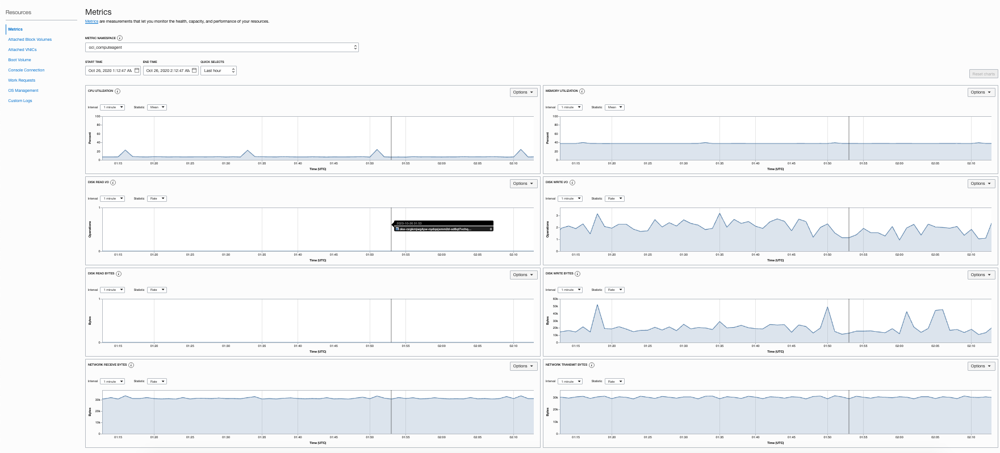
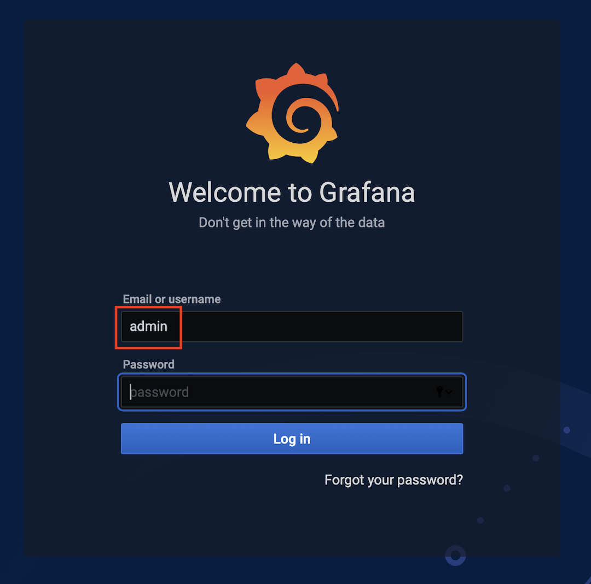
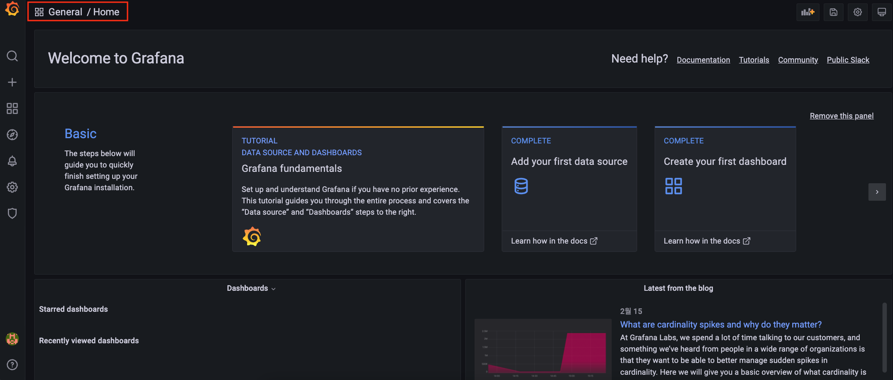

# 배포 모니터링

## 소개

Observability는 로그와 매트릭, 트레이스(추적) 모니터링을 조합하여 시스템의 가시성을 전반적으로 높이는데 도움을 줍니다.

소요시간: 10 minutes

### 목표

* OCI의 모니터링 콘솔 화면을 통해서 OKE Cluster, Node Pool, Worker Node의 상태 체크
* Grafana 대시보드 사용

### 사전 준비사항

1. 실습을 위한 노트북 (Windows, MacOS)
1. Oracle Free Tier 계정
1. Lab 2 혹은 Lab 3 완료, Grafana 모니터링의 경우 Lab 3가 사전에 완료되어야 함

## Task 1: OKE Metrics 보기

1. *OKE Cluster Metrics:* **Developer Services -> Kubernetes Clusters -> <클러스터 이름>** 로 이동

2. **Resources -> Metrics** 아래에서 다음 매트릭 대시보드 확인

      * Unschedulable Pods: Pod를 스케쥴하기 위한 리소스가 충분하지 않은 경우 노드풀 확장 작업을 트리거하는데 사용
      * API Server requests per second: Kubernetes API Server에서 발생하는 기본적인 성능문제를 확인하는데 도움
3. 이러한 매트릭은 OCI Monitoring 콘솔에서 **oci_oke**라는 네임스페이스를 통해서 볼 수 있습니다. 또한 산업 표준 통계, 트리거 작업, 시간 간격을 사용해서 알람 기능을 추가할 수 있습니다.

    

4. *OKE Node Pool Metrics:* **Developer Services -> Kubernetes Clusters -> <클러스터 이름> -> Node Pools -> <노드풀 이름>** 로 이동

    다음의 노드풀 매트릭스 정보 확인:

    * Node State (Worker 노드가 OCI Compute Service를 통해서 활성화된 상태로 인지될 때)
    * Node condition (Worker노드가 OKE API Server를 통해서 Ready 상태로 인지될 때)

    

5. *OKE Worker Node Metrics:* **Developer Services -> Kubernetes Clusters -> <클러스터 이름> -> Node Pools -> <노드풀 이름> -> Nodes -> <노드 이름>**

    다음의 노드 매트릭스 정보 확인:

    * CPU의 활동 수준. 총 시간(사용 중 및 유휴) 대 유휴 시간의 백분율로 표시됩니다. 일반적인 경보 임계값은 90%입니다.
    * 현재 사용중인 공간. 페이지로 측정됩니다. 사용된 페이지와 사용하지 않은 페이지의 비율로 표시됩니다. 일반적인 경보 임계값은 85%입니다.
    * I/O 읽기 및 쓰기의 활동 수준. 초당 읽기/쓰기로 표시됩니다.
    * 읽기/쓰기 처리량. 초당 읽기/쓰기 바이트로 표시됩니다.
    * 네트워크 수신/전송 처리량. 초당 수신/전송 바이트로 표시됩니다.

    

## Task 2: Grafana 모니터링 (Lab4 완료 시)

Lab 3에서 Helm Chart를 활용하여 Prometheus/Grafana를 이미 설치하였습니다. 이번에는 OKE에 Grafana 대시보드를 연결해보도록 하겠습니다.

1. 우측 상단의 Cloud Shell 아이콘을 클릭하여 Cloud Shell로 들어갑니다.

  

1. **mushop-utils**(Setup)가 설치되었는지 확인을 위해 Helm release를 조회합니다.

    ````shell
    <copy>
    helm list --all-namespaces
    </copy>
    ````

    Sample response:

    ````shell
    NAME            NAMESPACE               REVISION        UPDATED                                 STATUS          CHART                   APP VERSION
    mushop          mushop                  1               2022-02-15 16:46:14.886875446 +0000 UTC deployed        mushop-0.1.2            1.0        
    mushop-utils    mushop-utilities        1               2022-02-15 16:17:10.974208503 +0000 UTC deployed        mushop-setup-0.0.2      1.0
    ````

2. **mushop-utils** (setup chart) 에서 Grafana의 아웃풋 확인 (## Grafana 관련 내용 모두 메모)

    ````shell
    <copy>
    helm status mushop-utils --namespace mushop-utilities
    </copy>
    ````

3. Ingress Controller에 할당된 EXTERNAL-IP 확인 (EXTERNAL-IP 메모)

    ````shell
    <copy>
    kubectl get svc mushop-utils-ingress-nginx-controller --namespace mushop-utilities
    </copy>
    ````

4. 자동 생성된 Grafana **admin** 패스워드 확인

    ````shell
    <copy>
    kubectl get secret -n mushop-utilities mushop-utils-grafana \
    -o jsonpath="{.data.admin-password}" | base64 --decode ; echo
    </copy>
    ````

5. 브라우저를 통해서 http://< EXTERNAL-IP >/grafana 접속

6. **admin**/**< password >** 정보로 대시보드 접속

    

7. Grafana 메인 화면에서 **General / Home**을 선택합니다.

    

8. `Kubernetes Cluster` 대시보드를 선택합니다.

    *Note:* Mushop은 mushop-utils 차트의 일부로 대시보드를 미리 로드합니다.

    

9. OKE Cluster 모니터링 대시보드를 확인합니다.

    

10. 다른 형태의 대시보드도 선택할 수 있습니다.

    *Note:* [커뮤니티](https://grafana.com/grafana/dashboards?dataSource=prometheus)에서 다른 대시보드를 설치하거나 직접 만들 수 있습니다.

## Task 3: Autoscaling

배포를 스케일아웃하면 사용 가능한 리소스가 있는 노드에 새 포드가 생성되고 스케쥴됩니다. 이 단계는 MuShop 애플리케이션과 함께 배포된 [Horizontal Pod Autoscaling](https://kubernetes.io/docs/user-guide/horizontal-pod-autoscaling/) 구성을 보여줍니다.

1. MuShop 배포를 위한 현재 스케일링 대상 및 Replicas 수 확인

    ````shell
    <copy>
    kubectl get hpa
    </copy>
    ````

    Sample response:

    ````shell
    NAME                REFERENCE                      TARGETS   MINPODS   MAXPODS   REPLICAS   AGE
    mushop-api          Deployment/mushop-api          1%/70%    1         10        1          14m
    mushop-assets       Deployment/mushop-assets       1%/70%    1         10        1          14m
    mushop-catalogue    Deployment/mushop-catalogue    5%/70%    1         10        1          14m
    mushop-edge         Deployment/mushop-edge         2%/70%    1         10        1          14m
    mushop-events       Deployment/mushop-events       1%/70%    1         10        1          14m
    mushop-storefront   Deployment/mushop-storefront   1%/70%    1         10        1          14m
    mushop-user         Deployment/mushop-user         1%/70%    1         10        1          14m
    ````

    노드의 Shape에 따라 대상은 `1%`정도로 낮을 수 있고, Replicas 수는 `1` 정도로 낮게 설정되어 있는 것을 확인할 수 있습니다.

1. 배포(Deployments)에 의해서 생성된 ReplicaSet 확인

    ````shell
    <copy>
    kubectl get rs
    </copy>
    ````

    Sample response:

    ````shell
    NAME                            DESIRED   CURRENT   READY   AGE
    mushop-api-9dd66b45b            1         1         1       15m
    mushop-assets-7c87dc946f        1         1         1       15m
    mushop-carts-6c67469876         1         1         1       15m
    mushop-catalogue-6cd5f9bddd     1         1         1       15m
    mushop-edge-7bcbc7f576          1         1         1       15m
    mushop-events-56d6dfff9f        1         1         1       15m
    mushop-fulfillment-7cbbf7cfd4   1         1         1       15m
    mushop-nats-7679846f9f          1         1         1       15m
    mushop-orders-6fd9447846        1         1         1       15m
    mushop-payment-86f4d7897f       1         1         1       15m
    mushop-session-6fdc488cb9       1         1         1       15m
    mushop-storefront-587d5968d4    1         1         1       15m
    mushop-user-85579bdf64          1         1         1       15m
    ````

1. 부하를 주기위한 시뮬레이션 파드 배포

    ````shell
    <copy>
    kubectl create -f https://raw.githubusercontent.com/oracle-quickstart/oci-cloudnative/master/src/load/load-dep.yaml
    </copy>
    ````

1. 몇 분정도 대기 후 HPA Metrics 확인

    ````shell
    <copy>
    kubectl get hpa
    </copy>
    ````

    Sample response:

    ````shell
    NAME                REFERENCE                      TARGETS   MINPODS   MAXPODS   REPLICAS   AGE
    mushop-api          Deployment/mushop-api          80%/70%   1         10        2          13h
    mushop-assets       Deployment/mushop-assets       1%/70%    1         10        1          13h
    mushop-catalogue    Deployment/mushop-catalogue    5%/70%    1         10        1          13h
    mushop-edge         Deployment/mushop-edge         84%/70%   1         10        2          13h
    mushop-events       Deployment/mushop-events       2%/70%    1         10        1          13h
    mushop-storefront   Deployment/mushop-storefront   11%/70%   1         10        1          13h
    mushop-user         Deployment/mushop-user         1%/70%    1         10        1          13h
    ````

    대상이 증가하고 Replicas 수가 증가하기 시작했는지 확인

     *참고:* 클러스터 Worker 노드의 Shape에 따라 사용량이 더 낮거나 높을 수 있습니다.

1. Grafana 콘솔에서 대시보드 확인

    CPU와 Memory 사용량이 증가한 것을 확인할 수 있습니다.

1. 부하 시뮬레이터 삭제

    ````shell
    <copy>
    kubectl delete -f https://raw.githubusercontent.com/oracle-quickstart/oci-cloudnative/master/src/load/load-dep.yaml
    </copy>
    ````

    몇 분후 부하가 감소하고 대상의 리소스 사용량이 가장 낮은 수준으로 감소합니다. 이 시점에서 Kubernetes는 **scale down**을 시작하고 Replicas 수를 최소로 되돌립니다.

[다음 랩으로 이동](#next)

