# 실습 리소스 정리하기

## 소개

불필요한 비용이 발생하지 않도록 실습에 사용한 리소스를 정리하기 위한 단계 입니다.
아래 단계를 차례대로 실행하여 실습에 사용된 리소스를 정리해주세요

소요시간: 10 minutes

### 목표

- Oracle Cloud Infrastructure (OCI) Basic Service - Windows 실습에 사용한 리소스 종료.

### 사전 준비사항

1. 실습을 위한 노트북 (Windows, MacOS)
1. Oracle Free Tier 계정

## Task 1: 인스턴스 풀(Instance Pool) 종료하기

1. 인스턴스 풀 세부정보 화면에서 **"추가작업"** 버튼을 클릭 후 **"종료"** 버튼을 클릭합니다.
   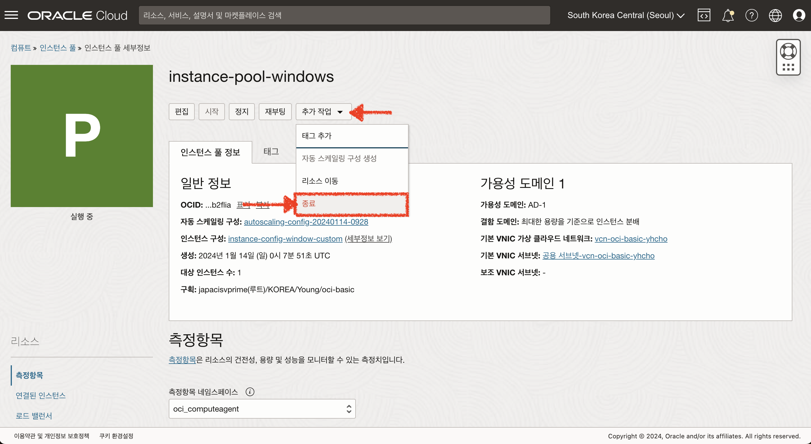

1. 인스턴스 풀 종료 확인 팝업에 **"TERMINATE"**를 입력하여 종료 합니다.
   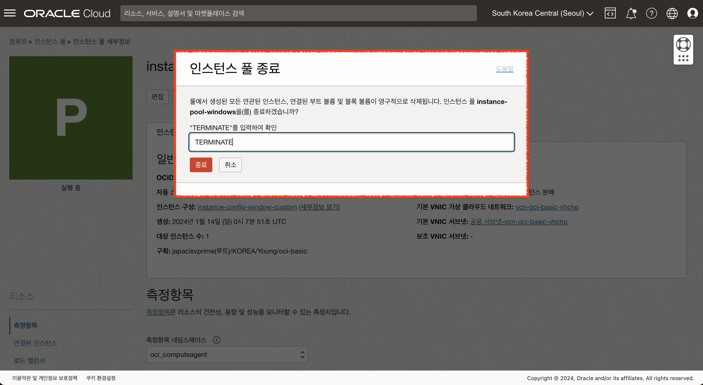

## Task 2: 인스턴스 종료하기

> **인스턴스 풀에서 생성된 인스턴스는 인스턴스 풀 삭제시 함께 삭제됩니다.**

1. 인스턴스 목록화면에서 종료하고자 하는 인스턴스의 체크박스를 활성화 한 후 **"작업"** 메뉴에서 **"종료"** 버튼을 클릭합니다.
   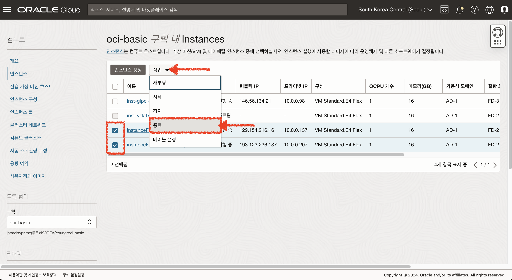

1. 연결된 부트 볼륨도 함께 삭제하길 원하는 경우 체크박스를 클릭 후 아래 데이터 손실 안내 확인하여 **"종료"** 버튼을 클릭합니다.
   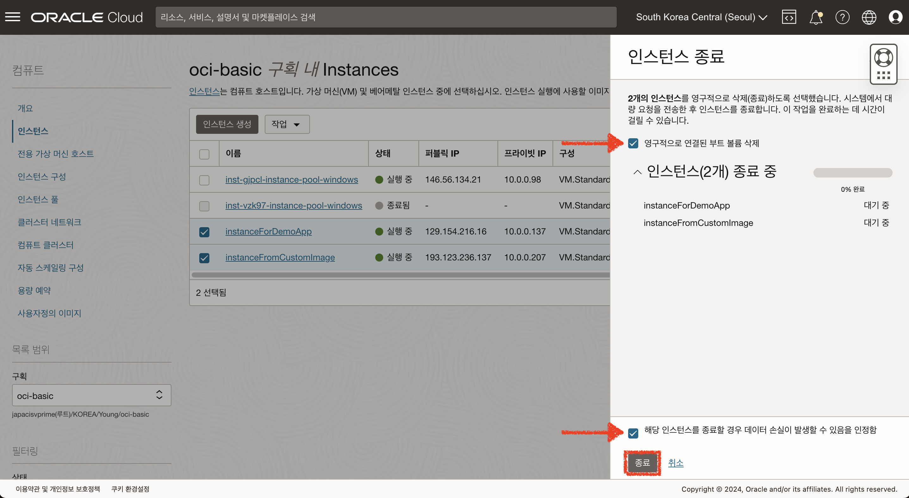

## Task 3: 로드밸런서 삭제하기

1. 로드밸런서 세부정보 화면에서 **"종료"** 버튼을 클릭합니다.
   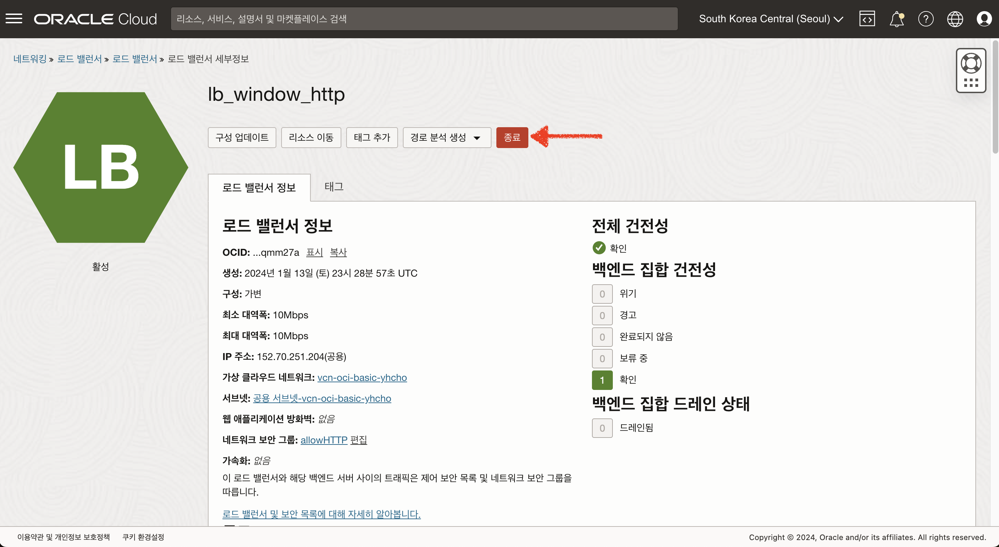

2. 종료 확인 팝업에서 **"종료"** 버튼을 클릭하여 로드밸런서를 종료합니다.
   

## Task 4: OCI Postgresql 시스템 삭제하기

1. Postgresql DB시스템 세부정보 화면에서 **"추가 작업"** 메뉴를 클릭 후 **"삭제"** 버튼을 클릭합니다.
   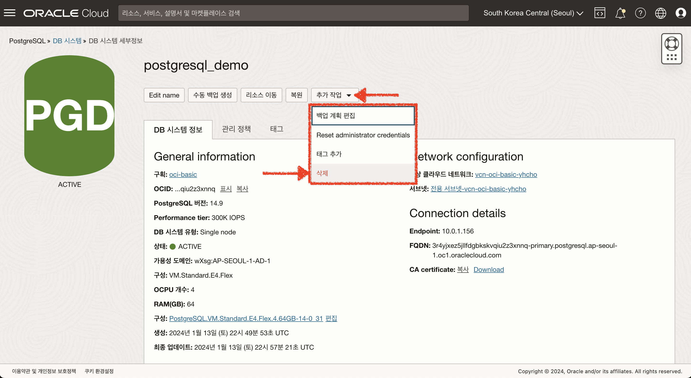

2. 삭제 확인 팝업에서 **"삭제"** 를 입력 후 **"삭제 확인"** 버튼을 클릭합니다.
   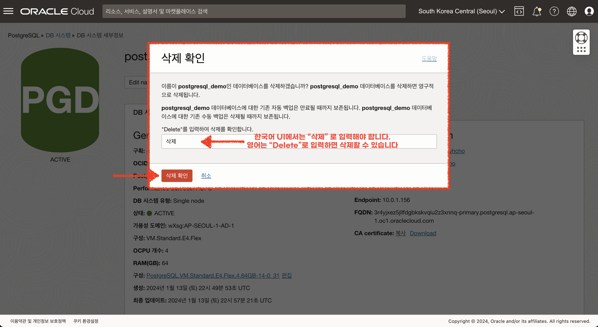
   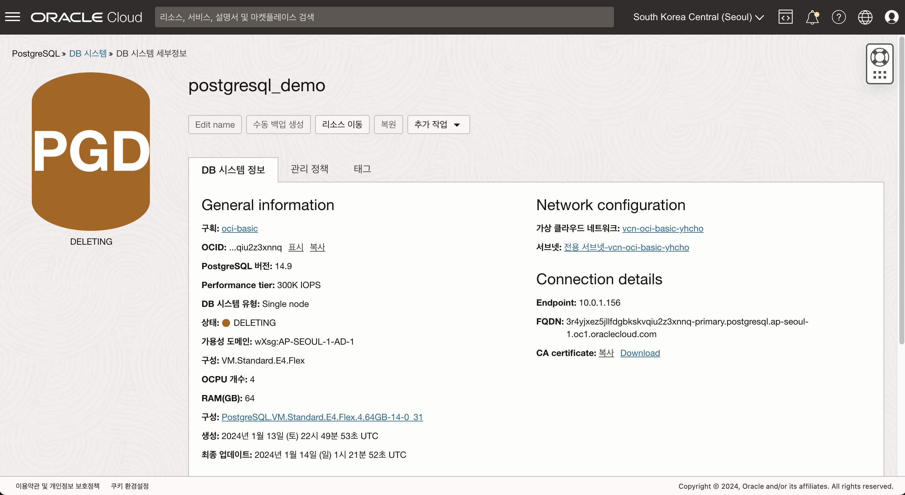

## Task 5: OCI Block Volume 삭제하기

1. OCI Block Volume 목록 화면에서 우측 **"액션버튼"**을 클릭하여 **"종료"** 버튼을 클릭합니다.
   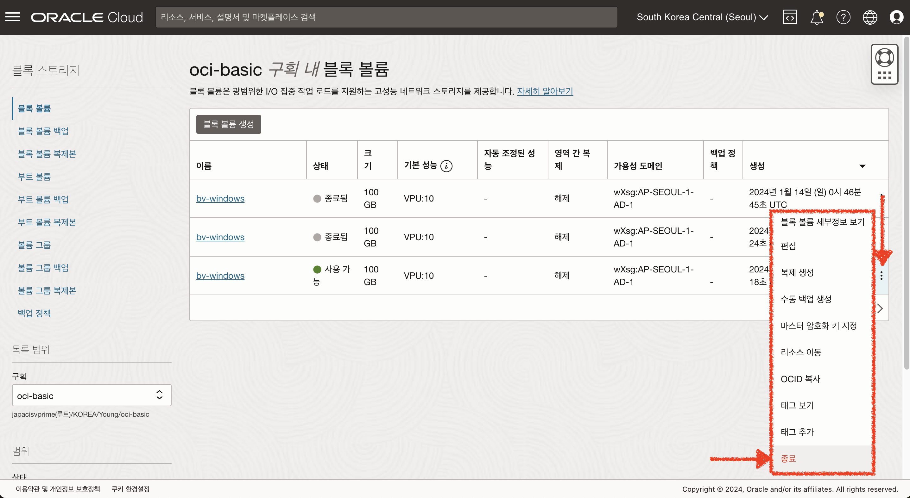

2. 종료 확인 팝업에서 **"종료"** 버튼을 클릭하여 Block Volume을 종료합니다.
   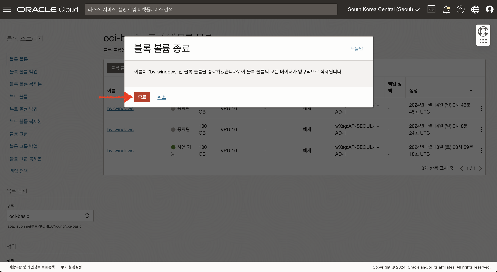
   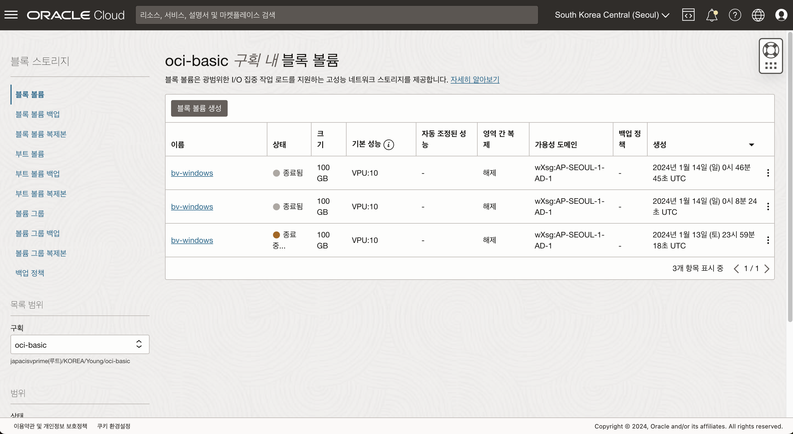

## Task 6: 사용자정의 이미지 삭제하기

사용자정의 이미지를 생성할 경우 생성된 크기만큼 Object Storage 단가와 동일한 비용이 발생합니다.
작은 비용 이지만, 삭제를 통해 불필요한 비용 지출을 예방할 수 있습니다.

1. OCI 사용자정의 이미지 목록 화면에서 우측 **"액션버튼"**을 클릭하여 **"삭제"** 버튼을 클릭합니다.
   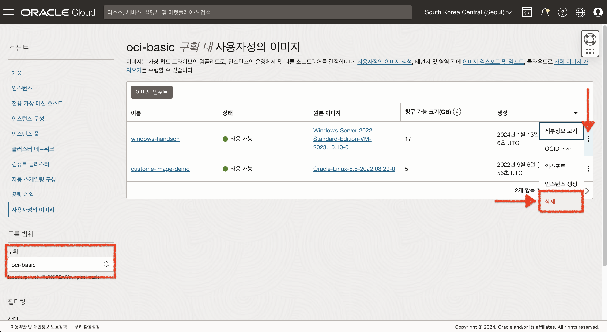

2. 삭제 확인 팝업에서 **"삭제"** 버튼을 클릭하여 사용자정의 이미지를 삭제합니다.
   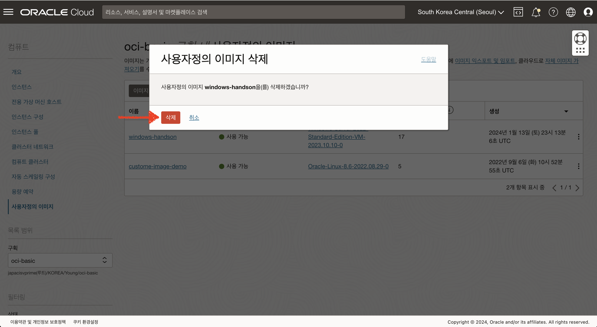
