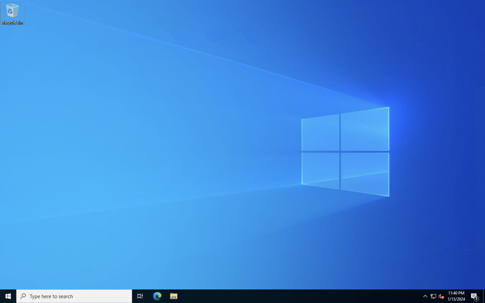

# OCI Compute Instance 및 Apache httpd 서버 설치 실습

## 소개

OCI 기본서비스 중 하나인 Compute - Instance 서비스를 Windows Server OS로 생성하고 접속하는 실습을 진행합니다.

소요시간: 20 minutes

### 목표

- OCI Compute Instance 서비스에 대한 이해
- OCI VCN Security 서비스에 대한 이해

### 사전 준비사항

1. 실습을 위한 노트북 (Windows, MacOS)
1. Oracle Free Tier 계정

## Task 1: Compute Instance 생성

1. 좌측 상단의 **햄버거 아이콘**을 클릭하고, **컴퓨트(Compute)**을 선택한 후 **인스턴스(Instances)**를 클릭합니다.
   

2. 왼쪽 하단에 구획을 확인하고 **인스턴스 생성(Create instance)**버튼을 클릭합니다.
   

3. 인스턴스 이름과 구획을 선택 합니다

   - 이름: Enter **instanceForDemoApp**
   - 구획에 생성: **oci-basic**
   - 가용성 도메인 : **AP-SEOUL-1-AD-1 (Seoul 리전 기준)**
     

4. **이미지 변경** 버튼을 클릭하여 설치할 이미지를 선택 합니다.
   - Platform : **Windows**
   - Image : **Windows Server 2022 Standard**
     
     

> \*Windows 이미지는 Compute 비용과 별도로 Core 당 License 비용이 부과 됩니다.

5. 추가 라이센스 수수료 관련 동의 체크 후 **"이미지 선택"** 버튼을 클릭합니다.
   

6. Shape은 기본 Shape을 그대로 사용합니다.

   - Shape : **VM.Standard.E4.Flex (1 OCPU, 16 GB Memory)**

7. 네트워크 관련 옵션을 선택 합니다

   - Virtual cloud network : **vcn-oci-basic**
   - Subnet : **공용 서브넷-vcn-oci-basic**
   - Public IP address : **공용 IPv4 주소 지정**
     

8. **Create** 버튼을 클릭 후 생성
   - 생성 후 Running 상태를 확인 합니다
     
     

## Task 2: OCI 보안목록 (Security List) 설정

1. 생성한 인스턴스 세부정보 화면에서 [기본 VNIC] 섹션의 서브넷 링크를 클릭합니다.
   

2. Subnet 상세보기 화면에서 하단 Security Lists 목록중 **Default Security List for vcn-oci-basic**을 클릭 합니다.
   

3. **수신 규칙 추가** 버튼을 클릭 합니다.
   

4. 다음과 같이 입력:
   - Source Type : **CIDR** (기본값)
   - Source CIDR : Enter **0.0.0.0/0**
   - IP Protocol : **TCP** (기본값)
   - Destination Port Range : **3389**
   - Description : **for remote**
   - **수신 규칙 추가** 클릭
     

## Task 3: Compute Instance 접속

### 인스턴스 접속을 위한 정보 확인

- 인스턴스 세부정보 화면에서 Public IP 주소와 초기 비밀번호를 확인할 수 있습니다. (기본 사용자 이름은 "opc" 입니다.)
  

### Windows 사용자 (Remote Desktop Connection)

- 윈도우에 기본 포함된 "원격 데스크톱 연결" 프로그램을 실행 시킨 후 IP/PW 정보를 입력하여 접속
  

### MacOS 사용자

- 윈도우 원격 연결을 위한 프로그램 설치 후 접속 (Microsoft Remote Desktop)
  

- 정상 접속 확인
  

[다음 랩으로 이동](#next)
