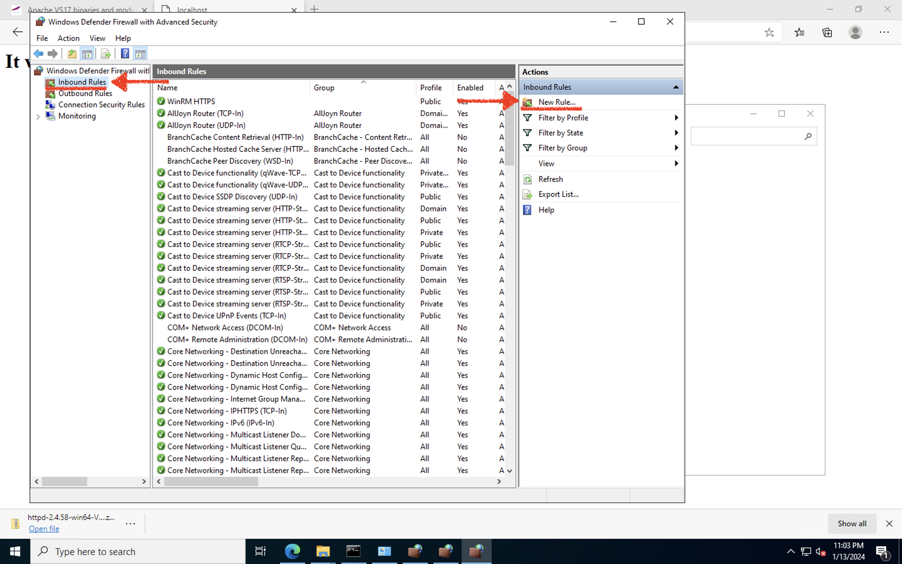

# Apache httpd 서버 설치 및 접속하기

## 소개

오라클 Cloud Infrastructure 에서 Windows Server에서 Apache httpd 서버를 운영하는데 필요한 지식을 실습을 통해 학습니다.

소요시간: 20 minutes

### 목표

- Windows 용 Apache httpd 서버 설치
- Windows 방화벽 설정
- 클라두으 방화벽 설정 (NSG)

### 사전 준비사항

1. 실습을 위한 노트북 (Windows, MacOS)
1. Oracle Free Tier 계정

## Task 1: Apache httpd 서버 설치

1. VM에 접속 후 아래 링크주소를 클릭하여 운영체제에 맞는 Windows 용 Apache httpd 서버 파일을 다운로드 합니다.

- [https://www.apachelounge.com/download/](https://www.apachelounge.com/download/)

2. 실습에서는 Win64 링크의 파일을 다운로드 하도록 하겠습니다.
   

3. 다운로드 받은 파일의 압축을 해제합니다.
   
4. Apache24 폴더를 복사하여 `C:\` 루트 경로로 복사합니다.
   
5. Command Prompt를 관리자 권한으로 실행합니다.
   
6. `C:\Apache24\bin` 경로로 이동 후 `httpd -k install` 명령어를 입력하여 서비스를 설치합니다.
   
7. `httpd -k start` 명령어를 입력하여 서비스를 시작합니다.
   
8. 웹 브라우저를 실행 후 http://localhost 에 접속하여 동작 여부를 확인합니다. ("It works!" 가 표시되면 정상입니다.)
   

## Task 2: Windows Server 방화벽 설정하기

서버 내부가 아닌 외부에서 접속하려면 윈도우서버의 방화벽에 http 서비스 포트를 허용해야 합니다.
아래 절차에 따라 윈도우서버의 방화벽에 http-80 Port 규칙을 추가 합니다.

1. VM에 접속 후 _Windows Defender Firewall_ 프로그램을 실행합니다.
   
2. "Advanced setting(고급 설정)" 메뉴를 클릭합니다.
   
3. 좌측 Inbound Rules를 클릭 후 _New Rule..._ 버튼을 클릭합니다.
   
4. 아래와 같이 선택 & 입력하여 TCP/80 규칙을 추가합니다.
   - Rule Type 을 *Port*로 선택 후 "Next"
     
   - _"TCP"_ 선택 후 Specific Local ports에 "80" 입력
     
   - _"Allow the connection"_ 선택 후 "Next"
     
   - 기본값 유지 하여 "Next"
     
   - Name 에 _allowHTTP_ 입력 후 "Finish"
     
5. 추가된 규칙을 확인합니다.
   

6. VM 외부에서 공인 IP (Public IP)로 접속을 시도합니다.  
   

> Windows 서버의 방화벽을 설정하였지만 여전히 외부에서 접속이 되지 않습니다. 이유는 클라우드의 방화벽을 설정하지 않았기 때문입니다. 다음 단계에서는 클라우드 방화벽을 설정하도록 하겠습니다.

## Task 3: 클라우드 방화벽 설정하기 (네트워크 보안 그룹(NSG - Network Security Group))

OCI의 기본 네트워크 구성요소인 VCN에서는 기본적으로 White List 정책으로 트래픽을 허용합니다.
그렇기 때문에 허용하도록 추가된 규칙 이외의 트래픽은 기본적으로 차단 됩니다.
이번 단계에서는 트래픽을 허용하는 방법 중 특정 리소스에만 방화벽 규칙을 허용할 수 있는 네트워크 보안 그룹을 생성, 리소스에 적용해 보도록 하겠습니다.

1. 전체메뉴에서 "네트워킹" - "가상 클라우드 네트워크" 메뉴를 클릭합니다.
   
2. 실습에서 생성한 VCN을 클릭합니다.
   
3. VCN 세부정보 화면의 왼쪽 리소스 패널의 "네트워크 보안 그룹" 을 클릭 후 "네트워크 보안 그룹 생성" 버튼을 클릭합니다.
   
4. 다음과 같이 입력 & 선택합니다.
   - 이름 : **allowHTTP**
   - 구획에 생성 : **실습에서 생성한 구획 선택**
     
5. 다음과 같이 입력:
   - Source Type : **CIDR** (기본값)
   - Source CIDR : Enter **0.0.0.0/0**
   - IP Protocol : **TCP** (기본값)
   - Destination Port Range : **80**
   - Description : **for HTTP**
   - **생성** 클릭
     
6. 추가된 네트워크 보안 그룹을 확인합니다.
   
7. 인스턴스 세부정보 화면으로 이동하여 네트워크 보안 그룹 옆의 "편집" 버튼을 클릭합니다.
   
8. 편집 레이어에서 방금 생성한 네트워크 보안 그룹 (allowHTTP)를 선택 후 변경사항을 저장합니다.
   
9. 적용된 이후 다시 한번 Public IP로 접속하여 서비스 접속을 확인합니다.
   
   

## Task 4: pgadmin 설치하기

1. VM에 접속 후 아래 링크주소를 클릭하여 운영체제에 맞는 Windows 용 pgadmin 서버 파일을 다운로드 합니다.

- [https://www.postgresql.org/ftp/pgadmin/pgadmin4/v8.2/windows/](https://www.postgresql.org/ftp/pgadmin/pgadmin4/v8.2/windows/)
  

2. Windows 용 64bit 설치파일을 다운로드 합니다.
   
3. 아래 순서대로 pgadmin을 설치합니다. (기본값 유지 후 Next)
   
   
   
   
   
   
   
4. 마지막 완료 화면에서 compute 재부팅 여부를 물어보는 화면에서 "나중에 재시작" 선택 후 완료합니다.
   

[다음 랩으로 이동](#next)
