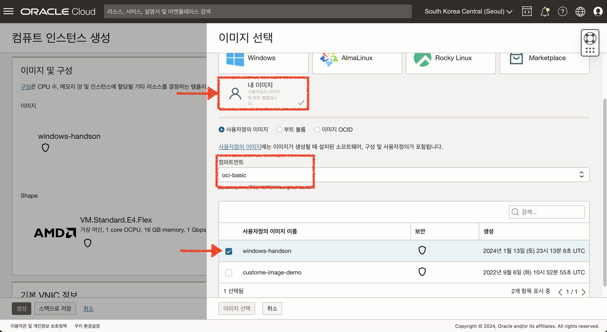
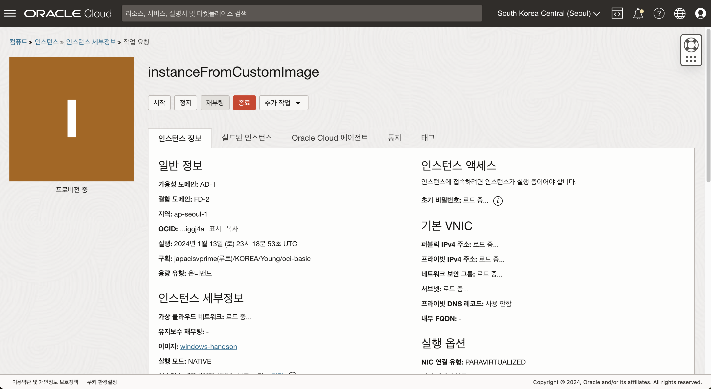

# 사용자정의 이미지를 확용하여 VM 생성하기

## 소개

OCI 컴퓨트 인스턴스는 사용자정의 이미지 생성 기능을 제공합니다.
사용자정의 이미지를 사용하면, 사용자가 인스턴스 OS에서 설정한 내용을 포함한 Custom 이미지를 생성할 수 있습니다.
이번 실습에서는 사용자정의 이미지를 생성하고 해당 이미지를 활용하여 인스턴스를 생성하는 방법에 대해 학습합니다.

소요시간: 10 minutes

### 목표

- OCI 사용자정의 이미지에 대한 이해

### 사전 준비사항

1. 실습을 위한 노트북 (Windows, MacOS)
1. Oracle Free Tier 계정

## Task 1: 사용자정의 이미지 생성하기

1. 좌측 상단의 **햄버거 아이콘**을 클릭하고, **컴퓨트(Compute)**을 선택한 후 **인스턴스(인스턴스)**를 클릭합니다.
2. 실습에서 생성한 컴퓨트 인스턴스를 클릭하여 세부정보 화면으로 이동합니다.
3. **추가 작업** 을 클릭하여 **사용자정의 이미지 생성** 버튼을 클릭합니다.
   
4. 이미지를 생성할 구획을 선택하고, 이미지 이름을 입력합니다.
   - 구획 : **실습에서 생성한 구획**
   - 이름 : **windows-handson**
     
5. 인스턴스 상태가 "이미지 생성 중"으로 바뀌며 잠시 정지 됩니다.
   
6. 생성된 사용자 정의 이미지를 확인합니다.
   

## Task 2: 사용자정의 이미지를 사용하여 VM 생성하기

1. 생성한 사용자정의 이미지 세부 정보 화면으로 이동하여 "인스턴스 생성" 버튼을 클릭합니다.
   
2. 인스턴스 이름과 구획을 선택 합니다
   - 이름: Enter **instanceFromCustomImage**
   - 구획에 생성: **oci-basic**
   - 가용성 도메인 : **AP-SEOUL-1-AD-1 (Seoul 리전 기준)**
     
3. **이미지 변경** 버튼을 클릭하여 "내 이미지"를 클릭하면 사용자정의 이미지 목록을 확인할 수 있습니다.
   
4. VCN, Subnet도 기존과 동일하게 설정합니다.
   - Virtual cloud network : **vcn-oci-basic**
   - Subnet : **공용 서브넷-vcn-oci-basic**
   - Public IP address : **공용 IPv4 주소 지정**
     
5. 나머지 정보는 기본값을 유지하고, 네트워크 섹션 하단의 "고급 옵션 표시" 버튼을 클릭합니다.
   
6. 네트워크 보안 그룹을 사용하여 트래픽 제어를 체크한 후 allowHTTP 규칙을 설정합니다.
   
   
7. 인스턴스를 생성합니다. (약 15분 소요)
   

> 사용자정의 이미지를 활용하여 생성된 인스턴스는 기존 인스턴스에 설정된 비밀번호가 유지 됩니다.

[다음 랩으로 이동](#next)
