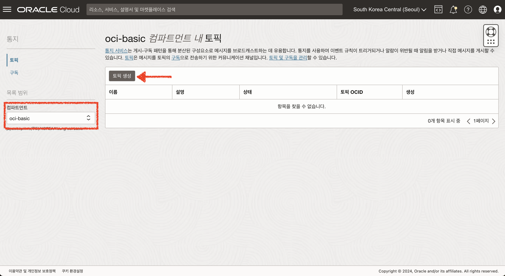
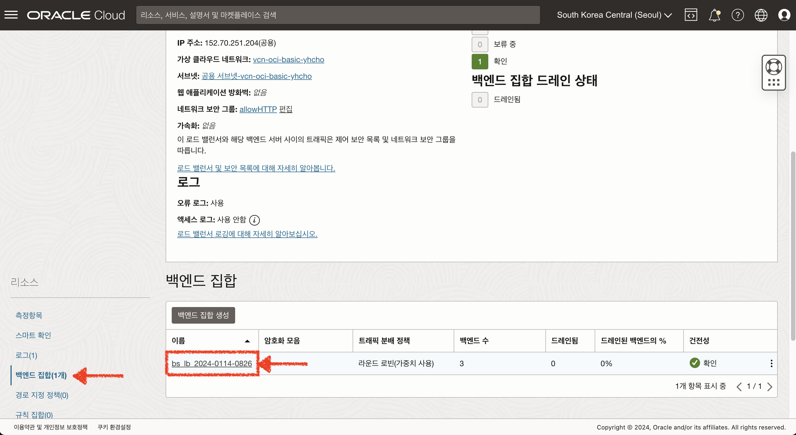

# Load Balancer 생성

## 소개

OCI에서는 애플리케이션 로드 밸런서와 네트워크 로드 밸런서를 제공합니다.
로드 밸런서는 한 시작점에서 VCN(가상 클라우드 네트워크)에서 연결 가능한 여러 서버로의 자동 트래픽 분배를 제공합니다.
리소스 활용률을 높이고 스케일링을 촉진하며 고가용성을 보장해 줍니다.
이번 실습을 통해 애플리케이션 로드 밸런서를 생성하고 구성하는 방법에 대해 알아봅니다.

소요시간: 20 minutes

### 목표

- OCI 로드밸런서에 대한 이해

### 사전 준비사항

1. 실습을 위한 노트북 (Windows, MacOS)
1. Oracle Free Tier 계정

## Task 1: OCI Load Balancer 생성

1. 좌측 상단의 **햄버거 아이콘**을 클릭하고, **네트워킹(Networking)**을 선택한 후 **로드 밸런서(Load Balancer)**를 클릭합니다.
   
2. 이동한 화면에서 현재 구획을 확인 후 **로드 밸런서 생성** 버튼을 클릭합니다.
   
3. 로드 밸런서 유형 선택 화면에서 상단의 Layer-7 **로드 밸런서**를 선택 후 **로드 밸런서 생성** 버튼을 클릭합니다.
   
4. 로드 밸런서 생성 화면에서 아래와 같이 입력 및 선택 합니다.
   - 로드 밸런서 이름: **lb\\\_window\\\_http**
   - 가시성 유형 선택: **공용**
   - 공용 IP 주소 지정 : **임시 IP 주소** / 예약된 IP 주소를 사용하려면 사전에 예약된 IP 생성 필요
     
5. 대역폭 구성은 기본값으로 구성합니다. (**최소/최대 10Mbps**)
   
6. 네트워킹 선택에서 아래와 같이 선택 합니다.
   - 가상 클라우드 네트워크: **vcn-oci-basic**
   - 서브넷 선택: **공용 서브넷-vcn-oci-basic**
   - **네트워크 보안 그룹을 사용하여 트래픽 제어** 체크 후 _allowHTTP_ 적용
   - **다음** 버튼을 클릭합니다.
     
7. 백엔드 선택 단계에서 아래와 같이 선택합니다.
   - 로드 밸런싱 정책 지정: **라운드 로빈(가중치 사용)**
8. **백엔드 추가** 버튼을 클릭하여 전단계에서 생성한 인스턴스를 선택합니다.
   
9. 건정성 검사 정책 지정 단계에서는 기본값을 그대로 사용 합니다.
   
10. 리스너 구성 화면에서 아래와 같이 입력 및 선택 합니다.
    - 리스너 이름: **listener_lb_demo**
    - 리스너가 처리하는 트래픽의 유형 지정: **HTTP**
    - 수신 트래픽에 대해 리스너가 모니터하는 포트 지정: **80**
    - **다음** 버튼을 클릭합니다.
      
11. 로깅 관리 설정 단계에서 아래와 같이 오류 & 엑세스 로그를 모두 사용함으로 설정하고 **제출** 버튼을 클릭하여 Load Balancer를 생성합니다.
    
12. 생성 완료 후 로드밸런서 정보를 확인합니다.
    
13. 맨 처음 생성한 instanceForDemoApp 서버에 접속 후 index.html 파일을 수정합니다.

- 파일 위치 : `C:\Apache24\htdocs\index.html`
- 변경 내용 :
  ```html
  <copy>
    <html>
      <body>
        <h1>It works!</h1>
        <h2>instanceForDemoApp</h2>
      </body>
    </html>
  </copy>
  ```
  

14. LB의 Public IP를 순차적으로 호출해서 두 대의 서버가 번갈아 호출되는 것을 확인합니다.
    

## Task 2: OCI Network Load Balancer 생성 (Option)

Application Load Balancer대신 Network Load Balancer를 생성하여 실습을 할 수 있습니다.
Network Load Balancer는 OCI 에서 무료로 사용 가능하며, TCP 또는 UDP 리스너를 구성할 수 있습니다.

1. 좌측 상단의 **햄버거 아이콘**을 클릭하고, **네트워킹(Networking)**을 선택한 후 **로드 밸런서(Load Balancer)**를 클릭합니다.
   
2. 이동한 화면에서 현재 구획을 확인 후 **로드 밸런서 생성** 버튼을 클릭합니다.
   
3. 로드 밸런서 유형 선택 화면에서 상단의 Layer-4 **네트워크 로드 밸런서**를 선택 후 **로드 밸런서 생성** 버튼을 클릭합니다.
4. 로드 밸런서 생성 화면에서 아래와 같이 입력 및 선택 합니다.
   - 로드 밸런서 이름: **nlb_for_demo**
   - 가시성 유형 선택: **공용**
   - 공용 IP 주소 지정 : **임시 IP 주소** / 예약된 IP 주소를 사용하려면 사전에 예약된 IP 생성 필요
     
5. 네트워킹 선택에서 아래와 같이 선택 합니다.
   - 가상 클라우드 네트워크: **vcn-oci-basic**
   - 서브넷 선택: **공용 서브넷-vcn-oci-basic**
   - **다음** 버튼을 클릭합니다.
     
6. 리스너 구성 화면에서 아래와 같이 입력 및 선택 합니다.
   - 리스너 이름: **listener_nlb_demo**
   - 리스너가 처리하는 트래픽의 유형 지정: **UDP/TCP**
   - 송신 트래픽 포트: **포트사용** / 별도의 포트 지정없이 Client에서 요청한 트래픽을 백엔드로 전달합니다.
   - **다음** 버튼을 클릭합니다.
     
7. 백엔드 선택 단계에서 아래와 같이 입력 및 선택합니다.
   - 백엔드 집합 이름 : **backendset_nlb_demo**
   - 백엔드 서버 선택 : **백엔드 추가** 버튼을 클릭하여 앞 단계에서 생성한 인스턴스를 추가 합니다.
     
8. 건전성 검사 정책 지정
   - 건전성 검사 정책은 TCP 프로토콜로 80 포트를 확인하도록 구성 합니다.
   - 프로토콜 : **TCP**
   - 포트 : **80**
   - 나머지 항목은 기본값을 유지하고 **다음** 버튼을 클릭합니다.
     
9. 입력한 내용을 검토 후 **네트워크 로드 밸런서 생성** 버튼을 클릭하여 리소스를 생성합니다.
   

## Task 3: OCI Load Balancer 의 Metric을 이용하여 Alarm 수신 설정하기 (Option)

만약 OCI Load Balancer를 이용하여 HA 구성을 했다면, 건전성 검사를 통해 백엔드 서버가 비정상인 시점에 알람을 받도록 설정할 수 있습니다.
아래 절차를 참고하여 원하는 측정항목을 이용하여 다른 알람 또한 구성할 수 있습니다.

### 토픽 생성 및 구독하기

1. 좌측 상단의 **햄버거 아이콘**을 클릭하고, **개발자 서비스**을 선택한 후 **애플리케이션 통합**, **통지** 메뉴를 클릭합니다.
   
2. **토픽 생성** 버튼을 클릭합니다.
   
3. 다음과 같이 입력하여 토픽을 생성합니다.
   - 이름 : TopicForNotification
   - 설명 : 각종 알람 수신을 위한 토픽
     
4. 생성된 토픽에서 **"구독 생성"** 버튼을 클릭합니다.
   
5. 다음과 같이 선택 & 입력하여 구독을 생성합니다.
   - 프로토콜 : 전자메일 _빠른 알람 수신을 원하는 경우 전자메일이 아닌 슬랙, SMS등 옵션을 선택합니다. 전자메일은 평균 2~3분 정도 Delay 됩니다._
   - 전자메일 : 수신할 이메일 주소 입력
     
6. 입력한 이메일로 수신된 구독 확인 메일에서 "Confirm Subscription" 링크를 클릭합니다.
   
7. 링크에서 구독이 컨펌되었음을 확인합니다.
   
8. 토픽 화면에서도 구독이 활성화 되었음을 확인할 수 있습니다.
   

### 알람 생성하기

1. LB의 세부 정보 화면에서 **"백엔드 집합"** 메뉴를 클릭하여 알람 수신을 설정하고자 하는 백엔드 집합 세부정보 화면으로 이동합니다.
   
2. 백엔드 집합의 측정항목 중 "비정상 백엔드 서버" 항목의 **옵션** 을 클릭하여 **이 질의에 대한 알람 생성** 메뉴를 클릭합니다.
   
3. 알람 이름을 아래와 같이 지정 합니다.
   - 이름 : **LB\_백엔드비정상알림**
     
4. 측정항목 설명, 차원 값을 확인합니다. _(변경하지 않습니다.)_
   
5. 트리거 규칙의 값을 "1" 에서 "0" 으로 설정합니다. (비정상 백엔드 서버 개수가 1개 이상인 경우 알람 수신)
   
6. 통지 대상에 앞 단계에서 생성한 토픽을 선택합니다.
   - 반복 통지를 원하는 경우 "반복 통지" 옵션을 활성화 합니다.
     
7. 생성된 알람을 확인합니다.
   

### 알람 테스트하기

백엔드 집합의 건전성 검사 포트를 임의로 변경하여 백엔드 집합 건전성을 실패하도록 처리 후, 알람 수신 여부를 테스트합니다.
알람이 수신된 이후에 건전성 검사를 다시 원복하여 서비스 정상 안내 메일 수신까지 확인해보도록 하겠습니다.

1. 백엔드 집합 세부정보 화면에서 "건전성 검사 업데이트" 버튼을 클릭합니다.
   
2. 건정성 검사 포트를 **80** 에서 **8080**으로 임의로 변경합니다.
   
3. 백엔드 집한 건정성 검사가 실패하고 알람 트리거 조건이 되었음을 확인합니다.
   
4. 이메일 수신을 확인합니다.
   
5. 건정성 검사 포트를 **8080** 에서 **80**으로 다시 변경합니다.
   
6. 알람 트리거 조건에서 해제 되었음을 확인합니다.
   
7. 정상화 메일을 수신합니다.
   

[다음 랩으로 이동](#next)
