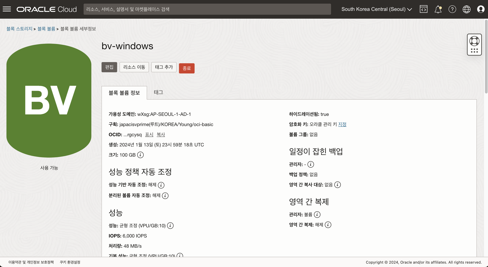
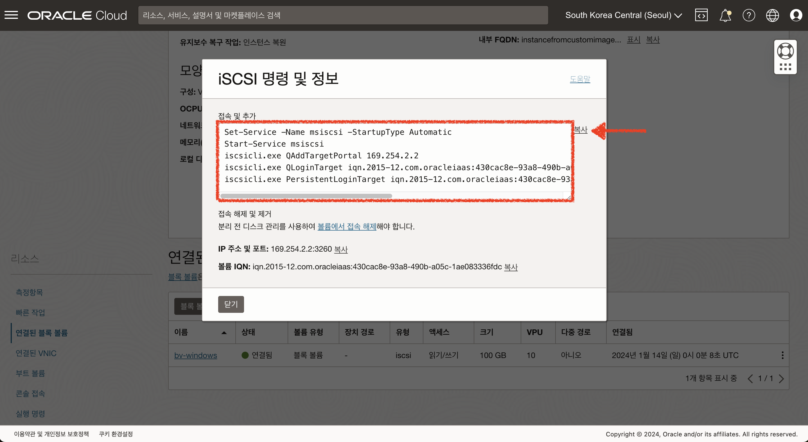
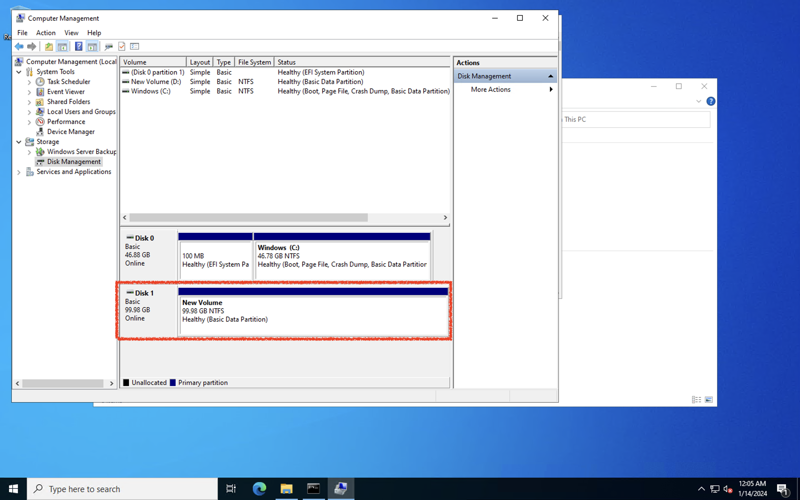

# Block Volume 생성 및 연결하기

## 소개

블록 볼륨 은 Oracle Cloud Infrastructure 컴퓨트 인스턴스에 사용할 수 스토리지입니다. 볼륨을 생성, 연결(Attach) 및 인스턴스에 탑재(Mount)한 후에는 인스턴스에서 물리적인 하드 드라이브처럼 사용할 수 있습니다. 볼륨은 한 번에 하나의 인스턴스에 연결할 수 있지만, 기존 인스턴스에서 볼륨을 분리하고 데이터를 유지한 상태에서 다른 인스턴스에 연결을 할 수 있습니다.
이 실습에서는 볼륨을 생성하고 인스턴스에 연결한 다음 해당 볼륨을 인스턴스에 연결하는 방법에 대해 학습합니다.

소요시간: 20 minutes

### 목표

- OCI 블록볼륨에 대한 이해

### 사전 준비사항

1. 실습을 위한 노트북 (Windows, MacOS)
1. Oracle Free Tier 계정

## Task 1: 블록 볼륨(Block Volume) 생성

1. 좌측 상단의 **햄버거 아이콘**을 클릭하고, **스토리지**을 선택한 후 **블록 볼륨**을 클릭합니다.
   
2. 다음과 같이 입력 및 선택합니다.
   - 이름 (Name): bv_windows
   - 구획에 생성 (Create In Compartment): oci-basic
   - 가용성 도메인 (Availability Domain): 데이터센터를 선택합니다. (서울은 1개)
   - 볼륨 크기 및 성능 (Volume Size and Performance)
     - 사용자정의 선택 (Custom)
     - 볼륨 크기(GB) (Volume Size (in GB)) : 100
     - 대상 볼륨 성능 (Target Volume Performance): VPU (Volume Performance Units)값으로 10
       - VPU에 대한 자세한 정보는 [https://docs.oracle.com/en-us/iaas/Content/Block/Concepts/blockvolumeperformance.htm](https://docs.oracle.com/en-us/iaas/Content/Block/Concepts/blockvolumeperformance.htm) 에서 확인
   - 성능 자동 조정 (Auto-tune Performance): 설정 (On)
     - 성능 자동 조정은 해당 볼륨이 분리된 상태에서는 가장 낮은 성능 옵션으로 자동 변경되어 비용이 절감됩니다. 다시 연결되면 이전에 설정된 성능 옵션으로 자동 조정됩니다.
   - 백업 정책 (Backup Policies): 선택하지 않음
     - 백업 정책을 설정하면 특정 시점에 자동으로 Object Storage에 백업이 이뤄집니다. 백업 정책 기본 Gold (가장 빈번하게 백업 발생), Silver, Bronze 정책이 제공되며, 사용자가 임의로 정의할 수 있습니다.
   - 영역 간 복제 (Cross Region Replication): 해제 (OFF)
     - 영역 간 복제는 현재 블록 볼륨을 생성하는 리전과 매핑되는 리전으로 자동 비동기 복제를 하는 기능입니다.
     - 영역 간 복제에 대한 설명과 매핑된 리전은 [https://docs.oracle.com/en-us/iaas/Content/Block/Concepts/volumereplication.htm](https://docs.oracle.com/en-us/iaas/Content/Block/Concepts/volumereplication.htm)에서 확인할 수 있습니다.
   - 암호화 (Encryption): Encrypt using Oracle-managed keys (기본 설정 유지)

마지막으로 **블록 볼륨 생성 버튼 (Create Block Volume)**을 클릭합니다.

## Task 2: 인스턴스에 블록 볼륨 연결 (Attach & Connect)

- iSCSI 방식으로 볼륨을 인스턴스에 연결해보도록 하겠습니다. 메뉴에서 **컴퓨트 (Compute) > 인스턴스 (Instances)**를 차례로 선택한 후에 앞서 사용자정의 이미지를 이용하여 생성한 인스턴스를 선택합니다.

- 인스턴스 상세 페이지에서 아래와 같이 좌측 **리소스 (Resources)** 메뉴에서 **연결된 블록 볼륨 (Attached block volumes)**을 선택합니다.

- **블록 볼륨 연결 (Attach block volume)**버튼을 클릭하고 다음과 같이 입력/선택 합니다.

* **블록 볼륨 선택 (Select volume):** 앞서 생성한 블록 볼륨을 선택합니다.
* **장치 경로 (Device path):** 목록중에서 하나를 선택합니다. (/dev/oracleoci/oraclevdb)
* **연결 유형 (Attachment type):** ISCSI
* **액세스 (Access):** 읽기/쓰기(Read/write)

- 연결을 클릭합니다.
- 이제 iSCSI 연결을 구성할 수 있습니다. 우선 **연결된 블록 볼륨** 메뉴에서 연결된 블록 볼륨의 우측 아이콘을 선택한 후 **iSCSI 명령 및 정보 (iSCSI commands and inforamtion)**를 선택합니다.
  

- 다음과 같이 **iSCSI 명령 및 정보** 대화창에서 접속 (Connect)에 있는 명령어를 복사합니다.

- 윈도우 서버에 원격으로 접속 후 command 에서 복사한 명령어를 실행합니다.
  

## Task 3: Windows Server 에서 디스크 작업

앞 단계에서 명령어를 통해 블록 볼륨과 연결되었지만, 아직 내 컴퓨터에서 추가된 디스크를 확인할 수 없습니다.
윈도우 서버의 "컴퓨터 관리" 기능을 통해 추가된 디스크를 드라이브로 추가해보도록 하겠습니다.

1. 실행창에 Compute Management 를 입력하여 검색되는 APP을 실행합니다.
   
2. Storage - Disk Management 메뉴를 클릭하면 디스크를 초기화 하라는 팝업을 확인할 수 있습니다. (확인)
   
3. 하단에 추가되어있는 Unknown Disk1에서 마우스 오른쪽 버튼을 클릭하여 "New Simple Volume" 메뉴를 클릭합니다.
   
4. 새로운 볼륨을 추가하기 위한 마법사가 실행되며, 기본값으로 Next, Finish 하여 볼륨을 추가합니다.
   
   
   
   
   
   
5. 내 컴퓨터에서 추가된 볼륨을 확인할 수 있습니다.
   

[다음 랩으로 이동](#next)
