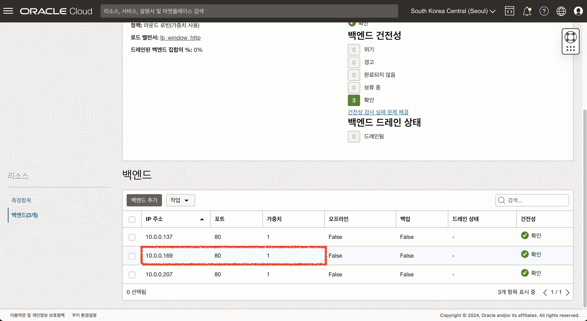
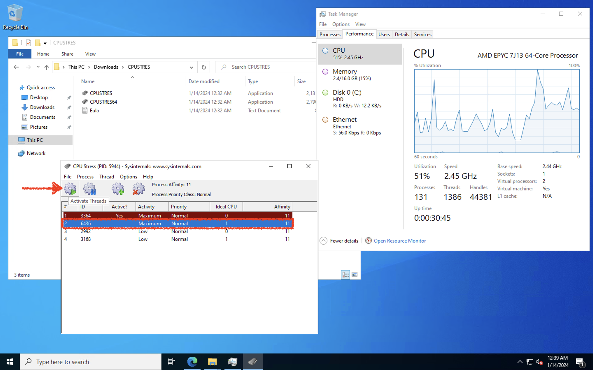

# Instance Pool 구성 및 오토스케일 설정하기

## 소개

OCI의 컴퓨트 리소스를 관리할 수 있는 서비스인 인스턴스 구성과 인스턴스 풀에 대해 실습을 통해 알아봅니다.
이 과정을 완료하면 인스턴스 구성, 인스턴스 풀을 이용하여 자동 스케일 조정 설정하는 방법을 학습할 수 있습니다.

소요시간: 30 minutes

### 목표

- OCI 인스턴스 구성, 인스턴스 풀 생성하기
- OCI 인스턴스 풀을 이용하여 자동 스케일 조정 설정 및 테스트하기

### 사전 준비사항

1. 실습을 위한 노트북 (Windows, MacOS)
1. Oracle Free Tier 계정

## Task 1: Instance Configuration 및 Instance Pool 생성

1. 사용자정의 이미지로 생성한 인스턴스 세부정보 화면에서 **"작업 더 보기"** 버튼을 클릭하여 **인스턴스 구성 생성** 메뉴를 클릭합니다.
   
2. 아래와 같이 정보 입력 후 **"인스턴스 구성 생성"** 버튼을 클릭하여 구성을 생성합니다.
   - 구획에 생성 : **oci-basic**
   - 이름 : instance-config-window-custom
     
3. 생성된 인스턴스 구성 화면에서 **"인스턴스 풀 생성"** 버튼을 클릭하여 인스턴스 풀을 생성합니다.
   
4. 다음과 같이 입력 및 선택 합니다.
   - 이름 : instance-pool-windows
   - 구획에 생성 : **oci-basic**
   - [oci-basic 구획]의 인스턴스 구성 : **instance-config-window-custom**
   - 인스턴스 수 : **1**
     
5. 풀 배치 구성 단계에서 아래와 같이 입력 및 선택 후 "다음" 버튼을 클릭합니다.
   - 가용성 도메인 : **기본값**
   - 결함 도메인 : **기본값(선택안함)**
   - 기본 VNIC (VCN 선택) : **vcn-oci-basic**
   - 기본 VNIC (Subnet 선택) : **공용 서브넷-vcn-oci-basic**
     
6. 로드 밸런서 연결을 선택하여 <mark>Lab 4</mark>에서 생성한 로드 밸런서를 연결합니다. **Lab 4** 에서 네트워크 로드밸런서를 생성한 경우 "네트워크 로드 밸런서" 유형을 선택합니다.
   - **(애플리케이션 로드 밸런서 연결) 로드 밸런서 유형**
     - 로드 밸런서 유형 : **로드 밸런서**
     - [oci-basic 구획]의 로드 밸런서 : **lb_window_http**
     - 백엔드 집합 : **bs_lb_2022-0906-1452** / 각자 생성되어 있는 백엔드 집합을 선택합니다.
     - 포트 : **80**
     - VNIC : **기본 VNIC**
       
7. 입력 및 선택한 정보 확인 후 "생성" 버튼을 클릭하여 인스턴스 풀을 생성합니다.
   
8. 인스턴스 풀이 프로비전 완료되면 자동으로 동일한 구성의 인스턴스가 함께 프로비전 됩니다.
   
   
   
9. 프로비전 된 인스턴스가 로드 밸런서의 백엔드 집합에 자동으로 추가됩니다.
   

## Task 2: Auto Scaling 구성 생성

1. 인스턴스 풀 세부정보 화면에서 **"작업 더 보기"** 버튼을 클릭하여 **자동 스케일링 구성 생성** 메뉴를 클릭합니다.
   
2. 아래와 같이 입력 및 선택 합니다.
   - 이름 : **기본값**
   - 구획에 생성 : **oci-basic**
     
3. 아래와 같이 선택 합니다.
   - **측정항목 기준 자동 스케일링** 선택
   - 자동 스케일링 정책 구성
     - 자동 스케일링 정책 이름 : **autoscaling-policy-20240114-0928** / 자동 생성된 이름 그대로 사용
     - 쿨타임(초) : **300 (최소 값 300초)**
       
4. 아래와 같이 입력 및 선택 합니다.

   - 성능 측정항목 : **CPU 활용률**
     - 스케일 아웃 규칙
       - 연산자 : 보다 큼(>)
       - 임계값 백분율 : 80
       - 추가할 인스턴스 수 : 1
     - 스케일 인 규칙
       - 연산자 : 보다 작음(<)
       - 임계값 백분율 : 20
       - 제거할 인스턴스 수 : 1
     - 스케일링 제한
       - 최소 인스턴스 수 : 1
       - 최대 인스턴스 수 : 3
       - 초기 인스턴스 수 : 1

   

5. 입력한 내용을 검토 후 이상이 없을 시 **"생성"** 버튼을 클릭하여 자동 스케일링 구성을 생성합니다.
   
   

## Task 3: Auto Scaling 테스트하기

1. 인스턴스 풀에서 자동으로 프로비전된 서버에 부하를 주기 위해 테스트에 필요한 프로그램을 다운로드 및 설치합니다.

   - [https://download.sysinternals.com/files/CPUSTRES.zip](https://download.sysinternals.com/files/CPUSTRES.zip)

2. 압축 해제 및 프로그램을 실행합니다.
   - _CPUSTRES64_
3. 인스턴스 풀에서 자동으로 프로비전된 서버에 접속하여 아래와 같이 조작하여 CPU 부하를 설정합니다.
   - 1번째 쓰레드에 Activity Level을 Maximum (100%)으로 설정합니다.
     
   - 2번째 쓰레드에 Activity Level을 Maximum (100%)으로 설정합니다.
     
   - 2번째 쓰레드를 활성화 합니다.
     
   - 명령어 실행 후 CPU 활용률
     
4. Auto Scaling은 최소 300초의 간격으로 작업이 수행되기 때문에 최대 5분간 부하를 주며 Auto Scaling 작업이 수행되기 기다립니다.
   
5. Auto Scaling 작업이 수행되면 자동으로 설정한 수 만큼 인스턴스가 추가 됩니다.
   
6. 로드 밸런서에도 자동으로 추가된 인스턴스가 백엔드 집합에 연결되는 것을 확인할 수 있습니다.
   
7. Scale-out 테스트가 완료되면 다시 Scale-in을 위해 부하 테스트를 중지합니다.
   - 1,2번째 쓰레드 비활성화 (Deactivate)
     
8. 인스턴스 풀의 CPU 활용률이 20 미만으로 떨어져서 스케일이 다시 조정됩니다. (2 -> 1)
   
   
   
9. 스케일 조정되어 다시 1개로 조정된 것을 확인할 수 있습니다.
   

[다음 랩으로 이동](#next)
