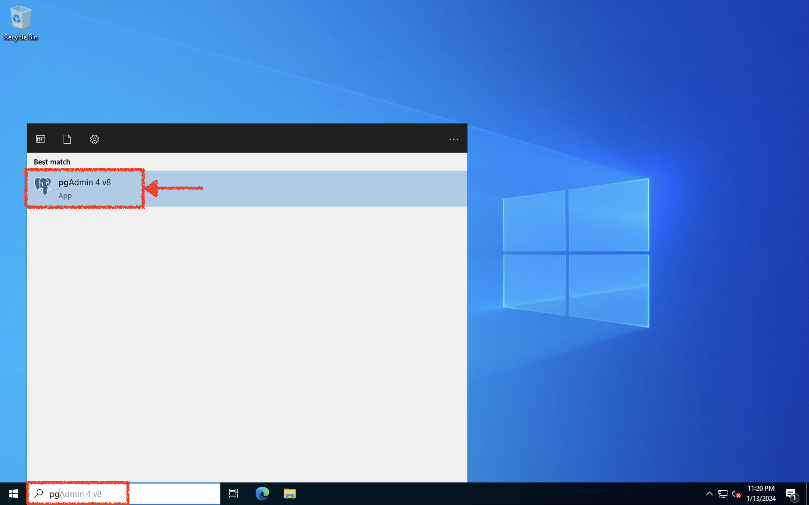
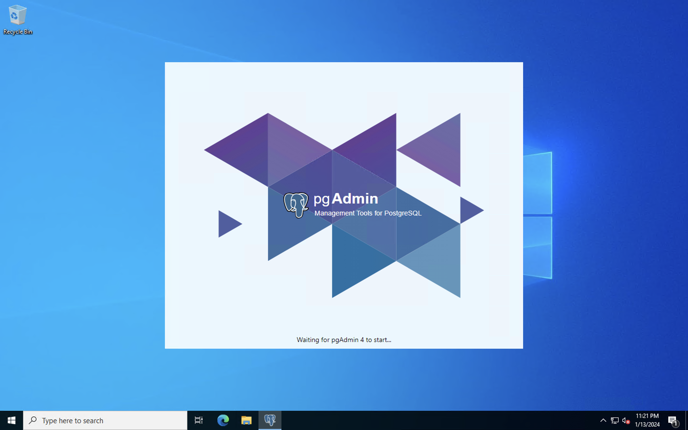
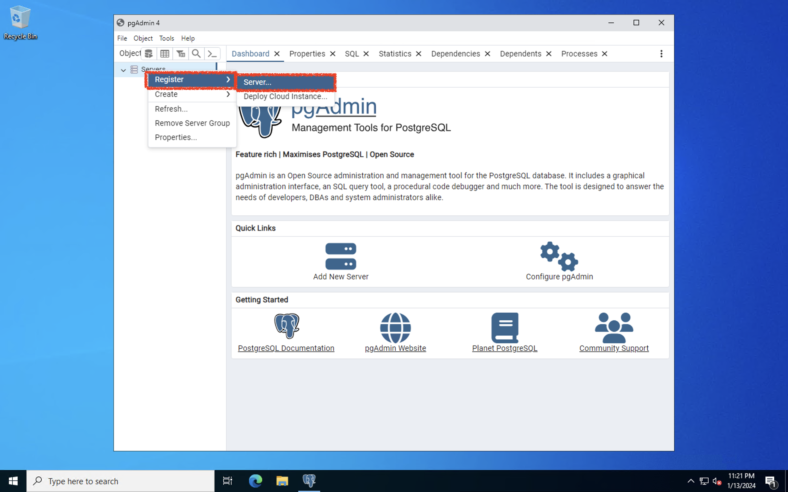
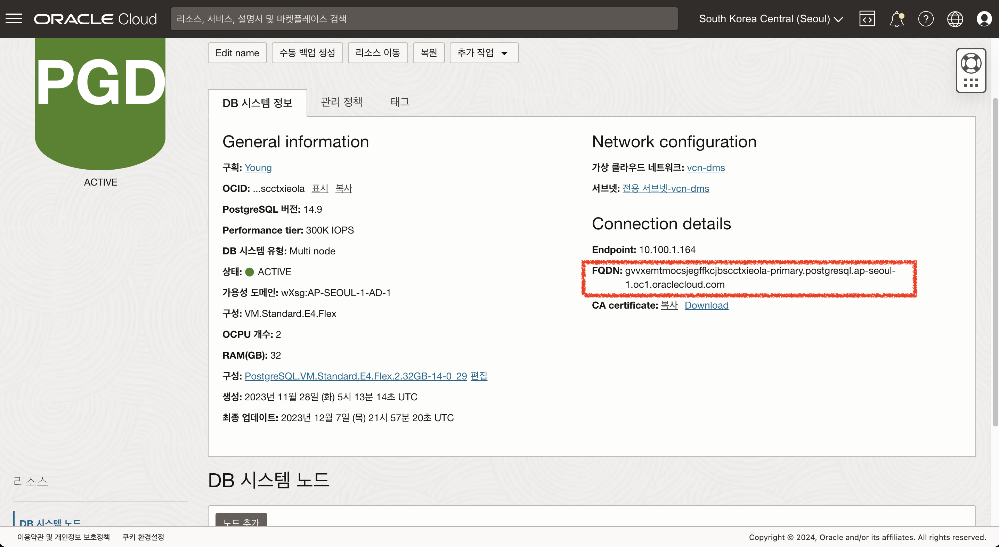
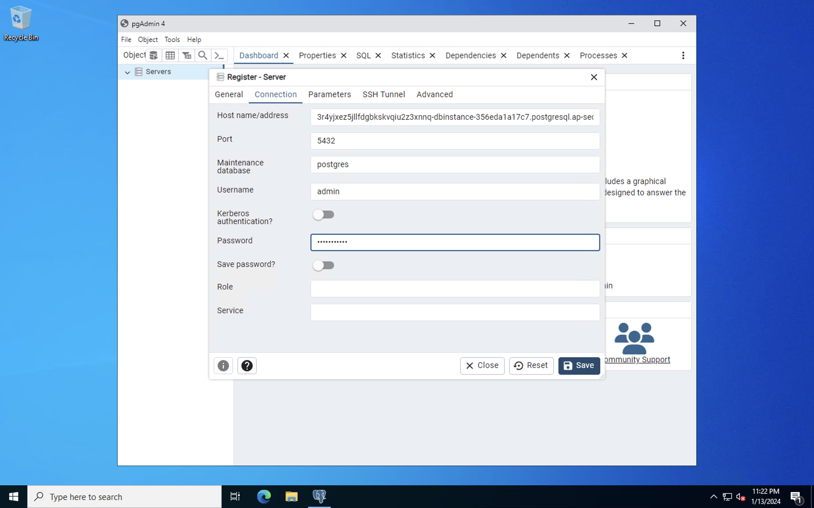
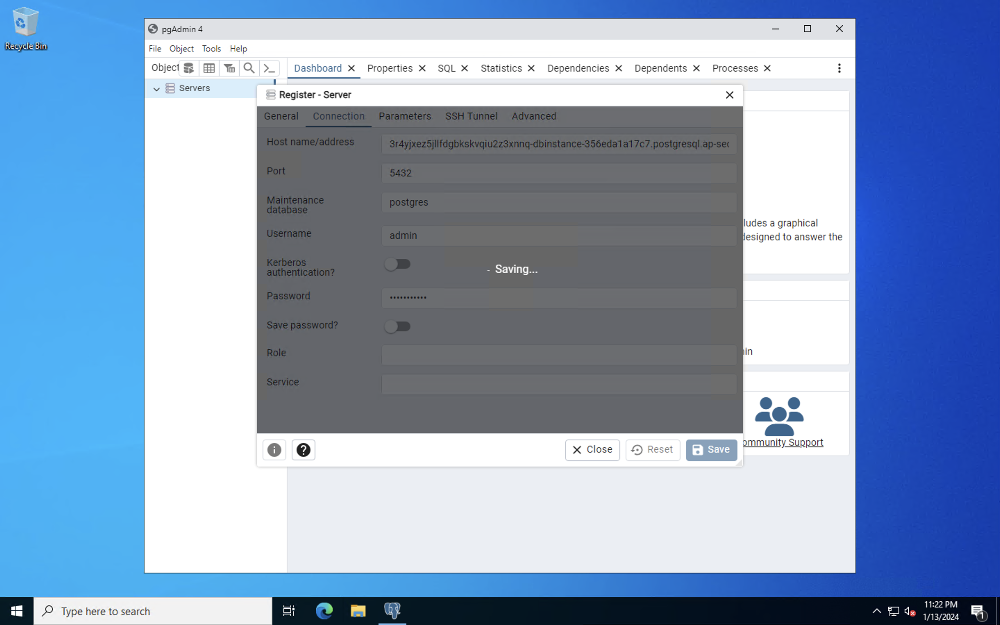
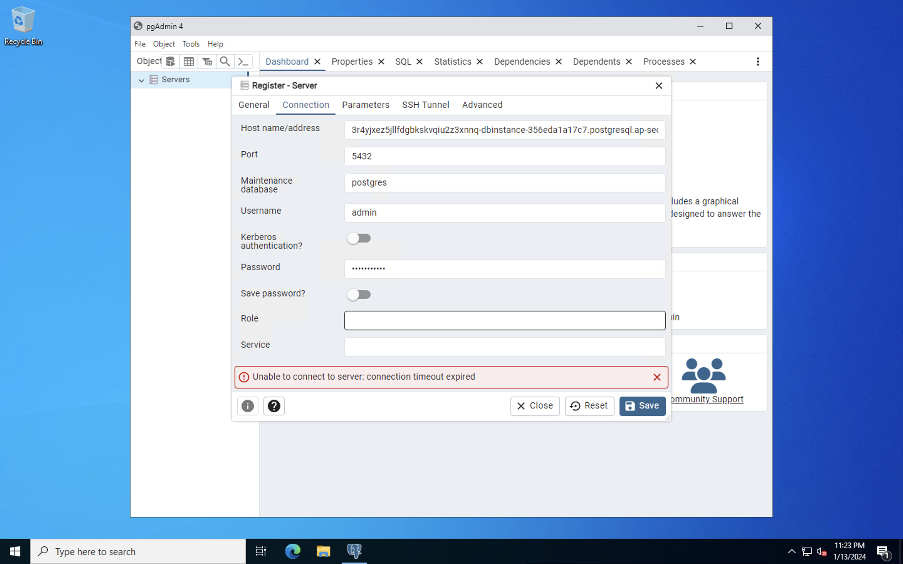
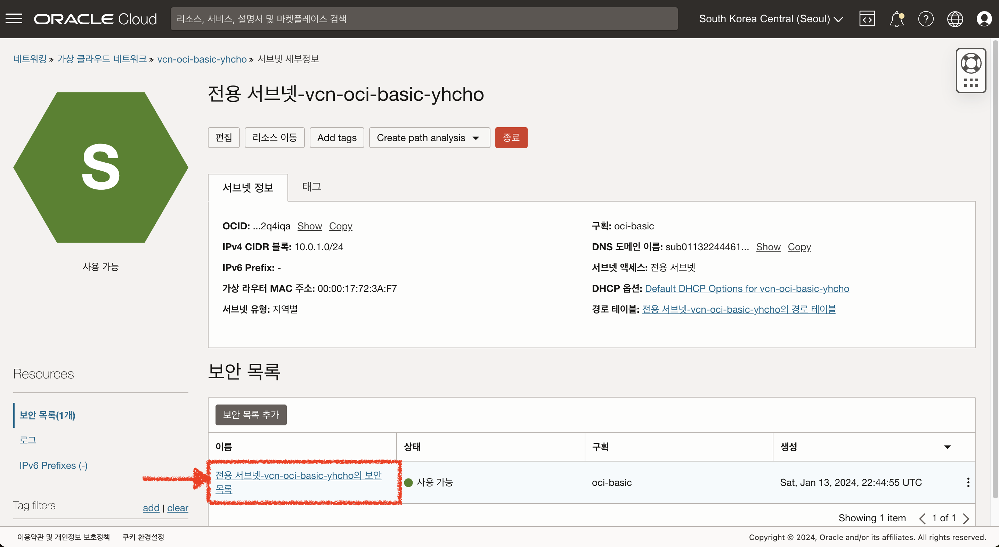
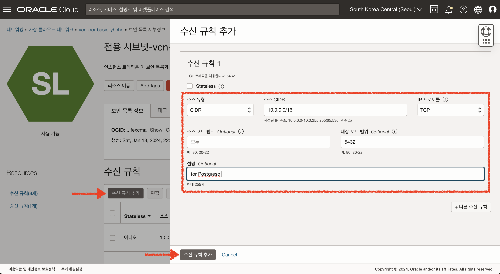
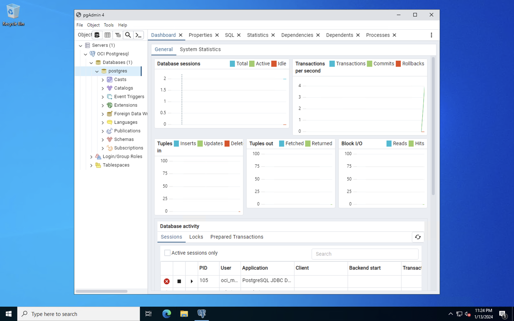

# OCI Postgresql Database Service 접속 하기 (Optional)

## 소개

PostgreSQL을 완전 관리형 서비스로 사용할 수 있는 OCI의 PostgreSQL Database 시스템에 접속하는 방법에 대해 학습합니다.

소요시간: 10 minutes

### 목표

- 윈도우 서버에서 OCI PostgreSQL 서비스 접속 하기

### 사전 준비사항

1. 실습을 위한 노트북 (Windows, MacOS)
2. Oracle Free Tier 계정

## Task 1: 윈도우 서버에 설치된 pgAdmin 실행

1. 윈도우 서버에서 pgAdmin을 검색하여 검색된 프로그램을 실행합니다.
   
2. 실행된 pgAdmin 에서 새로운 서버를 등록하기 위해 아래와 같이 실행합니다.
   - Servers에서 마우스 오른쪽 버튼 클릭
   - Register 메뉴 하위에 Server... 메뉴를 클릭
     
3. "General" 탭에서 Server의 이름을 입력합니다.
   
4. "Connection" 탭에서 연결 정보를 아래와 같이 입력합니다.
   - Host name/address : PostgreSQL 메뉴에서 확인한 FQDN을 입력
     
   - Port : **5432**
   - Username : **admin**
   - Password : 만약 실습에서 권장한 비밀번호를 사용했다면, `WelCome12##` 아니면 직접 설정한 비밀번호를 입력.
     
5. Save 버튼 클릭
   
6. 오류 발생
   

## Task 2: 클라우드 방화벽 설정하기 (보안목록 - Security List)

현재 윈도우 서버와 OCI PostgreSQL은 동일한 VCN에 생성 되었지만 각각 다른 서브넷에 배포되었습니다.
이렇게 서브넷이 다른경우 보안목록에 규칙을 추가해야만 정상적으로 통신이 가능합니다.
이번 케이스는 내부 통신이기 때문에 보안목록을 이용하여 규칙을 추가하도록 하겠습니다.

1. PostgreSQL이 생성된 전용서브넷의 세부 정보 화면으로 이동합니다.
2. Subnet 상세보기 화면에서 하단 Security Lists 목록중 **전용 서브넷-vcn-oci-basic의 보안목록**을 클릭 합니다.
   
3. **수신 규칙 추가** 버튼을 클릭 합니다.
4. 다음과 같이 입력:
   - Source Type : **CIDR** (기본값)
   - Source CIDR : Enter **10.0.0.0/16**
   - IP Protocol : **TCP** (기본값)
   - Destination Port Range : **5432**
   - Description : **for Postgresql**
   - **수신 규칙 추가** 클릭
     
5. 다시 pgAdmin에서 서버 정보 저장 시 정상적으로 서버에 접속되며 대시보드도 확인 할 수 있습니다.
   

[다음 랩으로 이동](#next)
