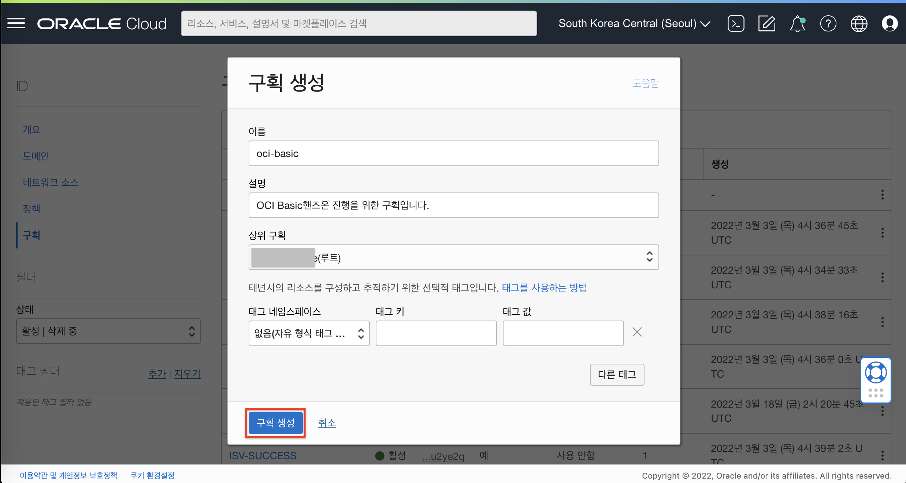
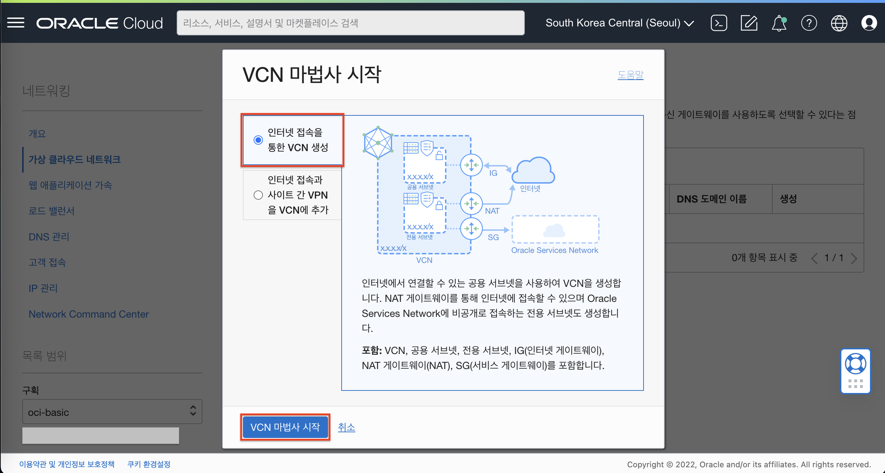
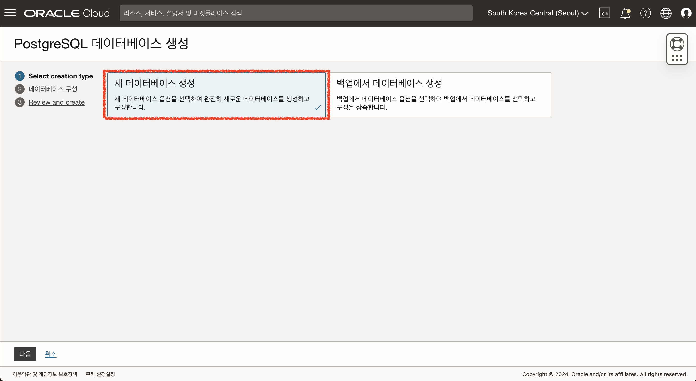

# 실습 환경 준비

## 소개

실습을 위한 Oracle 클라우드 환경을 구성합니다. 우선 OCI 내의 특정 구획(Comartment)이 생성될 것이며, 해당 구획내에 가상 클라우드 네트워크 (VCN)가 구성됩니다. 여기서 구획과 VCN은 자체 환경을 격리하고 보호하는 역할을 합니다.
 그리고 선택적으로 Oracle 에서 관리하는 PaaS 형태의 Database 서비스인 OCI PostgreSQL 인스턴스를 생성합니다.

소요시간: 20 minutes

### 목표

- Oracle Cloud Infrastructure (OCI) Basic Service (Compute) 실습 환경 구성.

### 사전 준비사항

1. 실습을 위한 노트북 (Windows, MacOS)
1. Oracle Free Tier 계정

## Task 1: OCI Console 로그인

OCI 콘솔에 로그인합니다.

1. 로그인하면 다음과 같은 홈 화면을 볼 수 있습니다. 좌측 상단의 햄버거 모양의 아이콘을 클릭하면 OCI의 모든 메뉴를 확인할 수 있습니다.
   

1. Dashboard를 클릭하면 기본적인 사용현황을 살펴볼 수 있습니다.
   

## Task 2: OCI 인프라스트럭처 기본 설정

> **Note**: 화면 언어는 한국어로 설정하고 진행합니다. 언어 변경은 우측 상단의 지구본 모양 **Language** 아이콘을 선택하고 변경할 수 있습니다.

### Compartment 생성

1. 좌측 상단의 **햄버거 아이콘**을 클릭하고, **ID & 보안(Identity & Security)**을 선택한 후 **구획(Compartments)**을 클릭합니다.

   

2. 이동한 화면에서 "구획 생성" 버튼을 클릭합니다.
   
3. 다음과 같이 입력하여 실습 구획을 생성합니다.

   - Name: Enter **oci-basic-[이니셜]** / 예시) oci-basic-yhcho
   - Description: **OCI Basic 핸즈온 진행을 위한 구획입니다.**
   - Parent Compartment: **루트 구획 또는 특정 구획 선택**
   - **구획 생성(Create Compartment)** 클릭

   

### Virtual Cloud Network 생성

1. 좌측 상단의 **햄버거 아이콘**을 클릭하고, **네트워킹(Networking)**을 선택한 후 **가상 클라우드 네트워크(Virtual Cloud Networks)**를 클릭합니다.

   

1. 화면 좌측 하단의 구획(Compartment)에서 위에서 생성한 **oci-basic**을 선택합니다.

   

1. **VCN 마법사 시작(Start VCN Wizard)**을 클릭합니다.

1. **인터넷 접속을 통한 VCN 생성(Create VCN with Internet Connectivity)**을 선택 후 **VCN 마법사 시작(Start VCN Wizard)**을 클릭합니다.

   

1. 다음과 같이 입력:

   - VCN Name: Enter **vcn-oci-basic-[이니셜]** / 예시) vcn-oci-basic-yhcho
   - VCN CIDR Block: **10.0.0.0/16** (기본값)
   - Public Subnet CIDR Block: **10.0.0.0/24** (기본값)
   - Private Subnet CIDR Block: **10.0.1.0/24** (기본값)
   - **Next** 클릭

   

1. 입력된 정보를 확인한 후 하단의 **Create**를 클릭하여 VCN을 생성합니다

   
   

## Task 3: OCI Postgresql Database Service 준비하기 (옵션)

1. 좌측 상단의 **햄버거 아이콘**을 클릭하고, **데이터베이스**를 선택한 후 **PostgreSQL** , **DB 시스템**을 클릭합니다.
   
2. **"PostgreSQL 데이터베이스 생성"** 버튼을 클릭합니다.
   
3. 다음 화면에서 **"새 데이터베이스 생성"** 버튼을 클릭합니다.
   
4. 데이터베이스 구성 화면에서 아래와 같이 입력 및 선택 합니다.
   - Database system name : **postgresql_demo**
   - PostgreSQL 버전 : **14**
   - 노드 수 : **1**
     
   - Performance tier : **300K IOPS** 기본값
   - OCPU 개수 : **2** 선택 후 하단 구성 체크박스 활성화
     
   - 가상 클라우드 네트워크 : 기본 인프라 설정 시 생성한 VCN을 지정합니다.
   - 서브넷 : VCN에서 Private 서브넷을 지정합니다.
     
   - 관리자 인증서 생성 `(설정한 관리자 정보로 로그인해야 하기 때문에 별도로 정보 저장해야 함)`
     - Password options : Input password
     - 사용자 이름 : admin
     - 비밀번호 & 비밀번호 확인 : 각자 기억하기 쉬운 비밀번호를 지정합니다. / 실습에서는 **WelCome12##** 로 지정하여 진행하겠습니다.
       
       
5. 입력 내용 확인 및 데이터베이스 생성
   

[다음 랩으로 이동](#next)
