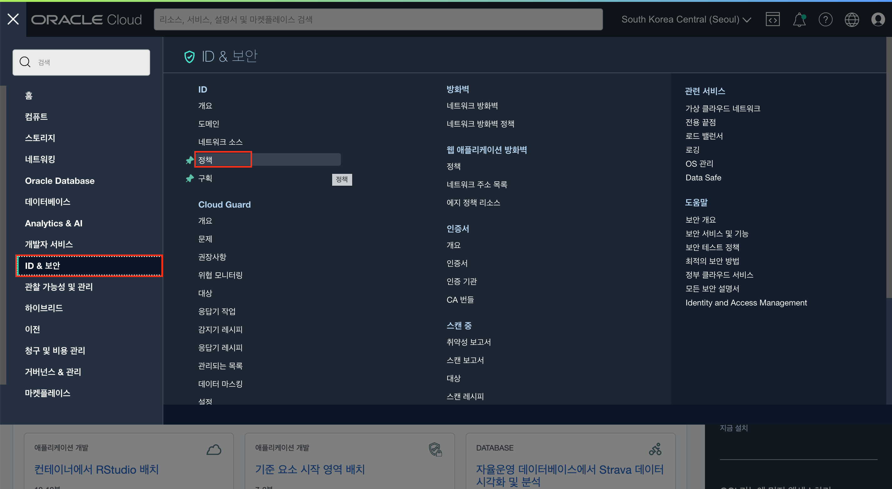
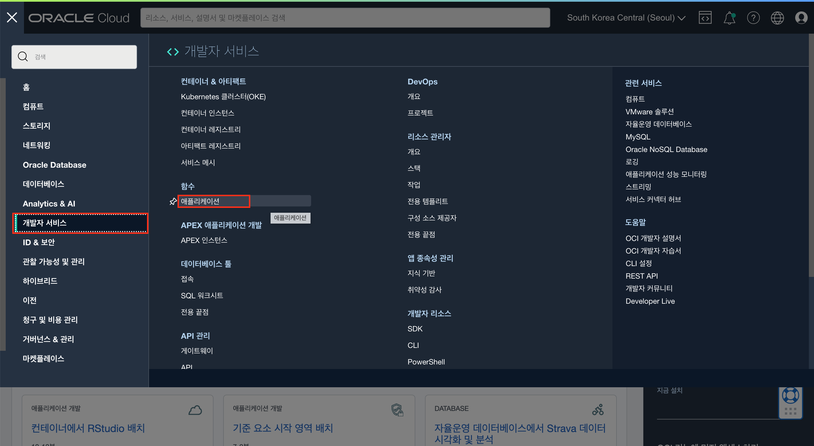

# 실습 환경 준비

## 소개

Oracle Functions는 엔터프라이즈급 Oracle Cloud Infrastructure와 Fn Project 오픈 소스 엔진을 기반으로 하는 Functions-as-a-Service 플랫폼입니다.<br> 
비즈니스 요구사항을 충족하기 위해 코드 작성에 집중하고 싶을 때는 Oracle Functions을 사용합니다. (그냥 Function이라고 부르기도 합니다.) <br>
Oracle Functions는 애플리케이션의 고가용성, 확장성, 보안 및 모니터링을 보장하므로 기본 인프라에 대해 걱정할 필요가 없습니다. <br>
Oracle Functions를 사용하면 코드를 배포하고 이벤트에 대해 직접 호출하거나 트리거할 수 있으며 실행 중에 사용된 리소스에 대해서만 비용이 청구됩니다.

소요시간: 60 minutes

### 목표

- Oracle Functions 서비스를 통해 간단한 샘플 Application 실행

### 사전 준비사항

1. 실습을 위한 노트북 (Windows, MacOS)
1. 기본 OCI 리소스가 이미 생성되어 있어야함.(구획, VCN, Compute Instance 등)

## Task 1: Compute Instance에 OCI CLI 설치 및 설정하기
1. 먼저 **Lab 1** 에서 생성한 Compute 인스턴스에 접속합니다.
2. 인스턴스에 접속이 되면 아래 명령어를 입력하여 OCI CLI 설치를 진행합니다. 진행도중 몇 번의 설정을 요구하는데 아래와 같이 입력
    ````shell
    <copy>
    bash -c "$(curl –L https://raw.githubusercontent.com/oracle/oci-cli/master/scripts/install/install.sh)"
    </copy>
    ````
3. 명령어를 입력하면 몇 가지 설정을 물어봅니다. 각 설정은 아래 예시를 참고하여 진행합니다.
   - In what directory would you like to place the install? (leave blank to use '/home/opc/lib/oracle-cli'): **_기본값, 아무것도 입력하지 않고 Enter 입력_**
   - In what directory would you like to place the 'oci' executable? (leave blank to use '/home/opc/bin'): **_기본값, 아무것도 입력하지 않고 Enter 입력_**
   - In what directory would you like to place the OCI scripts? (leave blank to use '/home/opc/bin/oci-cli-scripts'): **_기본값, 아무것도 입력하지 않고 Enter 입력_**
   - Currently supported optional packages are: ['db (will install cx\_Oracle)'] What optional CLI packages would you like to be installed (comma separated names; press enter if you don't need any optional packages)?: **_기본값, 아무것도 입력하지 않고 Enter 입력_**
   - Modify profile to update your $PATH and enable shell/tab completion now? (Y/n): <mark>**Y** 를 입력하여 $PATH 설정 적용</mark> 
   - Enter a path to an rc file to update (file will be created if it does not exist) (leave blank to use '/home/opc/.bashrc'): **_기본값, 아무것도 입력하지 않고 Enter 입력_**
4. 설치가 완료되면 정상적으로 설치가 되었는지 확입합니다.
   - _NOTE: 버전은 최소 3.22.1 이상이어야 합니다 (2023-01-14 기준)_
    ````shell
    <copy>
    oci -v
    </copy>
    ````
5. 설치가 완료되었으면, OCI Config 를 설정하기 위한 몇 가지 정보를 확인합니다.
   - 먼저 사용자 프로필 화면으로 이동하여 사용자의 User OCID를 복사하여 별도로 보관합니다. (메모장 등등)
     
   - 테넌시 세부정보 화면으로 이동하여 Tenancy OCID를 복사하여 별도로 보관합니다. (메모장 등등)
     
6. 정보를 모두 수집했다면 아래 명령어를 입력하여 OCI 설정을 진행합니다.
      ````shell
      <copy>
      oci setup config
      </copy>
      ````
7. 명령어를 입력하면 몇 가지 설정을 물어봅니다. 각 설정은 아래 예시를 참고하여 진행합니다.
   - Enter a location for your config [/home/opc/.oci/config]: **_기본값, 아무것도 입력하지 않고 Enter 입력_**
   - Enter a user OCID: **_보관해 두었던 사용자 OCID를 입력합니다._**
   - Enter a tenancy OCID: **_보관해 두었던 테넌시 OCID를 입력합니다._**
   - Enter a region by index or name(e.g.
     1: af-johannesburg-1, 2: ap-chiyoda-1, 3: ap-chuncheon-1, 4: ap-dcc-canberra-1, 5: ap-hyderabad-1,
     6: ap-ibaraki-1, 7: ap-melbourne-1, 8: ap-mumbai-1, 9: ap-osaka-1, 10: ap-seoul-1,
     11: ap-singapore-1, 12: ap-sydney-1, 13: ap-tokyo-1, 14: ca-montreal-1, 15: ca-toronto-1,
     16: eu-amsterdam-1, 17: eu-dcc-milan-1, 18: eu-frankfurt-1, 19: eu-madrid-1, 20: eu-marseille-1,
     21: eu-milan-1, 22: eu-paris-1, 23: eu-stockholm-1, 24: eu-zurich-1, 25: il-jerusalem-1,
     26: me-abudhabi-1, 27: me-dcc-muscat-1, 28: me-dubai-1, 29: me-jeddah-1, 30: mx-queretaro-1,
     31: sa-santiago-1, 32: sa-saopaulo-1, 33: sa-vinhedo-1, 34: uk-cardiff-1, 35: uk-gov-cardiff-1,
     36: uk-gov-london-1, 37: uk-london-1, 38: us-ashburn-1, 39: us-chicago-1, 40: us-gov-ashburn-1,
     41: us-gov-chicago-1, 42: us-gov-phoenix-1, 43: us-langley-1, 44: us-luke-1, 45: us-phoenix-1,
     46: us-sanjose-1): **_현재 설정을 진행하고자 하는 리전의 번호를 입력합니다. 실습에서는 서울 리전에서 진행하기 때문에 "10" 을 입력합니다._**
   - Do you want to generate a new API Signing RSA key pair? (If you decline you will be asked to supply the path to an existing key.) [Y/n]: **_"Y" 를 입력하여 새로운 키 생성_**
   - Enter a directory for your keys to be created [/home/opc/.oci]: **_기본값, 아무것도 입력하지 않고 Enter 입력_**
   - Enter a name for your key [oci\_api\_key]: **_기본값, 아무것도 입력하지 않고 Enter 입력_**
   - Enter a passphrase for your private key (empty for no passphrase): **_기본값, 아무것도 입력하지 않고 Enter 입력_**
8. 설정이 완료되면 아래 명령어를 통해 Public Key의 내용을 확인합니다.
      ````shell
      <copy>
      cat ~/.oci/oci_api_key_public.pem
      </copy>
      ````
9. 확인한 내용을 아래 메뉴로 이동하여 업로드 합니다.
   - "내 프로파일" 메뉴를 클릭 후 좌측 하단의 "API 키" 메뉴를 클릭하여 "API 키 추가" 버튼을 클릭합니다.
     
   - "공용 키 붙여넣기"를 선택 후 복사한 공용키 내용을 붙여넣고 "추가" 버튼을 클릭합니다.
     
10. 키 등록이 완료되면 아래 명령어를 통해 OCI CLI 설정이 잘되었는지 확인합니다.
      ````shell
      <copy>
      oci os ns get
      </copy>
      ````

## Task 2: Docker 설치하기 
> Note : 아래 Docker 설치는 Oracle Linux 8기준으로 작성되었습니다. 다른 버전의 OS는 정상적으로 설치가 되지 않을 수 있습니다.

1. Docker를 설치하기 위해 먼저 필요한 레파지토리를 활성화 합니다.
      ````shell
      <copy>
      sudo dnf install python3-librepo -y
      sudo yum-config-manager --add-repo https://download.docker.com/linux/centos/docker-ce.repo

      </copy>
      ````
2. 레파지토리를 활성화 한 다음 Docker 설치 명령어를 실행합니다.
      ````shell
      <copy>
      sudo yum install -y docker-ce docker-ce-cli containerd.io docker-compose-plugin
      </copy>
      ````
3. 설치가 완료되면 서비스를 연결하고 Docker 서비스를 시작합니다.
      ````shell
      <copy>
      sudo systemctl enable docker.service
      sudo systemctl start docker.service
      </copy>
      ````
4. sudo 명령어 없이 opc 사용자로 docker 명령어를 실행하기 위해서 아래 명령어를 실행합니다.
      ````shell
      <copy>
      sudo usermod -aG docker opc
      </copy>
      ````
5. 위 명령어를 실행 후 VM Instance에 대한 접속을 종료 후 다시한번 로그인 하여 변경된 내용을 적용합니다.
      ````shell
      <copy>
      exit
      
      ssh -i SSH-KEY-NAME opc@PUBLIC-IP-OF-COMPUTE-1
      </copy>
      ```` 

## Task 3: Function Application 생성하기
1. 좌측 상단의 **햄버거 아이콘**을 클릭하고, **ID & 보안(Identity & Security)**을 선택한 후 **ID(Identity)** , **정책(Policy)**를 클릭합니다.
   
2. VCN이 생성되어있는 구획인지 확인하고 **"정책 생성(Create Policy)"** 버튼을 클릭합니다.
   
3. 아래와 같이 입력하여 정책을 생성합니다.
   - Name : **FunctionApplicationPolicies**
   - Description : **allow function to work**
   - 수동편집기 옵션 활성화
      ```shell
      <copy>
      allow service FAAS to use virtual-network-family in tenancy
      allow service FAAS to read repos in tenancy
      </copy>
      ```
   
4. 좌측 상단의 **햄버거 아이콘**을 클릭하고, **개발자 서비스(Developer Services)**를 선택한 후 **함수(Function)** , **애플리케이션(Application)**를 클릭합니다.
   
5. "애플리케이션 생성" 버튼을 클릭해서 아래와 같이 선택 및 입력하여 애플리케이션을 생성합니다.
   - 이름 : **WorkshopFunctionApplication**
   - _**[구획]**_의 VCN : VCN이 생성된 구획을 선택하고 실습 VCN을 선택합니다.
   - _**[구획]**_의 서브넷 : 선택한 VCN에서 **전용 서브넷**을 선택합니다.
   - 생성 버튼을 클릭합니다.
   
6. 생성 후 Getting Started 섹션을 클릭하고 아래로 스크롤하면 초기 설정을 위한 명령어를 확인할 수 있습니다.
   

## Task 4: Function 환경 설정
1. OCI CLI 설정 및 Docker를 설치했던 VM Instance에 접속합니다.
      ````shell
      <copy>
      ssh -i SSH-KEY-NAME opc@PUBLIC-IP-OF-COMPUTE-1
      </copy>
      ````
2. OCI Functions의 애플리케이션 설정을 위해 아래 명령어를 실행하여 Fn CLI를 설치합니다.
      ````shell
      <copy>
      curl -LSs https://raw.githubusercontent.com/fnproject/cli/master/install | sh
      </copy>
      ````
3. Oracle Function 콘솔 화면에서 아래 단계에서 진행할 각종 명령어 예시를 확인할 수 있습니다.
   
4. OCI의 Function에서 사용할 Context를 생성합니다. Context 이름은 직접 지정할 수 있습니다. 이번 실습에서는 **_test-fn_**으로 진행하겠습니다.
      ````shell
      <copy>
      fn create context CONTEXT-NAME --provider oracle
   
      fn create context test-fn --provider oracle
      </copy>
      ````
5. Context가 생성되면 생성한 Context를 사용하기 위한 명령어를 실행합니다.
      ````shell
      <copy>
      fn use context CONTEXT-NAME
   
      fn use context test-fn
      </copy>
      ````
6. Context에서 사용할 api-url을 OCI의 Functions의 End-point로 업데이트 합니다.
      ````shell
      <copy>
      fn update context api-url https://functions.ap-seoul-1.oraclecloud.com
      </copy>
      ````
7. 생성한 Context를 DEFAULT Context로 지정합니다.
      ````shell
      <copy>
      fn update context oracle.profile DEFAULT
      </copy>
      ````
8. OCI 콘솔의 **시작하기(Getting Started)**에 있는 명령어 중 compartment-id 설정 명령어를 복사하여 VM Instance에서 실행합니다.
      ````shell
      <copy>
      fn update context oracle.compartment-id ocid1.compartment.oc1..aaaaaaaauuux~~~~~~~~~~~
      </copy>
      ````
9. 함수가 배포될 registry prefix 정보를 업데이트 합니다. prefix는 내 함수 이미지가 다른 사람의 함수 이미지와 구별되도록 고유한 저장소 이름 접두어를 제공합니다. 예를 들어, 'jdoe'를 접두어로 사용하면 'hello' 함수 이미지에 대한 이미지 경로는 '<region-key>.ocir.io/<tenancy-namespace>/jdoe/hello:0.0.1'입니다.
   - registry정보를 OCI 컨테이너 레지스트리로 지정하게 되면 생성된 이미지는 **컨테이너 레지스트리**에 저장됩니다.
   - 테넌시 내부에서 각 레파지토리의 이름은 고유해야 하며, 배포시점에 동일한 이름의 레파지토리가 없는 경우 **_루트 구획에 자동으로 생성_**됩니다.
   - **_특정 구획의 레파지토리에 이미지를 저장하고 싶은 경우, 해당 구획에 미리 레파지토리를 생성해야 합니다._**
   - 이번 실습에서는 OCI 콘솔에서 확인한 명령어에서 [repo-name-prefix]를 본인의 이니셜로 대체하여 명령어를 입력하겠습니다.
      ````shell
      <copy>
      fn update context registry icn.ocir.io/axlpeslmb1ng/[repo-name-prefix]
      
      fn update context registry icn.ocir.io/axlpeslmb1ng/yhcho
      </copy>
      ````
10. "인증 토큰 생성" 버튼을 클릭하여 OCI Registry에 로그인할 때 사용할 토큰을 생성합니다. **_생성된 토큰은 꼭 별도로 저장해주세요!_**
11. 레지스트리 로그인 명령어를 통해 로그인을 시도 합니다. **위 단계에서 생성한 토큰을 비밀번호로 입력합니다.**
      ````shell
      <copy>
      docker login -u '[tenancy namespace]/young.hwan.cho@oracle.com' icn.ocir.io
      </copy>
      ````

## Task 5: Sample Function 배포 및 호출 테스트
1. Oracle Functions의 다양한 샘플 코드는 [링크](https://github.com/oracle-samples/oracle-functions-samples)에서 확인할 수 있습니다.
2. VM Instance에서 아래 명령어를 실행하여 샘플 소스코드를 내려받습니다.
      ````shell
      <copy>
      cd ~
      git clone https://github.com/oracle-samples/oracle-functions-samples.git
      </copy>
      ````
3. 내려받은 소스코드 중 Hello World 소스코드 경로로 이동합니다.
      ````shell
      <copy>
      cd oracle-functions-samples/samples/helloworld/python
      </copy>
      ````
4. 아래 명령어를 입력하여 샘플 함수를 배포합니다. (혹시 Application 이름을 다르게 설정한 경우 생성한 Application 이름을 지정합니다.)
    - 만약 hello-world/python에 대한 저장소를 미리 생성하려면 func.yaml 파일의 name을 참고하여 특정 구획에 [prefix]/[func_name] 으로 저장소를 만들어 줍니다.
    - 예) **_yhcho/hello-python**_ 
      ````shell
      <copy>
      fn -v deploy --app WorkshopFunctionApplication
      </copy>
      ````
   
5. 샘플 함수를 호출하여 결과를 확인합니다.
      ````shell
      <copy>
      fn invoke WorkshopFunctionApplication hello-python
      </copy>
      ````
   

[다음 랩으로 이동](#next)