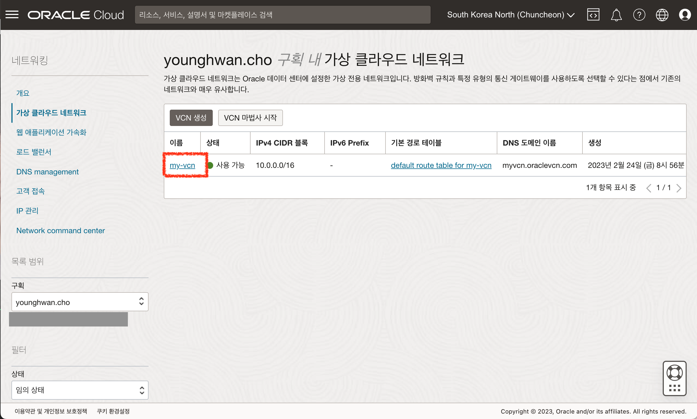
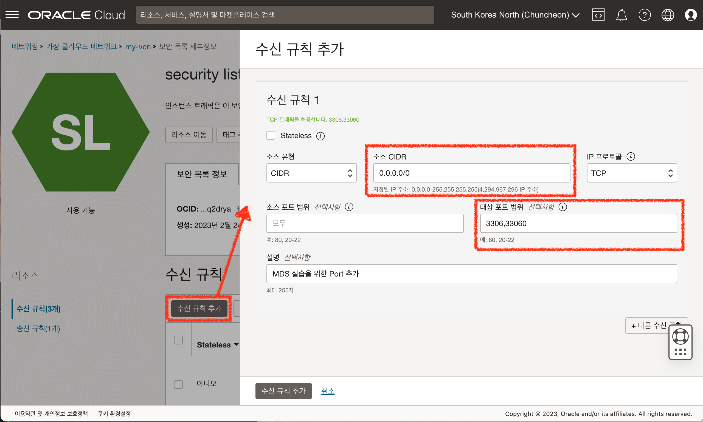
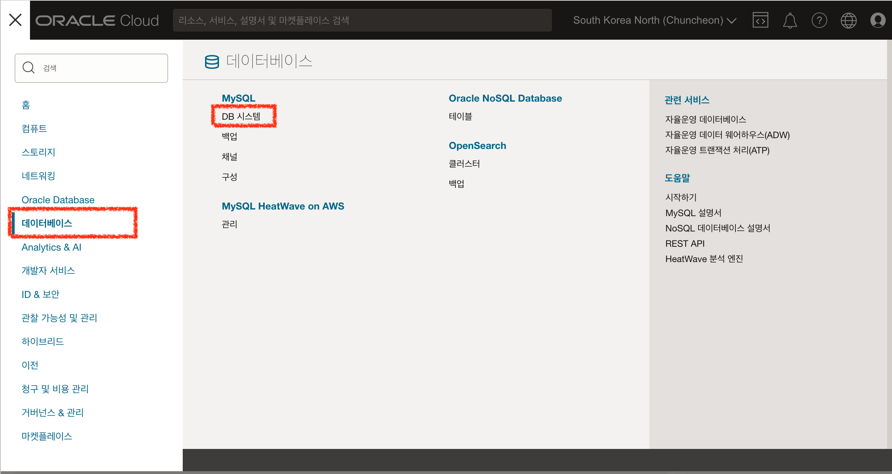

# OCI MySQL Database Service 간단 실습 (Optional)

## 소개

MySQL을 완전 관리형 서비스로 사용할 수 있는 OCI의 MySQL Database Service(MDS)를 생성하고 접속하는 방법에 대해 학습합니다.

소요시간: 20 minutes

### 목표
- OCI MDS 인스턴스 생성 방법 이해
- OCI MDS 서비스 접속 하기

### 사전 준비사항
1. 실습을 위한 노트북 (Windows, MacOS)
2. Oracle Free Tier 계정
3. 실습 구획 및 VCN 생성 ([사전 준비 사항] 단계 참고)
4. MDS 접속을 위한 인스턴스 생성 ([Lab 1] 단계 참고)
5. MDS 인스턴스 생성 ([사전 준비 사항] 단계 참고)

## Task 1: 보안목록에 실습을 위한 규칙 추가
1. 좌측 상단의 **햄버거 아이콘**을 클릭하고, **네트워킹**을 선택한 후 **가상 클라우드 네트워크**을 클릭합니다.
   
2. 실습에서 생성한 VCN을 클릭하여 상세보기 화면으로 이동합니다.
   
3. 2개의 서브넷 중 MDS를 생성한 서브넷을 클릭합니다. (본 실습에서는 Private에 생성하였습니다.)
   
4. Private 서브넷의 기본 보안목록을 클릭합니다.
   
5. 수신 규칙 추가 버튼을 클릭하여 3306, 33060 포트를 허용합니다. (본 실습에서는 Source IP 대역을 모든 IP 대역으로 작성하였습니다.)
   

## Task 2: MDS 생성 확인 및 접속을 위한 Tool 설치
1. 앞서 생성한 컴퓨트 인스턴스에 접속 합니다. (Shell 명령어)
   ```<shell>
   $ ssh -i [private key 파일 경로] opc@[public IP]
   $ ssh -i id_rsa opc@152.67.211.22
   ```
2. 인스턴스에 접속 후 아래 명령어를 실행하여 `MySQL Shell`을 설치합니다.
   ```<shell>
   $ sudo yum install mysql-shell -y
   ```

## Task 3: MDS 접속 및 확인
1. 좌측 상단의 **햄버거 아이콘**을 클릭하고, **데이터베이스**를 선택한 후 **MySQL** , **DB 시스템**을 클릭합니다.
   
2. 사전 준비사항 단계에서 생성한 MDS를 클릭하여 세부정보에서 끝점 Private IP를 확인합니다.
   
   
3. 아래 명령어를 참고하여 생성한 MDS 인스턴스에 접속합니다. 
   - MDS 생성 시 지정한 관리자 ID를 입력합니다.
   - 명령어 입력 후 MDS 생성 시 입력한 비밀번호를 입력합니다.
   ```<shell>
   $ mysqlsh [MDS 설정시 넣은 id 값]@[호스트네임 또는 private ip]
   $ mysqlsh admin@10.0.0.102
   ```
4. 정상적으로 로그인 되면 아래 명령어를 입력하여 sql 모드로 전환합니다.
   ```<shell>
   $ \sql
   ```
5. 전환이 완료되면 database 목록을 조회합니다.
   ```<sql>
   show databases;
   ```
   


[다음 랩으로 이동](#next)