# Deployment Pipeline을 이용하여 OCI 환경에 배포하기

## 소개
OCI에서는 OCI DevOps나 Jenkins와 같은 CI 도구를 통해 생성된 결과를 배포하기 위한 서비스인 Deployment Pipeline을 제공하고 있습니다.
Instance Group이나 OKE(Oracle Kubernetes Engine), Funtions 과 같은 환경에 간편하게 배포할 수 있는 Pipeline을 구성 할 수 있으며, 본 실습에서는 OKE(Oracle Kubernetes Engine)에 배포하는 실습을 진행합니다.


소요시간: 40 minutes

### 목표

- Oracle Cloud Infrastructure (OCI) DevOps Deployment Pipeline 구성
- Rolling Deploy 단계 구성 및 실습

### 사전 준비사항

1. 실습을 위한 노트북 (Windows, MacOS)
1. Oracle Free Tier 계정


## Task 1: Deployment Pipeline 생성
1. 좌측 상단의 **햄버거 아이콘**을 클릭하고, **Developer Services**을 선택한 후 **DevOps - Projects**를 클릭합니다.
   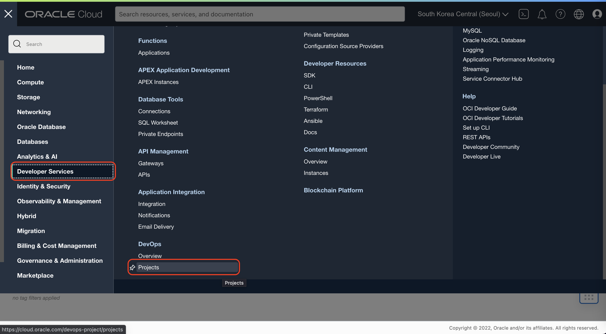
2. **Create pipeline** 버튼을 클릭 후 다음과 같이 입력합니다:
   - Pipeline name : **DeploySpringBootImagePipeline**
   - **Create pipeline** 버튼을 클릭하여 pipeline을 생성합니다.
   
   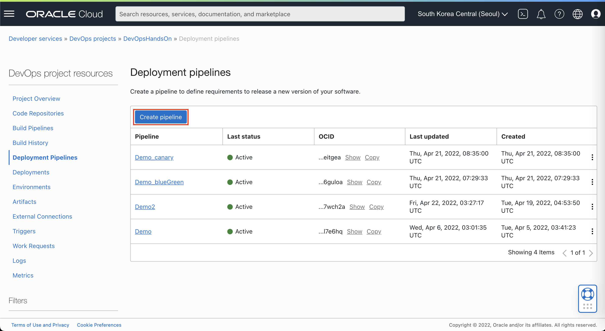
   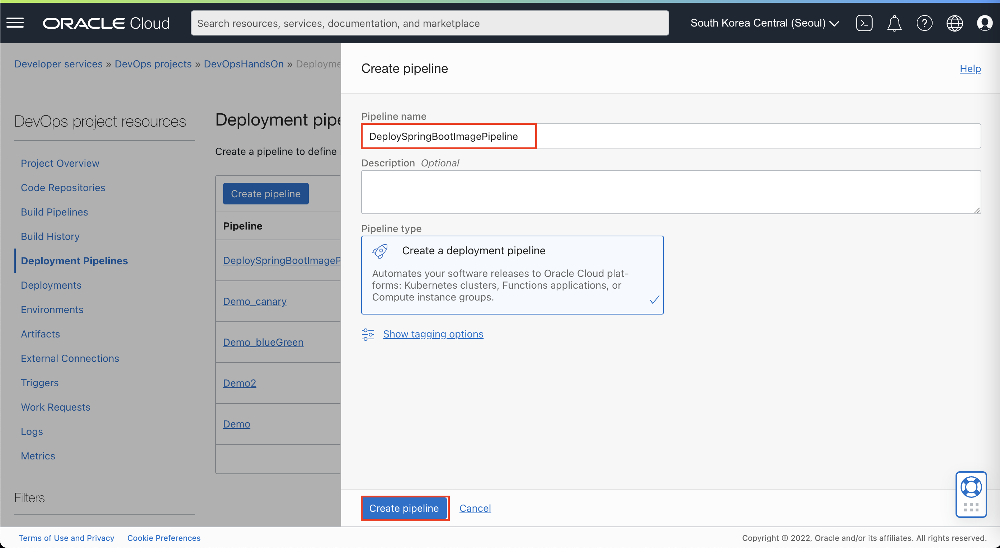
3. Pipeline 생성 완료
   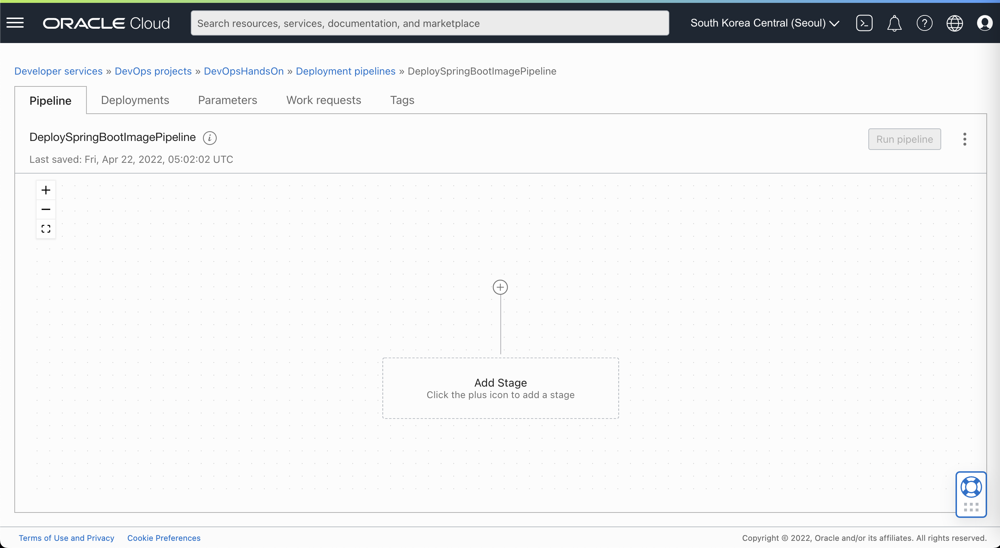
4. Pipeline 상세보기 화면에서 Parameter Tab을 클릭 하여 다음과 같이 파라미터를 추가 합니다.
   - REGISTRY_USERNAME : **cnfdr2omjc2j/oracleidentitycloudservice/dudghks34@gmail.com** [tenancy object storage namespace]/[사용자ID] 입력합니다.
   - Tenancy Object Storage Namespace 확인
     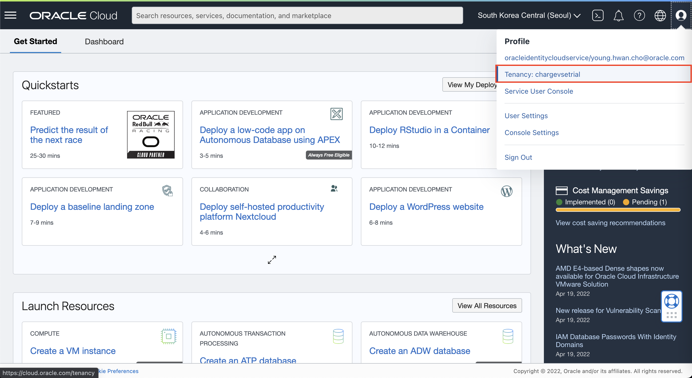
     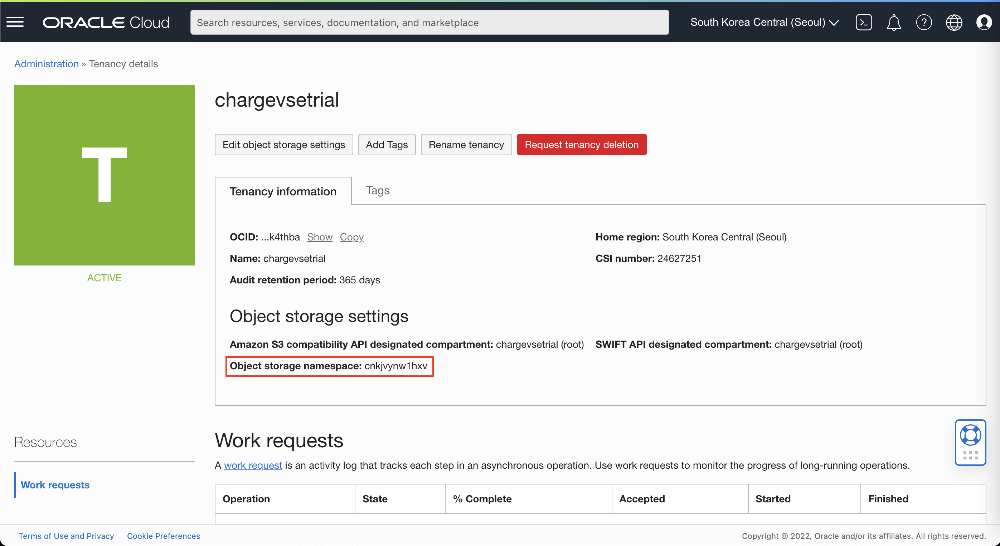
   - REGISTRY_TOKEN : 앞서 생성한 Auth Token 값을 입력합니다.
   - DOCKER_REGISTRY : **ap-chuncheon-1.ocir.io**
   
   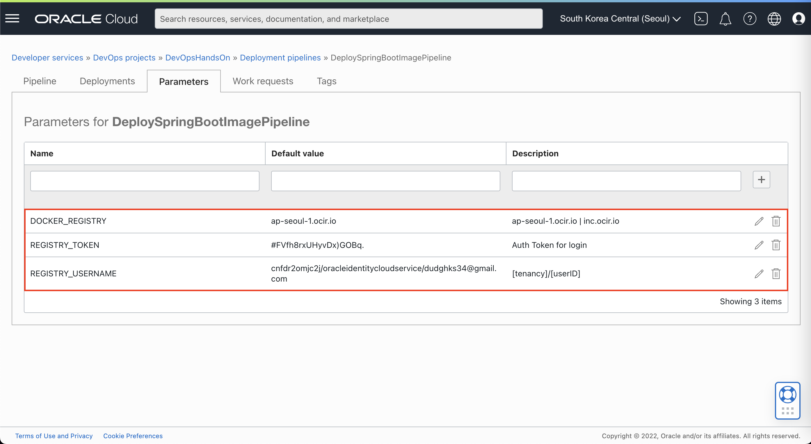

## Task 2: Environments 생성 (Oracle Kubernetes Engine)
1. DevOps 프로젝트 좌측 메뉴중 **Environments** 를 클릭 후 **Create environment** 버튼을 클릭합니다
   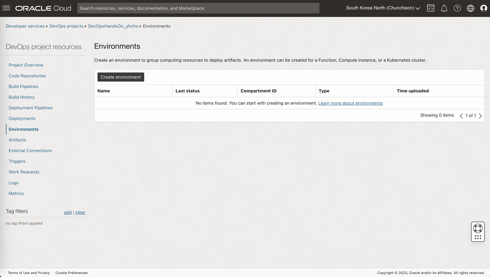
2. OKE(Oracle Kubenetes Engine)을 선택 후 다음과 같이 입력하여 **Next**를 클릭합니다.
   - Name : **demo_oke**
   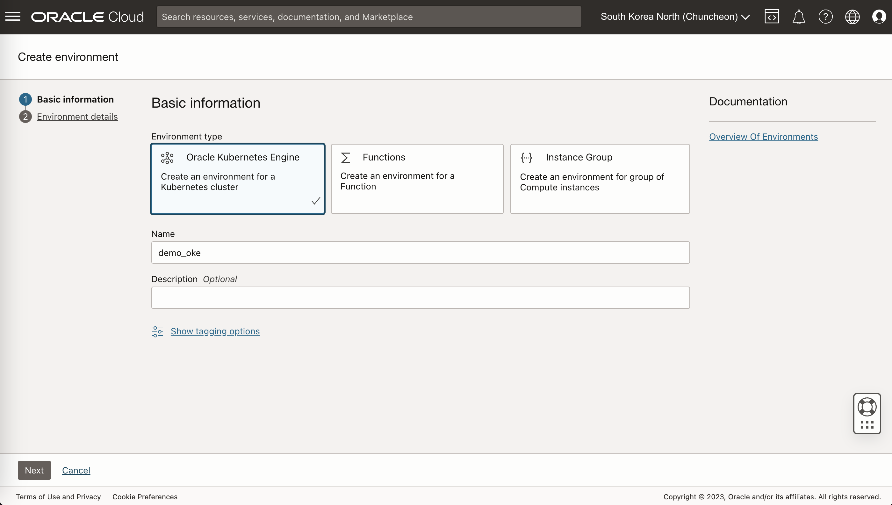
3. 다음 화면에서 아래와 같이 선택 및 입력하여 실습을 위한 환경을 생성 합니다.
   - Region: Select **South Korea North (Chuncheon)** / 실습을 진행하는 리전을 선택합니다.
   - Compartment : **OCIDevOpsHandsOn**
   - Cluster : **oke-cluster1** 을 선택합니다.
   - **Create environment** 를 클릭하여 환경을 생성합니다.
   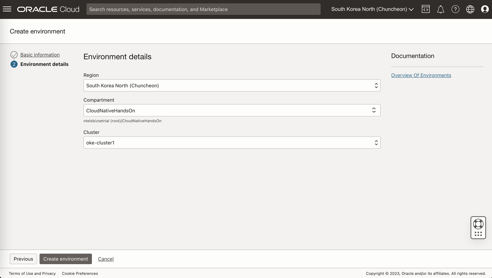

## Task 3: OKE 클러스터에 배포를 위한 Namespace 생성
클러스터 환경에 리소스를 배포할 네임스페이스를 아래와 같이 생성합니다.

1. OCI 콘솔 우측 상단에서 Cloud Shell을 실행합니다.
   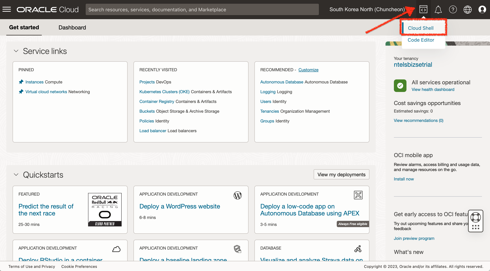
2. Cloud Shell이 실행되면 아래 명령어를 통해 Namespace를 생성합니다.

    ````shell
    <copy>
    kubectl create namespace <YourNamespaceName>
    </copy>
    ````
   
    ````shell
    <copy>
    kubectl create namespace demo-yhcho
    </copy>
    ````
   
3. 생성이 완료되면 아래 명령어를 통해 생성된 Namespace를 확인합니다.
    ````shell
    <copy>
    kubectl get namespace
    </copy>
    ````
    ````shell
    <copy>
    NAME              STATUS   AGE
    default           Active   3d
    demo-yhcho        Active   17h
    kube-node-lease   Active   3d
    kube-public       Active   3d
    kube-system       Active   3d
    </copy>
    ````

## Task 4: OCIR 인증을 위한 Kubernetes Secret 생성
OCIR 에 생성한 Repository가 Private으로 생성되어 있기 때문에 배포과정에서 OCIR에서 이미지를 Pull 하기 위해서 미리 인증을 위한 imagePullSecrets을 생성해야 합니다.
아래 명령어를 참조하여 Cloud Shell에서 앞서 생성한 Namespace에 imagePullSecrets을 생성합니다.

- 명령어 파라미터 설명
    - YourSecretName : 생성할 Secret의 이름을 지정합니다.
    - OCIR Region Code : 서울의 경우 `icn` 또는 `ap-seoul-1` , 춘천의 경우 `yny` 또는 `ap-chuncheon-1` 을 입력합니다. 모든 리전의 리전 코드는 [링크](https://docs.oracle.com/en-us/iaas/Content/General/Concepts/regions.htm#top)에서 확인할 수 있습니다.
    - YourTenancyNamespace : 실습 Tenancy의 namespace를 입력합니다. Cloud shell에서 `oci os ns get` 을 입력하여 확인할 수 있습니다.
    - YourID : 사전 준비사항에서 생성한 DevOps용 사용자 ID를 입력합니다.
    - YourAuthToken : 사전 준비사항에서 생성한 DevOps용 사용자의 Auth Token을 입력합니다.
    - YourEmail : 사용자의 이메일 주소를 입력합니다.
    - YourOKENamespace : 앞 단계에서 생성한 k8s namespace를 입력합니다.
  
        ````shell
        <copy>
        kubectl create secret docker-registry <YourSecretName> --docker-server=<OCIR Region Code>.ocir.io --docker-username='<YourTenancyNamespace>/<YourID>' --docker-password='<YourAuthToken>' --docker-email='<YourEmail>' -n <YourOKENamespace>
        </copy>
        ````

- 명령어 예시
    ````shell
    <copy>
    kubectl create secret docker-registry regcred-yhcho --docker-server=ap-chuncheon-1.ocir.io --docker-username='axiffngjdqvm/devops' --docker-password='XVCZUDG<.........' --docker-email='young.hwan.cho@oracle.com' -n demo-yhcho
    </copy>
    ````

## Task 5: Kubernetes manifest Artifact 생성

1. DevOps Project의 **Artifacts** 메뉴로 이동하여 **Add artifact** 버튼을 클릭합니다.
   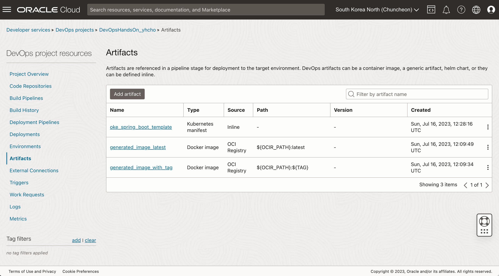
2. 다음과 같이 입력 후 순차적으로 진행 합니다.
   - Name : **oke\_spring\_boot\_template**
   - Type : **Kubernetes manifest**
   - Artifact source : **inline**
   - Config 내용 [파일 다운로드](files/oke_manifest.yml)
````yml
<copy>
apiVersion: apps/v1
kind: Deployment    
metadata:
  labels:
    app: ${APP_NAME}
  name: ${APP_NAME}
spec:
  replicas: 1
  selector:
    matchLabels:
      app: ${APP_NAME}
  template:
    metadata:
      labels:
        app: ${APP_NAME}
    spec:
      containers:
      - name: ${APP_NAME} 
        image: ${OCIR_PATH}:${TAG}
      imagePullSecrets:
      - name: regcred-yhcho #<-- 이 부분을 사용자에 맞게 수정해야 합니다.
---
apiVersion: v1
kind: Service
metadata:
  name: ${APP_NAME}-service
  annotations:
    service.beta.kubernetes.io/oci-load-balancer-shape: "flexible"
    service.beta.kubernetes.io/oci-load-balancer-shape-flex-min: "10"
    service.beta.kubernetes.io/oci-load-balancer-shape-flex-max: "100"
spec:
  type: LoadBalancer
  ports:
    - port: 80
      protocol: TCP
      targetPort: 8080
  selector:
    app: ${APP_NAME}
</copy>
````
   - **Add** 버튼을 클릭하여 Artifact를 추가합니다

   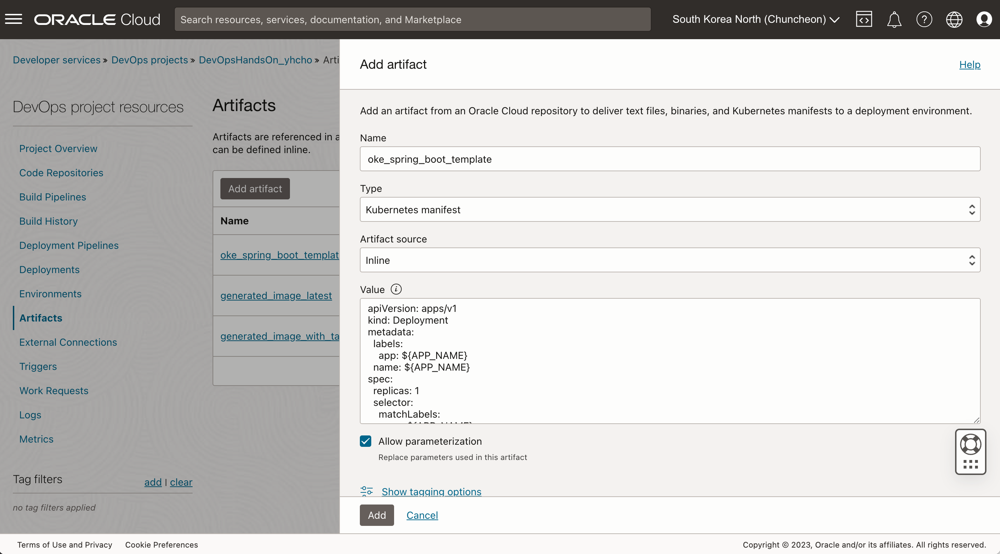

## Task 6: OKE: Deploy OKE: Rolling Stage 생성 및 반영 테스트
1. **_Task 1_**에서 생성한 DemoDeployPipeline 상세보기 화면으로 이동합니다.
2. **Add Stage** 버튼을 클릭 후 OKE Deploy Type을 선택하여 **Next** 를 클릭합니다.
   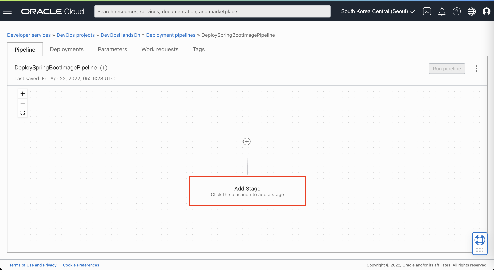
   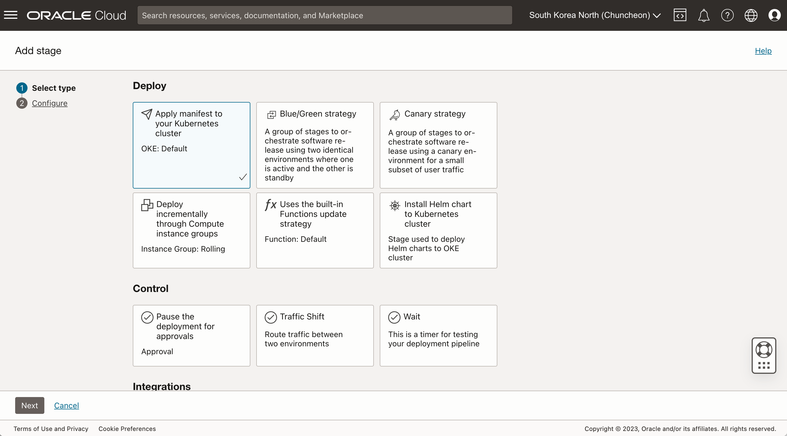
3. 다음과 같이 입력합니다:
   - Name : **DeployToOKE**
   - Environment : **demo_oke**
   - Deployment configuration : **Select Artifact** 클릭
   - oke\_spring\_boot\_template 선택 후 **Save Change** 클릭
   - Override Kubernetes namespace : **_Task 3_** 에서 생성한 namespace 입력 / demo-yhcho
   - If validation fails, automatically rollback to the last successful version? : **Yes**
   - **Add** 버튼 클릭

   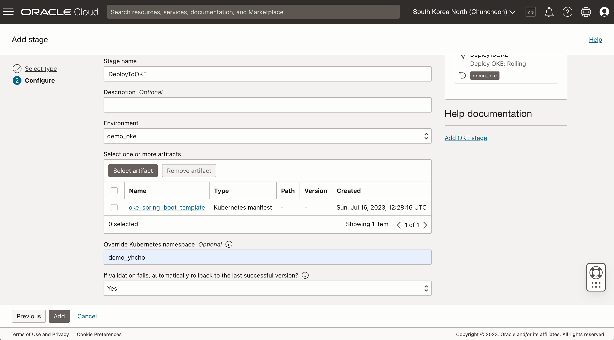

4. Build Pipeline에서 Deploy Pipeline을 실행 시키기 위해 [SpringBootDockerPipeline] 으로 이동 후 아래 순서대로 Stage를 추가 합니다.
   - **Deliver New Images** 하단 (+) **Add stage** 버튼 클릭
   
   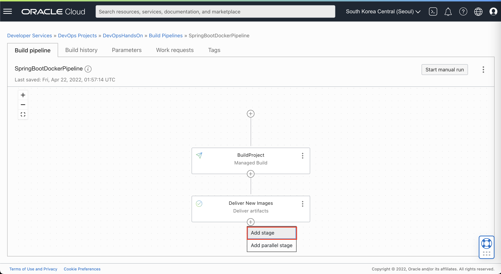
   - Trigger deployment 선택 후 **Next** 버튼 클릭

   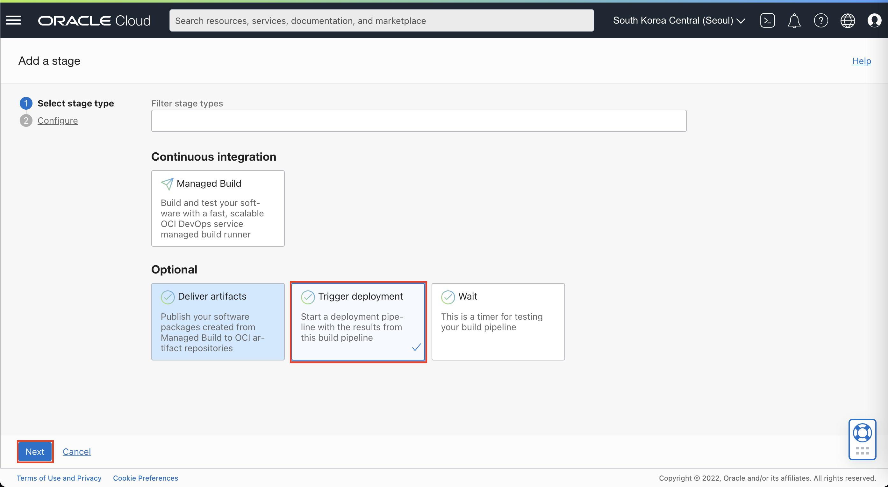
   - Name : **TriggerDeploy**
   - **Select deployment pipeline** 클릭

   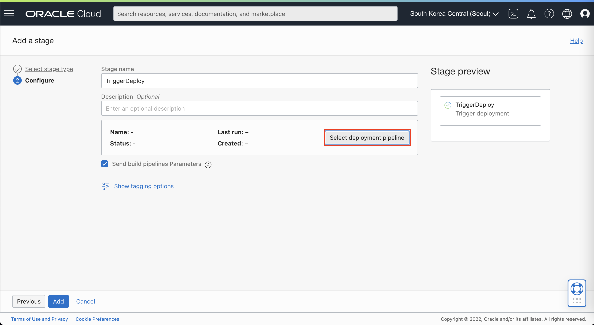
   - **DemoDeployPipeline** 선택 후 **Save** 버튼 클릭

   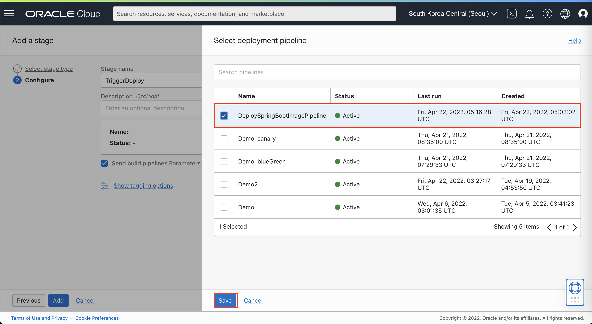
   - **Send build pipeline Parameters** 선택 후 **Add** 버튼 클릭

   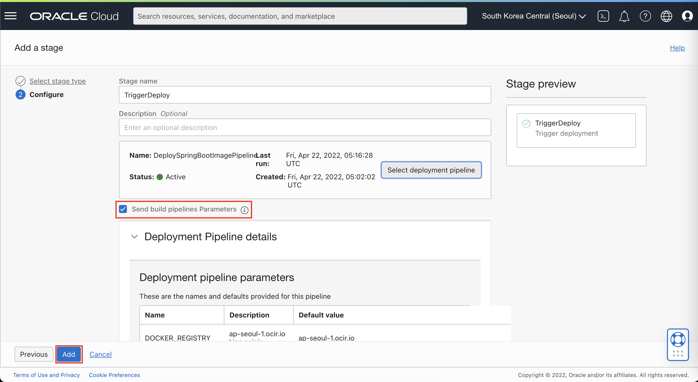

5. Build Pipeline & Deploy Pipeline 실습
   - Build Pipeline으로 이동 후 우측 상단 **Start manual run** 클릭

   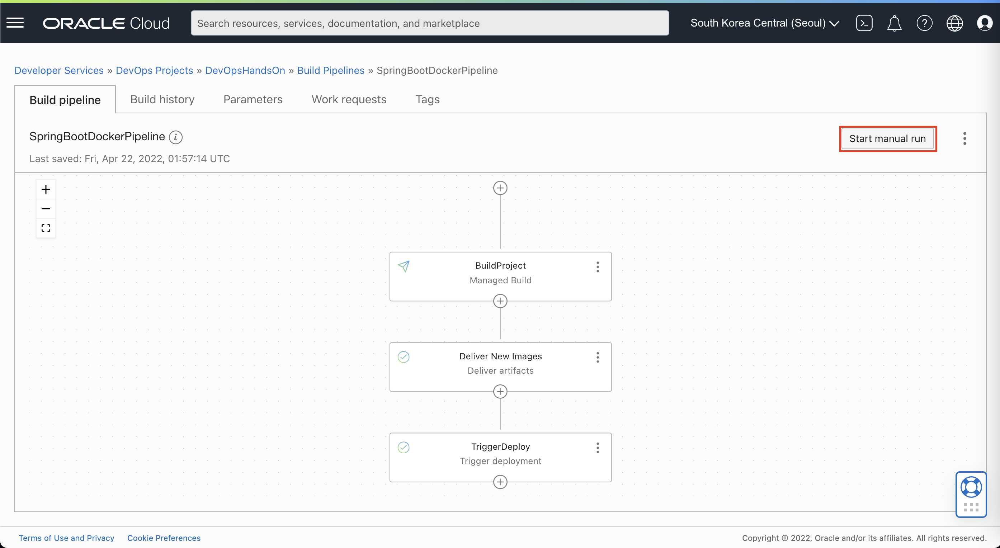
   - 좌측 하단 **Start manual run** 클릭   

   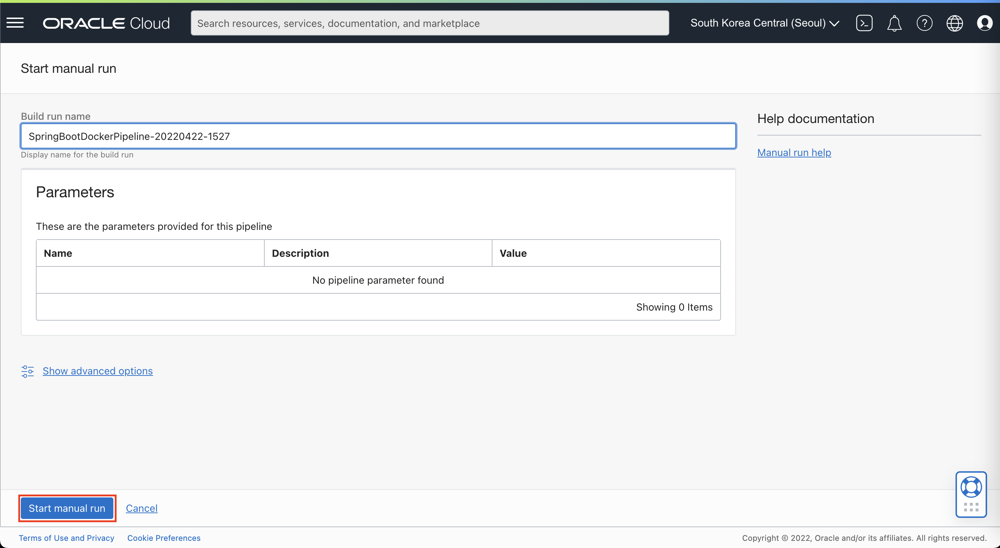
   - Build Pipeline 실행 완료 후 Deploy Trigger 여부 / Deploy 빌드 정상 실행 확인

   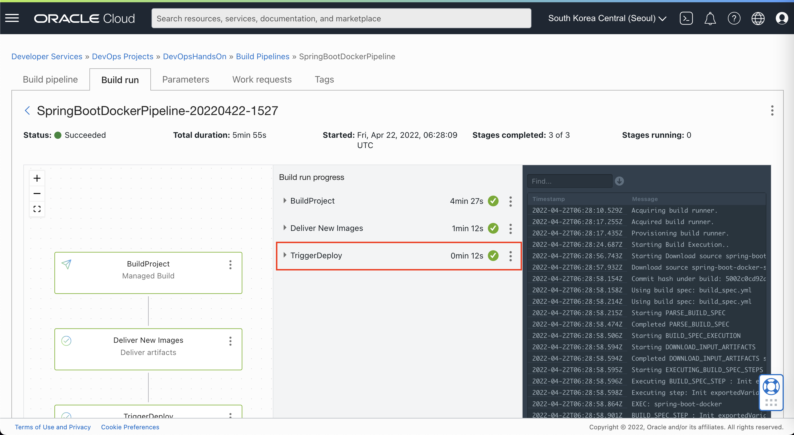
   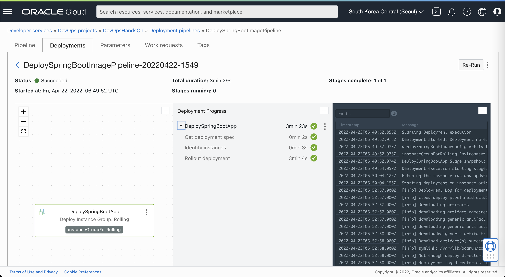
   - kubectl 확인 및 서비스 접속 확인
    ````
     kubectl get all -n demo-yhcho
    ````

   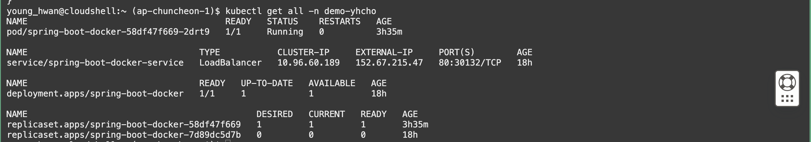
    ````
     http://<Load Balancer External IP>/
    ````

   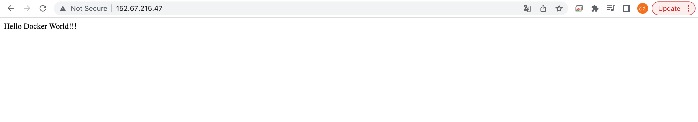

[다음 랩으로 이동](#next)
