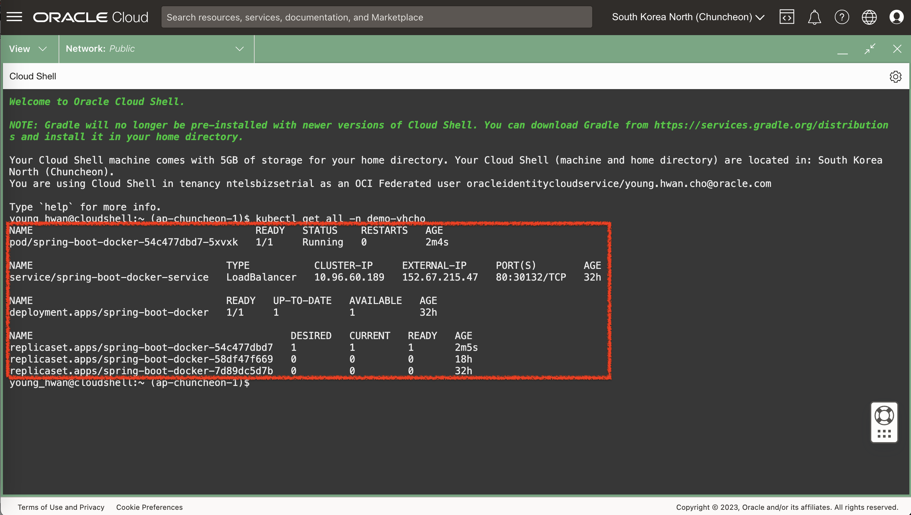

# Jenkins CI + OCI DevOps CD 환경 준비

## 소개

Jenkins CI Pipeline과 OCI DevOps CD Pipeline 환경을 연동하는 실습을 진행하기 위한 환경을 준비합니다.


소요시간: 40 minutes

### 목표

-  Oracle Cloud Infrastructure (OCI) Cloud Native 환경 구성.  

### 사전 준비사항

1. 실습을 위한 노트북 (Windows, MacOS)
1. Oracle Free Tier 계정

## Task 1 : Jenkins 설치하기 (helm)

> **Note**: 화면 언어는 English로 설정하고 진행합니다. 언어 변경은 우측 상단의 **Language** 아이콘을 선택하고 변경할 수 있습니다.

### helm 을 통한 Jenkins 설치하기

1. OCI 콘솔 우측 상단에서 Cloud Shell을 실행합니다.
   

2. helm 명령어를 통해 jenkins Repository를 추가합니다.
    ````shell
    <copy>
    helm repo add jenkins https://charts.jenkins.io
    helm repo update
    </copy>
    ````

3. 설정 변경을 위한 jenkins-values.yaml 파일을 아래 명령어를 통해 다운로드 받습니다.
    ````shell
    <copy>
    mkdir jenkins
    cd jenkins
    helm show values jenkins/jenkins > jenkins-values.yaml
    </copy>
    ````
4. 아래 내용을 참고하여 jenkins-values.yaml 파일의 내용을 일부 수정합니다.
   - 초기 비밀번호 설정
    ````shell
    <copy>
    # before
    # adminPassword: <default random>
   
    # after
    adminPassword: Welcome123
    </copy>
    ````
   - service Type 변경
    ````shell
    <copy>
    # before
    # For minikube, set this to NodePort, elsewhere use LoadBalancer
    # Use ClusterIP if your setup includes ingress controller
    serviceType: ClusterIP
    # Use Local to preserve the client source IP and avoids a second hop for LoadBalancer and Nodeport type services,
    # but risks potentially imbalanced traffic spreading.
    serviceExternalTrafficPolicy:
    # Jenkins controller service annotations
    serviceAnnotations: {}
   
    # after
    # For minikube, set this to NodePort, elsewhere use LoadBalancer
    # Use ClusterIP if your setup includes ingress controller
    #serviceType: ClusterIP
    serviceType: LoadBalancer
    # Use Local to preserve the client source IP and avoids a second hop for LoadBalancer and Nodeport type services,
    # but risks potentially imbalanced traffic spreading.
    serviceExternalTrafficPolicy:
    # Jenkins controller service annotations
    serviceAnnotations: {
     service.beta.kubernetes.io/oci-load-balancer-shape: "flexible"
     ,service.beta.kubernetes.io/oci-load-balancer-shape-flex-min: '10'
     ,service.beta.kubernetes.io/oci-load-balancer-shape-flex-max: '100'
    }
    </copy>
    ````
   - 기본 설치 플러그인 설정
    ````shell
    <copy>
    # before
    installPlugins:
        - kubernetes:3937.vd7b_82db_e347b_
        - workflow-aggregator:596.v8c21c963d92d
        - git:5.1.0
        - configuration-as-code:1647.ve39ca_b_829b_42
   
    # after
    installPlugins:
        - kubernetes:3937.vd7b_82db_e347b_
        - workflow-aggregator:596.v8c21c963d92d
        - git:5.1.0
        - configuration-as-code:1647.ve39ca_b_829b_42
        - pipeline-stage-view:2.33
        - oracle-cloud-infrastructure-devops:1.0.1
    </copy>
    ````

5. 아래 명령어를 통해 jenkins을 배포할 namespace를 생성합니다.
    ````shell
    <copy>
    kubectl create namespace jenkins
    </copy>
    ````

6. 마지막으로 helm 명령어를 통해 jenkins를 배포합니다. (jenkins-values.yaml 파일이 위치한 경로에서 실행합니다.)
    ````shell
    <copy>
    helm install jenkins jenkins/jenkins  -f jenkins-values.yaml -n jenkins
    </copy>
    ````
   - 실행 결과 예시
   
    ````shell
     <copy>
WARNING: Kubernetes configuration file is group-readable. This is insecure. Location: /home/opc/.kube/config
WARNING: Kubernetes configuration file is world-readable. This is insecure. Location: /home/opc/.kube/config
NAME: jenkins
LAST DEPLOYED: Wed Jul 12 07:38:14 2023
NAMESPACE: jenkins
STATUS: deployed
REVISION: 1
NOTES:
1. Get your 'admin' user password by running:
   kubectl exec --namespace jenkins -it svc/jenkins -c jenkins -- /bin/cat /run/secrets/additional/chart-admin-password && echo
2. Get the Jenkins URL to visit by running these commands in the same shell:
   NOTE: It may take a few minutes for the LoadBalancer IP to be available.
   You can watch the status of by running 'kubectl get svc --namespace jenkins -w jenkins'
   export SERVICE_IP=$(kubectl get svc --namespace jenkins jenkins --template "{{ range (index .status.loadBalancer.ingress 0) }}{{ . }}{{ end }}")
   echo http://$SERVICE_IP:8080

3. Login with the password from step 1 and the username: admin
4. Configure security realm and authorization strategy
5. Use Jenkins Configuration as Code by specifying configScripts in your values.yaml file, see documentation: http://$SERVICE_IP:8080/configuration-as-code and examples: https://github.com/jenkinsci/configuration-as-code-plugin/tree/master/demos

For more information on running Jenkins on Kubernetes, visit:
https://cloud.google.com/solutions/jenkins-on-container-engine

For more information about Jenkins Configuration as Code, visit:
https://jenkins.io/projects/jcasc/


NOTE: Consider using a custom image with pre-installed plugins
     </copy>
     ````

7. 잠시 후 모든 리소스가 배포되면 아래 명령어를 통해 배포된 리소스들을 확인할 수 있습니다.
    ````shell
    <copy>
    kubectl get all -n jenkins
    </copy>
    ````

   

### jenkins 접속 확인하기

1. External IP를 참조하여 jenkins 서비스에 접속합니다.
   - http://<YourServiceExternalIP\>:8080
   - 초기 관리자 ID는 admin 입니다.
   - 초기 관리자 PW는 앞 단계에서 설정한 비밀번호입니다. (실습에서는 Welcome123 으로 설정하였습니다.)
     
   
   

2. 플러그인 관리 메뉴에서 Oracle Cloud Infrastructure DevOps Plugin 도 정상적으로 설치된 것을 확인할 수 있습니다.
   

## Task 2: OCI DevOps 서비스 호출을 위한 자격증명 설정
1. 자격증명 생성을 위한 메뉴로 이동 합니다
   - **Jenkins 관리** 클릭 후 **Credentials** 클릭
   
   - 다음 순서대로 이동합니다.
   
   
   - **Add Credentials**를 클릭하여 자격증명을 생성합니다.
   
2. OCI CodeRepository를 위한 자격증명 생성
   - Kind : Username with password
   - Username : [테넌시명]/[사용자ID]  (예, _ntelsbizsetrial/devops_)
   - Password : 비밀번호는 사전에 생성한 Auth Token을 입력합니다
   - ID : 자격증명을 식별할 수 있도록 작성합니다. (예, credForOCICodeRepo__yhcho_)
   - Description : Credentials for OCI Code Repository
   
3. OCIR 접속을 위한 자격증명 생성
   - Kind : Username with password
   - Username : [테넌시 Namespace]/[사용자ID] (예, _amxkdnflekm/devops_)
   - Password : 비밀번호는 사전에 생성한 Auth Token을 입력합니다
   - ID : 자격증명을 식별할 수 있도록 작성합니다. (예, credForOCIR__yhcho_)
   - Description : Credentials for OCIR
     
4. OCI DevOps를 위한 자격증명 생성
   - 먼저 사용자 profile 화면에서 API Key를 등록합니다.
   
   
   - 등록화면에서 개인키/공개키 파일을 다운로드 받습니다.
   
   
   - 등록 완료 후 구성파일의 내용을 복사해둡니다.
   
   
5. 자격증명 생성 화면에서 다음과 같이 입력합니다.
   - fingerpring : 구성파일의 fingerprint 정보를 입력합니다
   - apikey : 다운로드 받은 private-key.pem 파일의 내용을 입력합니다.
   
   
   - tenantId : 구성파일의 tenancy 정보를 입력합니다.
   - userId : 구성파일의 user 정보를 입력합니다.
   - regionId : 구성파일의 region 정보를 입력합니다.
   
   
   - **testConnection** 버튼을 클릭하여 연결을 확인 후 자격증명을 생성합니다.
   
   

## Task 3: kaniko 에서 사용할 secret 생성하기
이번 실습에서 구성한 Jenkins의 경우 k8s pod 환경에서 실행되기 때문에 호스트에 설치된 Docker에 접근할 권한이 없고, 매번 호스트 Node에 도커를 설치할 수 없기 때문에 kaniko 라는 Opensource 기반 이미지 빌드 도구를 이용하여 이미지를 빌드하고, OCIR에 Push 하려고 합니다.
앞 단계에서 OCIR 에 접근하기 위해 생성한 imagePullSecrets을 jenkins Namespace에도 동일하게 생성해 줍니다.
아래 명령어를 참조하여 Cloud Shell에서 앞서 생성한 Namespace에 imagePullSecrets을 생성합니다.

- 명령어 파라미터 설명
   - YourSecretName : 생성할 Secret의 이름을 지정합니다.
   - OCIR Region Code : 서울의 경우 `icn` 또는 `ap-seoul-1` , 춘천의 경우 `yny` 또는 `ap-chuncheon-1` 을 입력합니다. 모든 리전의 리전 코드는 [링크](https://docs.oracle.com/en-us/iaas/Content/General/Concepts/regions.htm#top)에서 확인할 수 있습니다.
   - YourTenancyNamespace : 실습 Tenancy의 namespace를 입력합니다. Cloud shell에서 `oci os ns get` 을 입력하여 확인할 수 있습니다.
   - YourID : 사전 준비사항에서 생성한 DevOps용 사용자 ID를 입력합니다.
   - YourAuthToken : 사전 준비사항에서 생성한 DevOps용 사용자의 Auth Token을 입력합니다.
   - YourEmail : 사용자의 이메일 주소를 입력합니다.
   - YourOKENamespace : 앞 단계에서 생성한 k8s namespace를 입력합니다.

       ````shell
       <copy>
       kubectl create secret docker-registry <YourSecretName> --docker-server=<OCIR Region Code>.ocir.io --docker-username='<YourTenancyNamespace>/<YourID>' --docker-password='<YourAuthToken>' --docker-email='<YourEmail>' -n <YourOKENamespace>
       </copy>
       ````

- 명령어 예시
    ````shell
    <copy>
    kubectl create secret docker-registry regcred-yhcho --docker-server=ap-chuncheon-1.ocir.io --docker-username='axiffngjdqvm/devops' --docker-password='XVCZUDG<.........' --docker-email='young.hwan.cho@oracle.com' -n jenkins
    </copy>
    ````

## Task 4: Pipeline 생성 및 테스트 진행
1. pipeline 아이템 생성
   
2. **이 빌드에 매개변수 있음** 체크 후 다음과 같이 매개변수를 입력합니다.
   - DOCKER_REGISTRY : yny.ocir.io , ap-chuncheon-1.ocir.io
   - APPLICATION : OCIR Repository 이름 입력 (예, devops-handson-yhcho/spring-boot-docker)
   - NAMESPACE : 테넌시 namespace 입력
   
3. pipeline 내용 입력
   - Config 내용 [파일 다운로드](files/jenkins-pipeline-script.yml)
   
````yml
<copy>
   import groovy.json.JsonOutput

   # 이미지 경로 및 태그 관련 변수 설정하기
   def imageTag_latest = "${params.DOCKER_REGISTRY}/${params.NAMESPACE}/${params.APPLICATION}:latest"
   def random_str = UUID.randomUUID().toString()
   def imageTag = "${params.DOCKER_REGISTRY}/${params.NAMESPACE}/${params.APPLICATION}:" + random_str

   # OCI DevOps로 넘겨줄 파라미터 설정하기
   def args_map = [version: "1.${BUILD_NUMBER}",OCIR_PATH: "${params.DOCKER_REGISTRY}/${params.NAMESPACE}/${params.APPLICATION}", APP_NAME: "spring-boot-docker", TAG: random_str];
   def args_json = JsonOutput.toJson(args_map)

podTemplate(yaml: '''
              kind: Pod
              metadata:
                name: kaniko-image-build-pod
              spec:
                containers:
                - name: maven
                  image: maven:3-openjdk-8
                  imagePullPolicy: Always
                  command:
                  - sleep
                  args:
                  - 99d
                - name: kaniko
                  image: gcr.io/kaniko-project/executor:debug
                  imagePullPolicy: Always
                  command:
                  - sleep
                  args:
                  - 99d
                  volumeMounts:
                    - name: registry-credentials
                      mountPath: /kaniko/.docker
                  tty: true
                volumes:
                    - name: registry-credentials
                      secret:
                        secretName: regcred-yhcho #<-- 개인이 생성한 secret 이름으로 변경해야 합니다.
                        items: 
                        - key: .dockerconfigjson
                          path: config.json
'''
    ) {
      node(POD_LABEL) {
            stage('Git Process') {
              checkout scmGit(branches: [[name: '*/main']], extensions: [], userRemoteConfigs: [[credentialsId: 'credForOCICodeRepo_yhcho', url: 'https://devops.scmservice.ap-chuncheon-1.oci.oraclecloud.com/namespaces/axiffngjdqvm/projects/DevOpsHandsOn_yhcho/repositories/spring-boot-docker']])
            }
            stage('build maven project'){
              container('maven') {
                  sh 'mvn clean install'
                  sh 'mkdir -p target/dependency && (cd target/dependency; jar -xf ../*.jar)'
              }
            }
            stage('Build Image and push') {
               withCredentials([usernamePassword(credentialsId: 'credForOCIR_yhcho', passwordVariable: 'REGISTRY_TOKEN', usernameVariable: 'REGISTRY_USERNAME')]) {
                   container('kaniko') {
                      sh "executor --dockerfile=Dockerfile \
                      --context=dir://${env.WORKSPACE} \
                      --destination=${imageTag} \
                      --destination=${imageTag_latest}"
                   }
               }
            }
            stage('Call OCI Deployment Pipeline'){
                OCIDeployment (argumentVal: args_json, credentialsId: 'credForDevOps_yhcho', displayName: 'SpringBootDockerFromJenkins', endpoint: 'https://devops.ap-chuncheon-1.oci.oraclecloud.com', executionMode: 'ASYNC', pipelineId: 'ocid1.devopsdeploypipeline.oc1.ap-chuncheon-1.amaaaaaa3mrdaiya4otth6v7pzswifxnkozx7y3fnuk2xodmvw2vshvhhioa', pollingConfig: [pollingIntervalSeconds: 10, timeoutSeconds: 120])
            }
      }
   }
</copy>
````
4. OCI Code Repository 에서 checkout 하기
   - Steps : **checkout: Check out from version control** 선택
   - Repository URL : Code Repository URL을 입력합니다.
   - Credentials : Code Repository 를 위해 생성한 자격증명을 선택 합니다
   - Branch : */main
   - **Generate Pipeline Script** 를 클릭하여 스크립트를 생성합니다.
   
   
   
5. OCI DevOps : Deployment Pipeline 호출하기
   - Steps : **OCIDeployment: OCI Deployment**
   - Credential : OCI DevOps 용 자격증명을 선택합니다.
   - Pipeline OCID : OCI 콘솔에서 파이프라인의 OCID를 복사하여 입력합니다.
   - Display Name : **spring-boot-docker-from-jenkins**
   - Endpoint : **https://devops.ap-seoul-1.oci.oraclecloud.com** , [리전별 모든 EndPoint 확인 링크](https://docs.oracle.com/en-us/iaas/api/#/en/devops/20210630/)
   - **Generate Pipeline Script** 를 클릭하여 스크립트를 생성합니다.
   - **_생성된 스크립트에 ( ) 가 포함되어 있지 않아서 OCIDeployment([스크립트내용]) 형식으로 직접 입력해 줍니다_**
   
   
6. 테스트 수행
   
   
7. Image 업로드 확인
   
8. Deployment Pipeline 실행 확인
   
9. OKE 배포 결과 확인
    ````shell
    <copy>
    kubectl get all -n <YourNamespace>
    kubectl get all -n demo-yhcho
    </copy>
    ````
    

[다음 랩으로 이동](#next)
