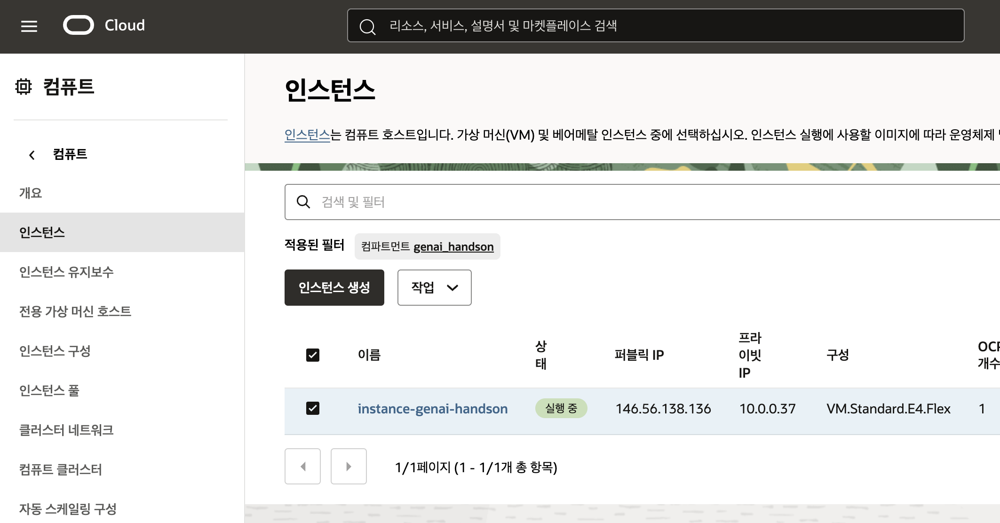
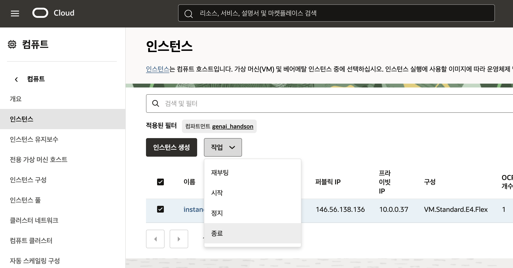
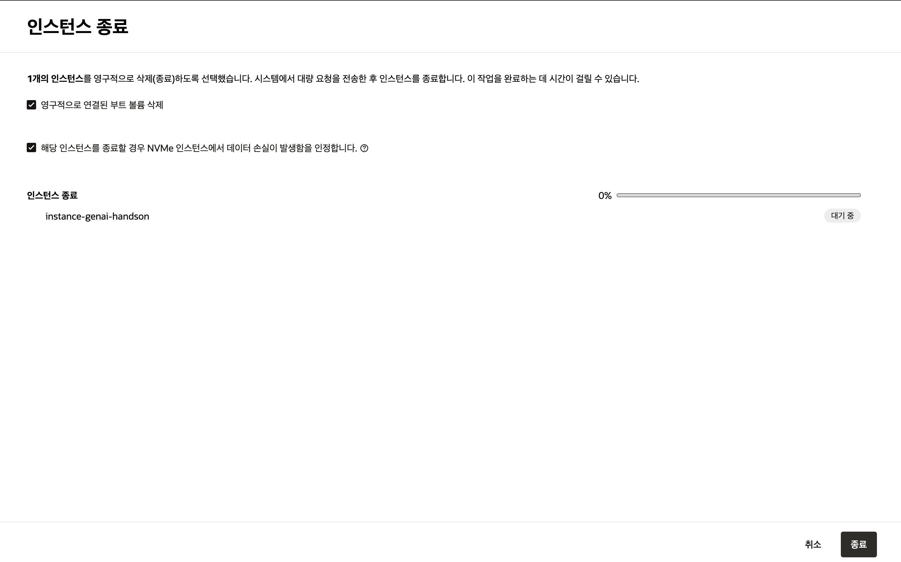
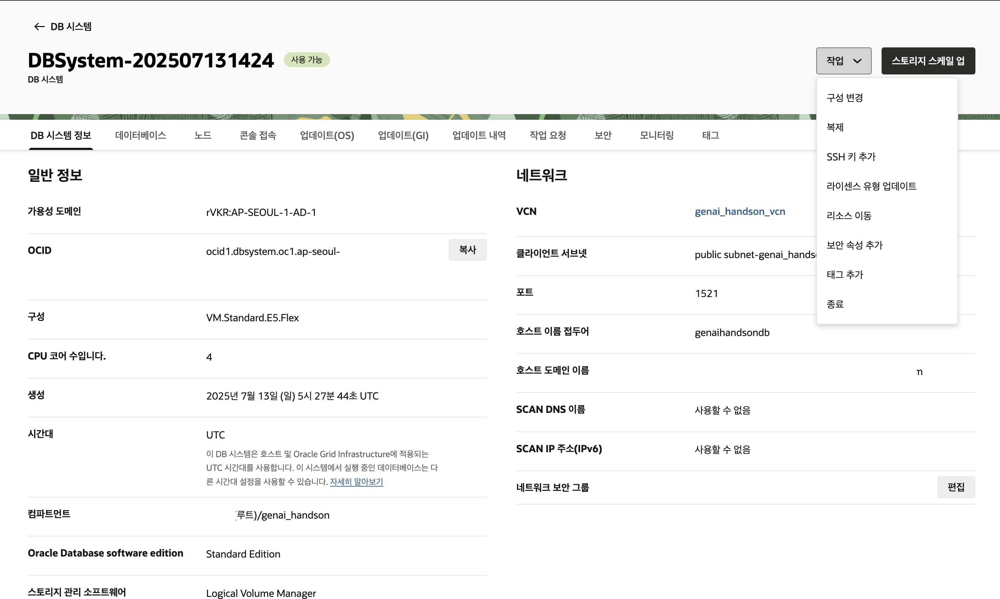

# 실습 리소스 정리하기

## 소개

불필요한 비용이 발생하지 않도록 실습에 사용한 리소스를 정리하기 위한 단계 입니다.
아래 단계를 차례대로 실행하여 실습에 사용된 리소스를 정리해주세요

Compute, DBCS 삭제

소요시간: 10 minutes

### 목표

- Oracle Cloud Infrastructure (OCI) Basic Service - Windows 실습에 사용한 리소스 종료.

### 사전 준비사항

1. 실습을 위한 노트북 (Windows, MacOS)
1. Oracle Free Tier 계정

## Task 1: 인스턴스 종료하기

> **인스턴스 풀에서 생성된 인스턴스는 인스턴스 풀 삭제시 함께 삭제됩니다.**

1. 인스턴스 목록화면에서 종료하고자 하는 인스턴스의 체크박스를 활성화 한 후 **"작업"** 메뉴에서 **"종료"** 버튼을 클릭합니다.
   
   

1. 연결된 부트 볼륨도 함께 삭제하길 원하는 경우 체크박스를 클릭 후 아래 데이터 손실 안내 확인하여 **"종료"** 버튼을 클릭합니다.
   

## Task 2: Base 데이터베이스 시스템 종료하기

1. Base 데이터베이스 시스템 세부정보 화면에서 **"작업"** 메뉴에서 **"종료"** 버튼을 클릭합니다.
   
