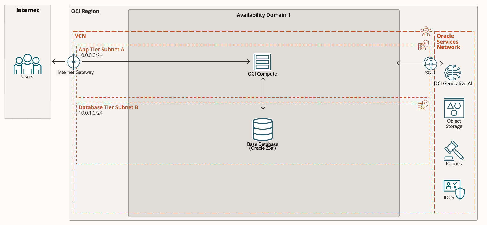

# 소개

## OCI GenAI & Vector Search Basic 실습

오라클 클라우드 인프라스트럭처(OCI)에서 제공하는 생성형 AI 서비스와 Oracle Database 23c의 AI Vector Search 기능의 기본 개념과 활용 방법을 학습하는 실습을 진행합니다.

이 실습에서는 OCI의 Generative AI 서비스의 기본 기능과 Oracle Database 23c의 AI Vector Search 기능을 LangChain 프레임워크를 통해 손쉽게 사용하는 방법을 알아봅니다.

현재 OCI Generative AI를 사용할 수 있는 OCI 리전은 [공식문서](https://docs.oracle.com/en-us/iaas/Content/generative-ai/overview.htm#regions) 에서 확인하실 수 있습니다.

주요 실습 내용:

- OCI Generative AI 서비스의 기본 기능 이해 및 활용
- Oracle 23ai의 AI Vector Search 기능 이해
- LangChain을 이용한 OCI GenAI, Oracle 23ai 활용 방법
- 문서 임베딩과 벡터 검색의 기본 개념 학습

소요시간: 2 hours

### 목표

- OCI GenAI 서비스의 이해
- Oracle 23ai DB의 Vector Search 기능 이해
- LangChain 과 OCI GenAI, Oracle 23ai 통합 방법 이해

### 사전 준비사항

1. 실습을 위한 노트북 (Windows, MacOS)
1. Oracle Free Tier 계정
