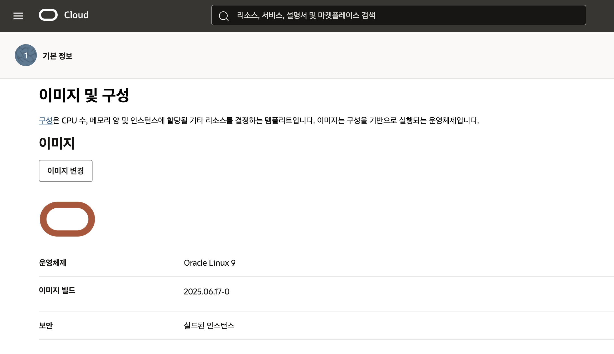
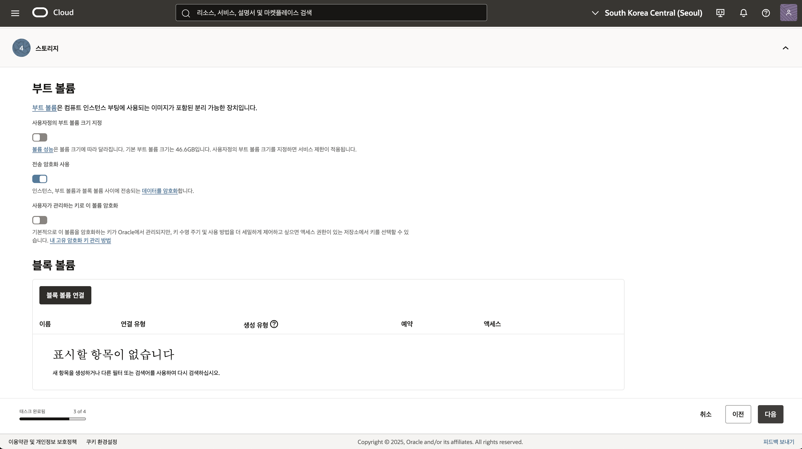

# OCI 클라우드 리소스 생성 및 설정

## 소개

소요시간:

### 목표

- OCI Compute Instance 서비스에 대한 이해
- OCI VCN Security 서비스에 대한 이해

### 사전 준비사항

1. 실습을 위한 노트북 (Windows, MacOS)
1. Oracle Free Tier 계정

## Task 1: OCI Console 로그인

OCI에 로그인합니다.

1. 로그인하면 다음과 같은 홈 화면을 볼 수 있습니다. 좌측 상단의 햄버거 모양의 아이콘을 클릭하면 OCI의 모든 메뉴를 확인할 수 있습니다.


## Task 2: OCI 인프라스트럭처 기본 설정

> **Note**: 화면 언어는 한글로 설정하고 진행합니다. 언어 변경은 우측 상단의 프로필 아이콘을 클릭하여 나오는 메뉴에서 **언어:한국어**를 클릭하고 변경할 수 있습니다.

### 구획(Compartment) 생성

프로그램 코드에서 OCI 리소스를 호출할 때 리소스를 격리하고 보호하기 위해 구획(Compartment)을 생성합니다.
구획은 OCI 리소스를 논리적으로 격리하고 관리할 수 있게 해주는 기본 단위입니다.

1. 좌측 상단의 **햄버거 아이콘**을 클릭하고, **ID & 보안(Identity & Security)**을 선택한 후 **구획(Compartments)**을 클릭합니다.


1. **Create Compartment**를 클릭합니다.

1. 다음과 같이 입력:
   - Name: Enter **genai_handson**
   - Description: **GenAI 실습을 위한 구획**
   - Parent Compartment: 부모 구획으로 기본 선택되는 root 구획 선택
   - **Create Compartment** 클릭


1. 생성이 완료되면 생성된 구획의 OCID를 복사 후 보관합니다.

### 동적 그룹 (Dynamic Group) 생성

프로그램 코드에서 OCI 리소스를 호출할 때 Instance Principal 인증 방식을 사용하기 위해 동적 그룹(Dynamic Group)을 생성합니다.
동적 그룹은 특정 조건을 만족하는 컴퓨트 인스턴스들을 그룹화하여 해당 그룹에 권한을 부여할 수 있게 해줍니다.

1. 좌측 상단의 **햄버거 아이콘**을 클릭하고, **ID & 보안(Identity & Security)**을 선택한 후 **도메인(domain)**을 클릭합니다.


1. 현재 도메인 Label이 표시된 도메인을 클릭합니다.


1. 도메인 세부정보 화면에서 "동적 그룹" 탭으로 이동 후 "동적 그룹 생성"을 클릭합니다.


1. 다음과 같이 입력:
   - Name: Enter **dg-genai-handson**
   - Description: **GenAl 핸즈온을 위해 Instance Principal 정책을 적용하기 위한 동적 그룹 입니다**
   - 일치 규칙: **아래 정의된 규칙 중 하나라도 일치**
   - 규칙1 (특정 구획의 모든 인스턴스에게 적용됨):
     ```txt
     Any {instance.compartment.id = '[위에서 생성한 구획의 OCID 입력]'}
     ```
   - 생성 버튼을 클릭합니다


1. 규칙을 직접 작성하기 어려운 경우 **규칙 작성기** 를 이용하여 규칙을 손쉽게 작성할 수 있습니다.

   - 구획에 생성된 모든 인스턴스에게 적용되는 규칙 작성 예시

   

   - 구획에 생성된 특정 인스턴스에게 적용되는 규칙 작성 예시

   

### 정책(Policy) 생성

1. 좌측 상단의 **햄버거 아이콘**을 클릭하고, **ID & 보안(Identity & Security)**을 선택한 후 **도메인(domain)**을 클릭합니다.


1. 정책 화면에서 정책을 생성하고자 하는 구획을 선택합니다. 테넌시 레벨의 정책은 루트 구획에 생성해야 하므로, 루트 구획을 선택합니다.


1. 다음과 같이 입력합니다.

   - 이름: **policy-genai-handson**
   - 설명: **genai handson을 위한 정책입니다.**
   - 구획: 위에서 생성한 실습 구획 **genai_handson** 선택

1. 다음과 같은 정책을 추가 후 생성버튼을 클릭합니다.

   - 정책 예시

   ```text
   <copy>
   allow dynamic-group [your-group-name] to manage generative-ai-family in compartment [your-compartment-name]
   allow dynamic-group [your-group-name] to use object-family in compartment [compartment-with-bucket]
   </copy>
   ```

   - 정책

   ```text
   <copy>
   allow dynamic-group dg-genai-handson to manage generative-ai-family in compartment genai_handson
   allow dynamic-group dg-genai-handson to use object-family in compartment genai_handson
   </copy>
   ```

   

### VCN 생성

1. 좌측 상단의 **햄버거 아이콘**을 클릭하고, **네트워킹(Networking)**을 선택한 후 **가상 클라우드 네트워크(Virtual Cloud Networks)**를 클릭합니다.


1. VCN 생성 화면에서 VCN을 생성하고자 하는 구획을 선택합니다. 앞서 생성한 **genai_handson** 구획을 선택합니다.


1. **작업** 드롭다운 리스트에서 **VCN 마법사 시작**을 클릭합니다.


1. 다음과 같이 입력합니다.

   - VCN 이름: **`genai_handson_vcn`**
   - 컴파트먼트: **genai_handson**
   - VCN CIDR 블록: **10.0.0.0/16** (기본값 유지)
   - 공용 서브넷 CIDR 블록: **10.0.0.0/24** (기본값 유지)
   - 전용 서브넷 CIDR 블록: **10.0.1.0/24** (기본값 유지)

   

1. **다음**을 클릭한 후 **생성**을 클릭합니다.

   

## Task 3: Oracle 기본위치 데이터베이스 (DBCS) 생성

### Oracle Database (DBCS) 생성

1. 좌측 상단의 **햄버거 아이콘**을 클릭하고, **Oracle Database**을 선택한 후 **Oracle 기본 위치 데이터베이스**를 클릭합니다.

   

2. 화면 상단 적용된 필터에서 컴파트먼트 필터를 위에서 생성한 **genai_handson**을 선택합니다.

   

3. **DB 시스템 생성(Create DB System)** 버튼을 클릭 합니다.
4. DB 시스템에 대한 기본정보에 아래와 같이 입력 및 선택 합니다.

   - 컴파트먼트 선택: Enter **genai_handson** 을 선택합니다.
   - DB 시스템 이름 지정: **`DB23ai_GenAI_Handson`**
   - 가용성 도메인 선택: AD-1 (서울 리전의 경우)

   

5. 모양 구성 섹션에서 OCPU구성 섹션의 우측 끝 Action 버튼을 클릭 후 **OCPU 개수 업데이트** 버튼을 클릭하여 아래와 같이 구성합니다.

   - 구성 계열: **AMD**
   - 노드당 OCPU 수: **1**
   - **변경** 버튼을 클릭합니다.

   
   

   - AMD로 구성하게 되면 OCPU 개수를 유연하게 선택할 수 있고 메모리와 네트워크 대역폭 IOPS등 성능은 OCPU와 비례적으로 확장됩니다.
     

6. 스토리지 구성 설정은 변경하지 않습니다.
7. DB 시스템 구성에 아래와 같이 입력 및 선택 합니다.

   - Oracle Database 소프트웨어 에디션: **Standard Edition**

8. SSH 키 추가 섹션에서 신규로 키를 생성하거나 기존 키를 업로드 또는 붙여넣기 합니다.
9. 라이센스 유형 및 네트워크 정보를 아래와 같이 입력 및 선택 합니다.

   - 라이센트 유형 선택: **라이센스 포함됨**
   - 가상 클라우드 네트워크: **genai-handson-vcn**
   - 클라이언트 서브넷: **전용 서브넷-genai-handson-vcn**
   - 호스트 이름 접두어: DB23ai
   - **다음** 버튼을 클릭하여 데이터베이스 정보를 구성합니다.

   
   

10. 데이터베이스 정보 단계에서 아래와 같이 입력 및 선택 합니다.

    - **데이터베이스 이미지 변경** 클릭
    - 데이터베이스 이미지 : **Oracle Database 23ai** (변경필요)
    - PDB 이름 : **PDB1**

    
    

11. 관리자 정보를 다음과 같이 입력합니다.

    - 관리자 비밀번호 규칙: **비밀번호는 9자에서 30자 사이여야 하며 대문자, 소문자, 특수 문자 및 숫자를 각각 두 개 이상 포함해야 합니다. 특수 문자는 \_, # 또는 -여야 합니다.**
    - 관리자 비밀번호: **WelCome123##**
    - 데이터베이스 백업 구성: **자동 백업 사용 체크 해제**
    - **생성(Create DB System)** 버튼을 클릭하여 DB 시스템 생성

    

12. DB System이 프로비전되는 동안 다른 실습을 진행합니다.

## Task 4: OCI Compute 인스턴스 생성

1. 좌측 상단의 **햄버거 아이콘**을 클릭하고, **컴퓨트(Compute)**을 선택한 후 **인스턴스(Instances)**를 클릭합니다.
   

2. 왼쪽 하단에 구획을 확인하고 **인스턴스 생성(Create instance)**버튼을 클릭합니다.
   

3. 인스턴스 이름과 구획을 선택 합니다

   - 이름: **`instance_genai_handson`**
   - 구획에 생성: **genai_handson**
   - 가용성 도메인 : **AP-SEOUL-1-AD-1 (Seoul 리전 기준)**
     

4. 설치할 이미지와 Instance의 Shape을 선택 합니다.

   - Image : **Oracle Linux9 - 2025.06.17-0**
     
     

5. Shape을 선택합니다.

   - Shape : **VM.Standard.E4.Flex (1 OCPU, 16 GB Memory)**
     
     

6. 보안 옵션은 기본값으로 유지하고 다음 단계로 이동합니다.

   

7. 네트워크 관련 옵션을 선택 합니다

   - Virtual cloud network : **`genai_handson_vcn`**
   - Subnet : **공용 서브넷-genai_handson_vcn**
   - Public IP address : **공용 IPv4 주소 지정**
     

8. Boot volume 관련 옵션은 기본 설정을 유지 합니다.

   

9. VM에 접속할때 사용할 SSH Keys 추가 합니다.

   - 이번 실습에서는 **자동으로 키 쌍 생성** 를 선택 후 전용 키, 공용 키를 다운받아 잘 보관 합니다.
     

10. 입력한 정보를 확인한 후 **생성(Create)** 버튼을 클릭합니다.
    

[다음 랩으로 이동](#next)
