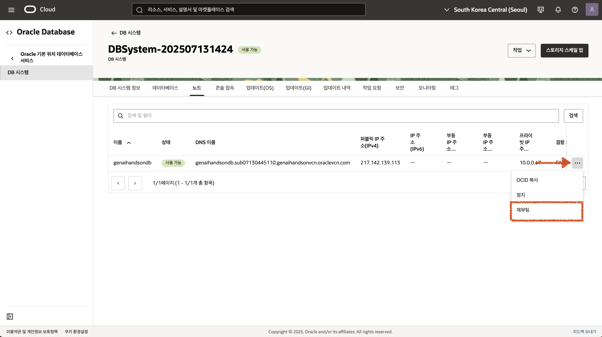

# VM 환경 패키지 설치 및 설정

## 소개

이 단계에서는 OCI GenAI & Vector Search 실습에 필요한 DBCS 및 VM 설정, 그리고 패키지 설치 방법을 설명합니다.
VM에서는 Python 3.12와 Conda 가상환경을 사용하여 실습을 진행할 예정입니다.

소요시간: 20 minutes

### 목표

- GenAI & Vector Search 실습을 위한 VM 설정
- Vector Search 실습을 위한 DBCS 설정

### 사전 준비사항

1. 실습을 위한 노트북 (Windows, MacOS)
1. Oracle Free Tier 계정

## Task 1: Oracle Database 23c AI 벡터 메모리 설정

Oracle Database 23c AI의 Vector Search 기능을 사용하기 위해서는 벡터 메모리 크기를 적절하게 설정해야 합니다.
Lab-1에서 생성한 DBCS 인스턴스에 접속하여 다음 작업을 순서대로 실행하세요.

1. Database 노드에 SSH로 접속

   - Lab-1에서 다운로드 받은 SSH 키를 사용하여 접속합니다.

1. CDB 접속

```shell
sqlplus / as sysdba
```

2. CDB, PDB 의 벡터 메모리 사이즈 파라미터 변경

```sql
-- CDB에 설정
ALTER SYSTEM SET vector_memory_size=200m SCOPE=SPFILE CONTAINER=ALL;

-- PDB 접속
ALTER SESSION SET CONTAINER=pdb1;

-- PDB에 설정
ALTER SYSTEM SET vector_memory_size=200m SCOPE=SPFILE;

SHOW PARAMETER VECTOR MEMORY_SIZE;
```

3. 데이터베이스 노드 재부팅



## Task 2: 컴퓨트 인스턴스 패키지 설치

### conda 가상환경 패키지 설치

- conda 패키지 다운로드 및 설치

  ```shell
  <copy>
  wget https://repo.anaconda.com/miniconda/Miniconda3-latest-Linux-x86_64.sh
  chmod +x Miniconda3-latest-Linux-x86_64.sh
  ./Miniconda3-latest-Linux-x86_64.sh
  </copy>
  ```

- 환경변수 적용

  ```shell
  <copy>
  source ~/.bashrc
  eval "$(/home/opc/miniconda3/bin/conda shell.bash hook)"
  </copy>
  ```

- conda 환경 초기화 및 버전 정보 확인

  ```shell
  <copy>
  conda init
  conda --version
  </copy>
  ```

### oracle instantclient 설치

- 파일 다운로드 및 설치
  ```shell
  <copy>
      wget https://download.oracle.com/otn_software/linux/instantclient/2380000/oracle-instantclient-basic-23.8.0.25.04-1.el9. x86_64.rpm
      sudo yum install oracle-instantclient-basic-23.8.0.25.04-1.el9.x86_64.rpm
  </copy>
  ```

[다음 랩으로 이동](#next)
