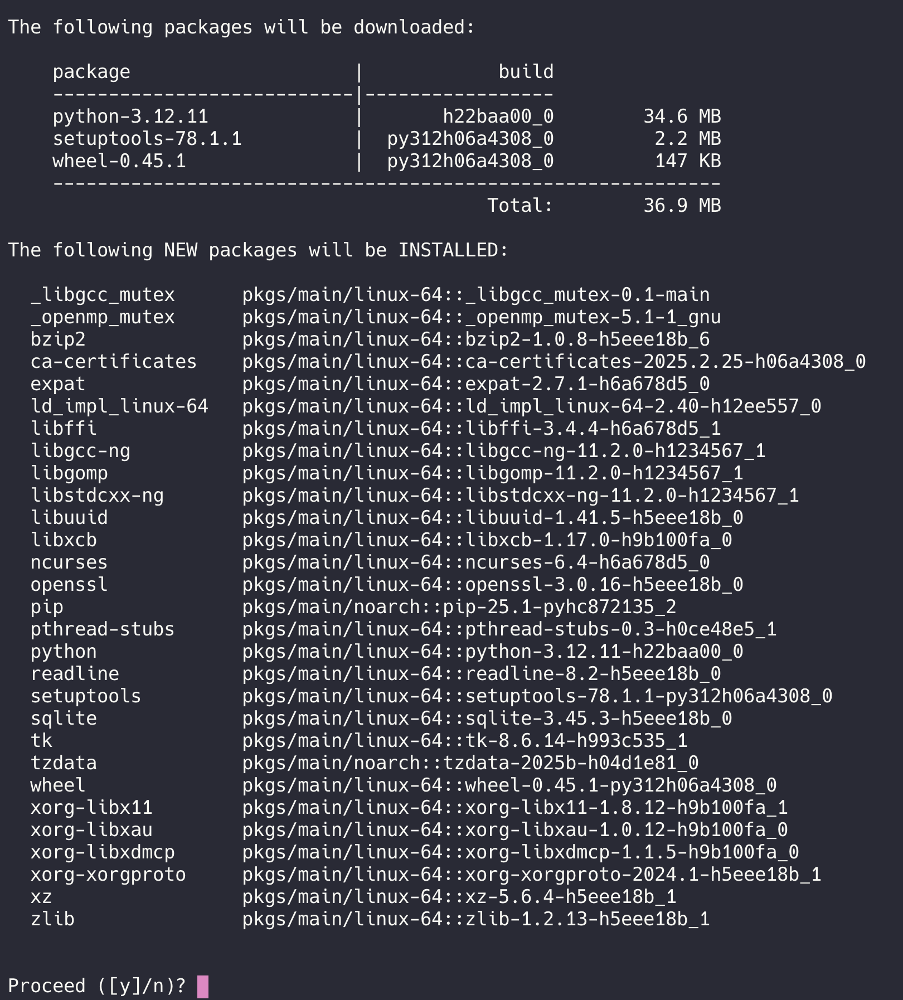
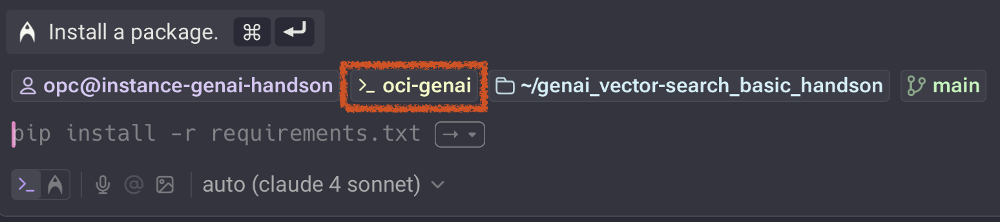

# 실습 코드 준비

## 소개

이 단계에서는 실습에 필요한 코드를 다운로드하고, Conda 가상환경을 생성 및 활성화하는 방법을 설명합니다.

소요시간: 10 minutes

### 목표

- 실습코드 다운로드 및 Conda 환경 생성

### 사전 준비사항

1. 실습을 위한 노트북 (Windows, MacOS)
1. Oracle Free Tier 계정

## Task 1: 소스코드 다운로드 (깃헙)

### 실습 소스코드 다운로드

설치가 끝나면 원하는 디렉터리(예: 홈 디렉터리)로 이동하여 실습 코드를 내려받습니다.  
필요하다면 Lab-2에서 만든 conda 환경을 먼저 활성화하세요.

- Home 디렉토리로 이동합니다.

```shell
<copy>
cd ~
</copy>
```

- 깃허브 저장소 코드를 Clone 합니다

```shell
<copy>
git clone https://github.com/the-team-oasis/genai_vector-search_basic_handson.git
</copy>
```

- 깃허브 코드 디렉토리로 이동합니다.

```shell
<copy>
cd genai_vector-search_basic_handson
</copy>
```

## Task 2: 가상환경 생성 및 활성화

- 가상환경 생성 명령어 실행

```shell
<copy>
conda create -n oci-genai python=3.12
</copy>
```

- 진행 여부를 묻는 프롬프트가 출력되면 **ENTER** 키를 입력합니다.



- 생성한 가상환경 활성화

```shell
<copy>
conda activate oci-genai
</copy>
```

- 가상환경 활성화 확인
  

> **Note**: 사용하는 터미널 환경에 따라 다르게 출력됩니다. 위 화면은 Warp 기준으로 확인된 내용입니다.

### Task 3: 실습 코드 패키지 설치

```shell
<copy>
pip install -r requirements.txt
</copy>
```

[다음 랩으로 이동](#next)
